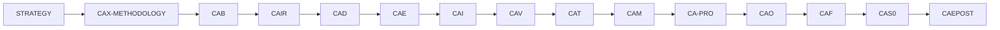

# 🤖 ASI-T Copilot Agent Quick Reference

## 🚨 MANDATORY READING ORDER

1. **FIRST**: Read [ASI-T-COPILOT-AGENT-STYLEGUIDE.md](./ASI-T-COPILOT-AGENT-STYLEGUIDE.md)
2. **THEN**: Review [copilot-instructions.md](./copilot-instructions.md) for specific patterns
3. **VALIDATE**: Run `python scripts/validate_copilot_styleguide.py` before changes

## ⚡ Quick Validation Commands

```bash
# Full TFA structure validation
make check

# Copilot styleguide validation  
python scripts/validate_copilot_styleguide.py

# TFA path validation (example)
echo "TFA/SYSTEMS/SI/ASIT-GENESIS-0001-OV.md" | grep -E "^(?:ASI-T|TFA)/(SYSTEMS|STATIONS|COMPONENTS|BITS|QUBITS|ELEMENTS|WAVES|STATES)/[A-Z]{2}/(?:_revisions/REV_[A-Z]/HOV_[^/]+/)?[A-Z0-9-]{10,}\.md$"
```

## 🎯 Critical Rules Summary

| Rule | Description | Example |
|------|-------------|---------|
| **UIX.v1** | Universal Injection required before any action | Import SSoT before executing |
| **TFA-Only** | Path must follow canonical grammar | `TFA/SYSTEMS/SI/UTCS-ID.md` |
| **MAL-EEM** | Ethics & empathy guardrails active | Fail-closed on harmful requests |
| **FCR-1/FCR-2** | Two-step process for changes | Intent → Implementation |
| **rev 0** | Baseline = stable filename | `document.md` |
| **rev ≥ 1** | Revision pattern required | `_revisions/REV_A/HOV_MSN1-3_CAD/document.md` |

## 📋 15 CAx Phases (Chronological Order)



## 🏗️ TFA Layer Structure

```
SYSTEMS    → SI (System Integration) | DI (Domain Interface)
STATIONS   → SE (Station Envelope)
COMPONENTS → CV (Component Vendor) | CE (Component Equipment) | CC (Configuration Cell) | CI (Configuration Item) | CP (Component Part)
BITS       → CB (Classical Bit)
QUBITS     → QB (Qubit)
ELEMENTS   → UE (Unit Element) | FE (Federation Entanglement)
WAVES      → FWD (Future/Foresight/Fluctuant/Functional Waves Dynamics)
STATES     → QS (Quantum State)
```

## 🚫 Common Error Codes

- **[E1001]** PathGrammarError — Invalid TFA path
- **[E2001]** SchemaError — Invalid front-matter
- **[E2107]** HOVNotAllowed — Baseline with HOV
- **[E2108]** HOVMissing — Revision without HOV
- **[E2110]** HOVPhasesInvalid — Invalid CAx phases
- **[E2111]** HOVPathMismatch — Path/front-matter mismatch
- **[E6001]** ProvenanceDrift — Hash mismatch

## 📄 Front-Matter Template (UTCS-MI)

```yaml
---
id: DOMAIN-PROGRAM-BLOCKS-ID
rev: 0                     # 0=baseline; >=1 revisions
llc: SI                    # Use canonical LLC codes
title: "Document Title"
configuration: baseline    # REQUIRED for rev 0
classification: "INTERNAL / EVIDENCE-REQUIRED"
version: "1.0.0"
release_date: 2024-01-01
maintainer: "ASI-T Architecture Team"
provenance:
  policy_hash: "sha256:..."
  model_sha: "sha256:..."
  data_manifest_hash: "sha256:..."
  operator_id: "UTCS:OP:handle"
  canonical_hash: "sha256:..."
licenses:
  code: "Apache-2.0"
  docs: "CC-BY-4.0"
# For rev >= 1 only:
hov:
  msn_range: "MSN1-3"
  phases: ["CAD","CAE","CAI"]
  label: "Description"
bridge: "CB→QB→UE→FE→FWD→QS"
ethics_guard: "MAL-EEM"
---
```

## 🔧 Tools & Validation

- **Validator**: `scripts/validate_copilot_styleguide.py`
- **TFA Check**: `make check`
- **LLC Map**: `8-RESOURCES/llc-map.yaml`
- **Templates**: `8-RESOURCES/TEMPLATES/`

---

**⚠️ Remember**: Always validate before committing, follow FCR process, and maintain deterministic evidence chain.