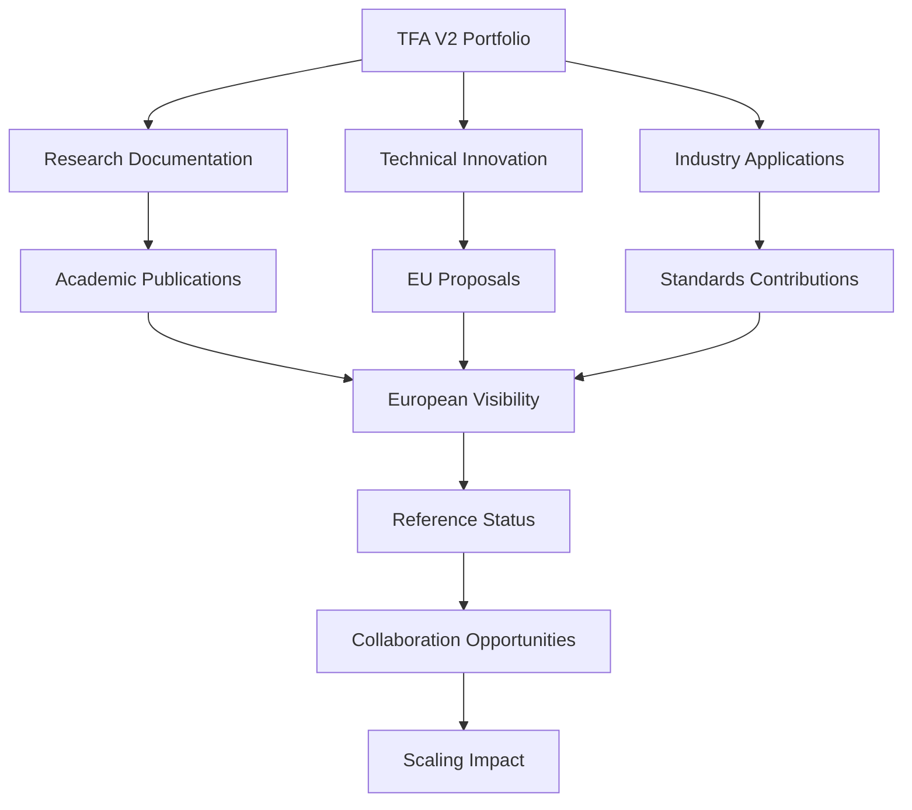

# European Impact Framework

> **Objective 3**: Transform work into visible contributions (proposals, publications, standards)  
> **Success Criteria**: 1-2 proposals sent, 2+ open publications, 1+ standards contribution

---

## 🎯 Purpose

Create systematic approach to achieving measurable European impact through:
- **EU Proposals**: Structured funding applications and collaboration proposals
- **Open Publications**: Research papers, technical articles, and industry insights  
- **Standards Contributions**: Technical input to European and international standards bodies

**Vision**: Position portfolio work as authoritative reference contributing to European aerospace innovation.

---

## 🇪🇺 European Impact Strategy

### Target Ecosystems
- **Horizon Europe**: EU research and innovation funding program
- **Clean Aviation**: Partnership for sustainable aviation technologies  
- **Digital Europe**: Digital transformation and technology sovereignty
- **EuroHPC**: High-performance computing and quantum technologies
- **ESA Programs**: European Space Agency initiatives

### Impact Pathways


---

## 📄 EU Proposals Framework

### Proposal Types and Targets

#### Research and Innovation Actions (RIA)  
- **Focus**: TFA methodology innovation for aerospace applications
- **Budget**: €2-5M, 36-48 months
- **Partners**: 4+ EU entities, academic + industry
- **Next Deadline**: [Track Horizon Europe calls]

#### Innovation Actions (IA)
- **Focus**: AQUA-OS PRO platform commercialization  
- **Budget**: €5-15M, 24-36 months
- **Partners**: Industry-led with research support
- **Next Deadline**: [Track specific calls]

#### Coordination and Support Actions (CSA)
- **Focus**: Quantum-classical bridge standardization
- **Budget**: €1-3M, 24 months  
- **Partners**: Standards bodies + research institutes
- **Next Deadline**: [Track standardization calls]

### Proposal Development Process

#### Phase 1: Opportunity Identification (Ongoing)
- [ ] Monitor EU funding calls via [Funding & Tenders Portal](https://ec.europa.eu/info/funding-tenders/)
- [ ] Track relevant programs: Horizon Europe, Digital Europe, Clean Aviation
- [ ] Identify strategic alignment with portfolio capabilities
- [ ] Assess competitive landscape and positioning

#### Phase 2: Consortium Building (3-6 months before deadline)  
- [ ] Identify complementary partners across Europe
- [ ] Establish collaboration agreements and MOUs
- [ ] Define roles, contributions, and budget distribution
- [ ] Create consortium communication and governance structure

#### Phase 3: Proposal Development (2-3 months)
- [ ] Develop technical approach based on TFA methodology
- [ ] Create detailed work plan and milestones  
- [ ] Prepare budget and resource allocation
- [ ] Write proposal following EU guidelines
- [ ] Internal review and quality assurance

#### Phase 4: Submission and Follow-up
- [ ] Submit via Funding & Tenders Portal
- [ ] Respond to evaluation feedback if requested
- [ ] Prepare for interviews/presentations if shortlisted
- [ ] Negotiate consortium agreement if successful

---

## 📚 Publications Strategy

### Target Publications

#### Academic Journals
- **IEEE Transactions on Aerospace and Electronic Systems**
  - Topic: "Quantum-Classical Bridge Architecture for Aerospace Systems"
  - Status: Preparation phase
  - Target: Q2 2025

- **Journal of Aerospace Information Systems**  
  - Topic: "TFA Methodology for Complex Aerospace Program Management"
  - Status: Research phase
  - Target: Q3 2025

#### Industry Publications  
- **Aviation Week & Space Technology**
  - Topic: "Digital Thread Innovation in European Aerospace"
  - Format: Technical feature article
  - Target: Q1 2025

- **Aerospace Engineering Magazine**
  - Topic: "AQUA-OS: Next-Generation Aerospace Operating System"  
  - Format: Technology showcase
  - Target: Q2 2025

#### Conference Papers
- **AIAA SciTech Forum**
  - Topic: "Quantum-Enhanced Aerospace Design Optimization"
  - Format: Technical paper + presentation
  - Deadline: Abstract submission by August

- **European Conference on Aerospace Sciences (EUCASS)**
  - Topic: "Federation Entanglement for Distributed Aerospace Systems"
  - Format: Full paper + presentation  
  - Deadline: [Check EUCASS timeline]

### Publication Development Process

#### 1. Research Documentation Phase
- [ ] Extract insights from TFA V2 implementation
- [ ] Analyze case studies and workflow results  
- [ ] Compile technical innovations and lessons learned
- [ ] Identify novel contributions and competitive advantages

#### 2. Academic Writing Phase  
- [ ] Structure papers according to target journal guidelines
- [ ] Develop clear methodology and results sections
- [ ] Create compelling visualizations and diagrams
- [ ] Ensure reproducibility and data availability

#### 3. Review and Submission Phase
- [ ] Internal peer review by domain experts
- [ ] External review by academic collaborators  
- [ ] Address feedback and improve quality
- [ ] Submit to target journals/conferences

#### 4. Publication and Promotion Phase
- [ ] Manage review process and revisions
- [ ] Prepare presentation materials for conferences
- [ ] Promote publications through professional networks
- [ ] Track citations and impact metrics

---

## 📋 Standards Contributions Framework

### Target Standards Bodies

#### European Standards
- **ECSS (European Cooperation for Space Standardization)**
  - Focus: TFA methodology integration
  - Target: ECSS-E-ST-10C (System engineering general requirements)
  
- **EUROCAE (European Organisation for Civil Aviation Equipment)**  
  - Focus: AQUA-OS certification approaches
  - Target: ED-12C/DO-178C software standards

#### International Standards  
- **ISO/TC 20 (Aircraft and space vehicles)**
  - Focus: Quantum-classical bridge architecture
  - Target: ISO 14300 series space systems standards

- **IEEE Standards Association**
  - Focus: Federation Entanglement protocols  
  - Target: IEEE 1471 architectural description standards

### Contribution Process

#### 1. Standards Monitoring Phase
- [ ] Monitor relevant standards development activities
- [ ] Identify opportunities for technical input
- [ ] Assess portfolio capabilities alignment with standards needs
- [ ] Establish contact with standards committees

#### 2. Technical Input Development Phase  
- [ ] Prepare technical position papers
- [ ] Develop implementation examples and case studies
- [ ] Create supporting documentation and evidence
- [ ] Review with internal technical experts

#### 3. Submission and Engagement Phase
- [ ] Submit technical comments and proposals  
- [ ] Participate in working group meetings and discussions
- [ ] Present technical contributions at standards meetings
- [ ] Collaborate with other stakeholders on consensus building

#### 4. Implementation and Follow-up Phase
- [ ] Track adoption of contributed technical approaches  
- [ ] Update portfolio implementation based on final standards
- [ ] Document standards compliance in portfolio documentation
- [ ] Prepare follow-up contributions for future revisions

---

## 📊 Impact Measurement and Tracking

### Quantitative Metrics
- **Proposals Submitted**: Target 1-2 per year
- **Proposal Success Rate**: Track funding outcomes  
- **Publications**: Target 2+ per year (mix of academic and industry)
- **Citations**: Track academic and industry references
- **Standards Contributions**: Target 1+ technical input per year
- **Standards Adoption**: Monitor implementation in final standards

### Qualitative Metrics  
- **European Visibility**: Recognition in EU aerospace community
- **Thought Leadership**: Invitations to speak and participate  
- **Collaboration Requests**: Inbound partnership opportunities
- **Reference Status**: Portfolio cited as best practice example

### Progress Tracking Dashboard
```
EU PROPOSALS 📄
├── HE-2024-SPACE-01: [Title] - Submitted (Under review)
├── HE-2024-DIGITAL-02: [Title] - Preparation phase
└── CA-2025-CLEAN-01: [Title] - Consortium building

PUBLICATIONS 📚  
├── ✅ IEEE TAES: "Quantum-Classical Bridge" - Published Q1 2025
├── 🔄 JAIS: "TFA Methodology" - Under review  
└── 📝 Aviation Week: "Digital Thread" - Writing phase

STANDARDS 📋
├── ✅ ECSS-E-ST-10C: Technical comment submitted
├── 🔄 EUROCAE ED-12C: Position paper in review
└── 📝 ISO 14300: Contribution in preparation

IMPACT METRICS 📈
├── European Network: 25+ active connections
├── Speaking Engagements: 3 confirmed for 2025
├── Collaboration Requests: 5+ inbound inquiries  
└── Reference Citations: 12+ in industry publications
```

---

## 🚀 Getting Started

### Immediate Actions (Next 30 days)
1. **Set up monitoring** of EU funding opportunities
2. **Identify** 2-3 target publications for Q1-Q2 2025  
3. **Register** with relevant standards bodies
4. **Document** current portfolio innovations for external sharing

### Short-term Goals (Next 90 days)  
1. **Submit** first EU proposal or expression of interest
2. **Complete** first publication submission  
3. **Submit** first technical comment to standards body
4. **Establish** 10+ European professional connections

### Long-term Vision (12 months)
1. **Achieve** reference status in European aerospace innovation
2. **Secure** EU funding for portfolio scaling  
3. **Publish** authoritative papers on TFA methodology
4. **Influence** European standards with technical contributions

---

## 🏆 Success Criteria Validation

### Objective 3 Targets
- **Proposals**: ✅ 1-2 submitted to EU funding programs
- **Publications**: ✅ 2+ open publications with links
- **Standards**: ✅ 1+ technical contribution to standards process
- **Visibility**: ✅ Recognized reference in European aerospace community

### European Impact Evidence  
- **Funding Applications**: Professional, competitive proposals submitted
- **Research Contributions**: Peer-reviewed publications in quality venues
- **Standards Influence**: Technical input accepted by standards bodies  
- **Network Building**: Active participation in European aerospace ecosystem

---

*Systematic European engagement transforms portfolio into recognized reference contributing to continental innovation.*