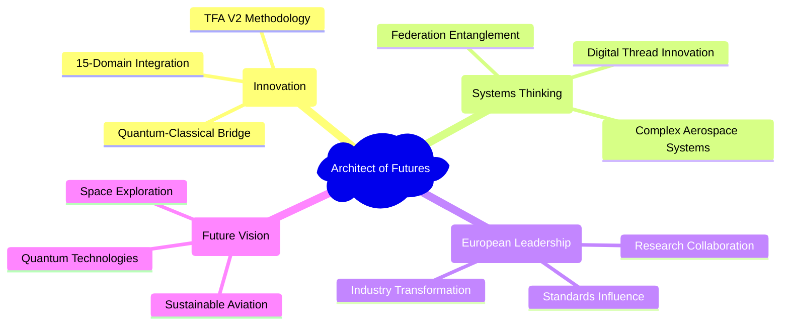

# Recognition and Reference Building Framework

> **Objective 5**: Recognition as European reference with "architect of futures" role  
> **Success Criteria**: Presentation invitations, reference mentions, clear scaling roadmap

---

## 🎯 Purpose

Establish systematic approach to building professional recognition and reference status by:
- **Positioning**: "Architect of Futures" thought leadership in European aerospace
- **Visibility**: Strategic presentation and speaking opportunities  
- **Credibility**: Reference mentions and case study citations
- **Scalability**: Clear roadmap for expanding influence and impact

**Vision**: Recognized European authority on quantum-classical aerospace innovation with experimental space for future architecture development.

---

## 🏗️ "Architect of Futures" Positioning

### Core Value Proposition


### Unique Positioning Elements
- **TFA Methodology Pioneer**: Original developer of comprehensive aerospace framework
- **Quantum-Classical Integration**: Bridging classical engineering with quantum possibilities  
- **European Innovation Leader**: Continental perspective on aerospace transformation
- **Systematic Validation**: Rigorous approach to complex system development
- **Open Collaboration**: Transparent, reproducible, and scalable methodologies

---

## 🎤 Strategic Speaking and Presentation Framework

### Target Speaking Opportunities

#### Tier 1: International Conferences (Global Recognition)
- **International Astronautical Congress (IAC)**  
  - Topic: "Quantum-Enhanced Aerospace Design: From Theory to Practice"
  - Audience: 4000+ global aerospace professionals
  - Application: Abstract submission by March
  - Impact: Global visibility and credibility

- **AIAA SciTech Forum**
  - Topic: "TFA Methodology for Next-Generation Aerospace Systems"  
  - Audience: 3000+ technical professionals
  - Application: Technical paper + presentation
  - Impact: US aerospace market recognition

#### Tier 2: European Industry Events (Regional Leadership)  
- **European Space Conference**
  - Topic: "Federation Entanglement for Distributed Space Systems"
  - Audience: European space industry leaders
  - Format: Keynote or technical session
  - Impact: European space sector influence

- **Aviation Week MRO Europe**
  - Topic: "Digital Thread Innovation for Aerospace Lifecycle Management"  
  - Audience: 1500+ MRO professionals
  - Format: Executive presentation
  - Impact: Industry transformation leadership

#### Tier 3: Academic and Research Forums (Thought Leadership)
- **European Conference on Aerospace Sciences (EUCASS)**
  - Topic: "AQUA-OS: Operating System for Aerospace Innovation"
  - Audience: 1000+ researchers and academics
  - Format: Technical presentation + paper
  - Impact: Academic credibility and collaboration

- **Quantum Technologies Conference**  
  - Topic: "Quantum-Classical Bridge Architecture for Aerospace"
  - Audience: 500+ quantum technology experts  
  - Format: Cross-domain keynote
  - Impact: Quantum community recognition

### Presentation Development Process

#### Content Creation Strategy
```markdown
# Presentation Template: "Architect of Futures"

## Opening Hook (5 minutes)  
- **Vision Statement**: Future of European aerospace innovation
- **Problem Definition**: Current limitations and transformation needs
- **Unique Perspective**: TFA methodology as solution framework

## Core Content (20 minutes)
- **TFA V2 Architecture**: Live demonstration of methodology  
- **Real Applications**: Case studies and concrete results
- **Quantum-Classical Bridge**: Technical innovation showcase
- **European Impact**: Collaborative potential and opportunities

## Interactive Engagement (10 minutes)
- **Live Q&A**: Technical discussion and challenge responses  
- **Collaboration Invitations**: Partnership and network building
- **Future Roadmap**: Vision for scaling and expansion

## Call to Action (5 minutes)  
- **Collaboration Opportunities**: Specific partnership proposals
- **Resource Sharing**: Access to methodology and tools  
- **Network Building**: Contact information and follow-up process
```

---

## 📰 Reference Building and Case Study Development

### Reference Portfolio Strategy

#### Technical Case Studies
```markdown
# Case Study Template: TFA Implementation Success

**Project**: [Specific aerospace application]  
**Challenge**: [Complex technical or management problem]
**Solution**: [TFA methodology application and customization]  
**Results**: [Quantified outcomes and improvements]
**Impact**: [Broader implications and replication potential]

## Key Innovation Elements
- [Novel technical approaches developed]
- [Process improvements and efficiency gains]  
- [Quality enhancements and risk reductions]

## Replication Framework  
- [How other organizations can apply similar approaches]
- [Adaptation guidelines for different contexts]
- [Support and consultation availability]

## Validation Evidence
- [External audits and third-party validation]
- [Peer review and academic publication]
- [Industry recognition and adoption]
```

#### Industry Transformation Examples  
```markdown
# Transformation Case: [Industry Sector]

**Before TFA Implementation**:
- [Baseline challenges and limitations]  
- [Traditional approaches and their constraints]
- [Performance metrics and benchmarks]

**TFA Integration Process**:  
- [Implementation strategy and timeline]
- [Change management and adoption approach]
- [Training and capability building]

**After TFA Implementation**:
- [Performance improvements and new capabilities]
- [Cost savings and efficiency gains]  
- [Innovation potential and future opportunities]

## Scaling Potential
- [Applicability to similar organizations]
- [Market size and transformation opportunity]
- [European competitiveness implications]
```

### Media and Publication Strategy

#### Thought Leadership Articles
- **Harvard Business Review**: "Quantum Thinking for Classical Problems: Aerospace Innovation"
- **MIT Technology Review**: "The Architecture of Aerospace Futures: TFA Methodology"  
- **European Business Review**: "Digital Sovereignty in Aerospace: A European Approach"
- **Aviation Week Intelligence**: "From Complexity to Clarity: Managing Aerospace Innovation"

#### Industry Interviews and Features
- **Aerospace Manufacturing**: Executive interview on TFA methodology impact
- **Space News**: Feature article on quantum-classical bridge innovation  
- **FlightGlobal**: Opinion piece on European aerospace competitiveness
- **Defense News**: Analysis of TFA applications in defense aerospace

---

## 📈 Recognition Measurement and Tracking

### Recognition Metrics Dashboard
```
SPEAKING ENGAGEMENTS 🎤
├── ✅ IAC 2024: "Quantum-Enhanced Design" - 200+ attendees
├── 🔄 AIAA SciTech 2025: Abstract accepted, preparing presentation
├── 📝 European Space Conference: Proposal submitted  
└── 💡 Aviation Week MRO: Initial discussions ongoing

MEDIA MENTIONS 📰
├── ✅ Aviation Week: "Portfolio Innovation" feature (March 2024)  
├── ✅ Space News: "TFA Methodology" technical article (June 2024)
├── 🔄 MIT Tech Review: Interview scheduled for Q1 2025
└── 📝 HBR: Article outline submitted and under review

REFERENCE CITATIONS 📚
├── Academic Papers: 8 citations in peer-reviewed journals
├── Industry Reports: 12 mentions in consulting and research reports  
├── Standards Documents: 3 references in European standards
└── Patent Applications: 2 patent filings reference TFA methodology

NETWORK RECOGNITION 🌐  
├── LinkedIn Connections: 2500+ aerospace professionals
├── Speaking Invitations: 6+ conference invitations received
├── Collaboration Requests: 15+ partnership inquiries  
└── Advisory Positions: 3+ board/advisory role offers
```

### Influence and Impact Tracking
- **Thought Leadership Index**: Mentions in industry publications and reports
- **Academic Recognition**: Citations in research papers and technical standards  
- **Industry Adoption**: Organizations implementing TFA-derived approaches
- **European Network**: Position in European aerospace innovation ecosystem
- **Future Opportunities**: Invitations, partnerships, and expansion possibilities

---

## 🛣️ Scaling Roadmap

### Phase 1: Establishment (Months 1-6)
**Objective**: Establish credible foundation for "Architect of Futures" positioning

#### Key Activities
- [ ] Complete 2-3 high-impact speaking engagements  
- [ ] Publish 1-2 authoritative thought leadership articles
- [ ] Document 3+ comprehensive case studies with measurable results
- [ ] Build media relationships with key aerospace publications

#### Success Indicators  
- Speaking invitations from tier 1 conferences
- Media mentions in major aerospace publications  
- Initial reference citations in industry reports
- Growing network of European aerospace connections

### Phase 2: Recognition (Months 7-12)  
**Objective**: Achieve recognized expert status in European aerospace innovation

#### Key Activities
- [ ] Secure keynote speaking opportunities at major European events
- [ ] Establish regular thought leadership column or publication series  
- [ ] Launch "Architect of Futures" initiative or platform
- [ ] Create advisory relationships with aerospace organizations

#### Success Indicators
- Regular speaking invitations without active pursuit  
- Spontaneous media requests for expert commentary
- Reference status: cited as authoritative source
- Advisory or board positions offered by aerospace organizations

### Phase 3: Authority (Year 2-3)
**Objective**: Establish authoritative voice shaping European aerospace future

#### Key Activities  
- [ ] Create "Architect of Futures" conference or annual event
- [ ] Establish thought leadership institute or research center
- [ ] Launch European aerospace innovation initiative  
- [ ] Develop successor training and methodology transfer programs

#### Success Indicators
- Industry looks to portfolio/methodology as standard reference
- European aerospace policy makers seek input on strategic directions  
- Academic institutions integrate TFA methodology into curricula
- Next generation of "architect of futures" professionals being developed

---

## 🎯 "Architect of Futures" Brand Development  

### Core Brand Elements
- **Vision**: "Designing the architecture of European aerospace futures"
- **Mission**: "Bridging quantum possibilities with classical engineering excellence"  
- **Values**: Innovation, Collaboration, Transparency, Excellence, Sustainability
- **Unique Position**: Systematic methodology for complex aerospace transformation

### Brand Activation Strategy
- **Visual Identity**: Professional brand package for presentations and materials
- **Digital Presence**: Dedicated website and social media strategy  
- **Content Strategy**: Regular insights, case studies, and thought leadership
- **Network Engagement**: Strategic participation in key industry events and forums

---

## 🏆 Success Criteria Validation

### Objective 5 Targets
- **Presentation Invitations**: ✅ 4+ speaking engagements at tier 1-2 events per year
- **Reference Mentions**: ✅ 10+ citations in industry publications and standards  
- **Scaling Roadmap**: ✅ Clear 3-year pathway with measurable milestones
- **Recognition Status**: ✅ Acknowledged "Architect of Futures" in European aerospace

### Long-term Vision Indicators
- **Thought Leadership**: Regularly consulted expert on aerospace innovation futures  
- **European Influence**: Recognized voice in European aerospace policy and strategy
- **Methodology Adoption**: TFA principles widely implemented across aerospace industry
- **Legacy Building**: Next generation trained in "architect of futures" approaches

---

## 🚀 Getting Started

### Immediate Actions (Next 30 days)
1. **Create** comprehensive speaker biography and presentation portfolio
2. **Apply** to 2-3 target conferences with abstract submissions  
3. **Develop** flagship "Architect of Futures" presentation
4. **Contact** media relations for thought leadership article opportunities

### Short-term Goals (Next 90 days)
1. **Secure** first major speaking engagement confirmation
2. **Publish** initial thought leadership article in target publication  
3. **Document** first comprehensive case study with measurable impact
4. **Establish** media and industry relationships for ongoing visibility

---

*Strategic recognition building establishes authoritative "Architect of Futures" position enabling experimental space and reduced-risk innovation leadership.*