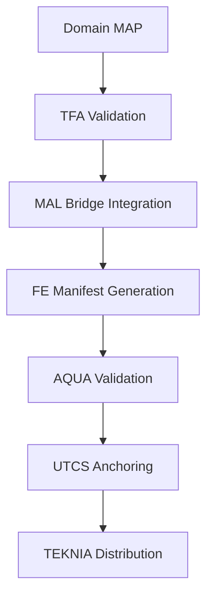

# WORKFLOWS — Gobernanza, Ciclo de Vida y Operación del Ecosistema

**Ubicación:** 0-STRATEGY/WORKFLOWS/README.md  
**Ámbito:** Programa y portfolio (AIR/SPACE/GROUND/DEFENSE/CROSS) bajo TFA, OPTIMO-DT y AQUA.  
**Relación:** ver 0-STRATEGY/MISSION.md, 7-GOVERNANCE/, docs/quantum-classical-bridge.md, services/aqua-webhook/README.md.

---

## 1) Principios rectores

- **Idempotencia y verificación**: toda acción se repite sin efectos colaterales si el estado deseado ya se alcanzó.
- **TFA-only**: estructura canónica por dominio y LLC (SI, DI, SE, CV… QS).
- **MAP/MAL**: un MAP por dominio; un MAL por capa bridge (CB/QB/UE/FE/FWD/QS) como servicio transversal.
- **OPTIMO-DT**: hilo digital único (Org → Proceso → Técnico → AI/Twin).
- **AQUA**: validación de manifiestos TFA, verificación FE (EIP-712), UTCS anchoring y TEKNIA payouts.

---

## 2) Roles y responsabilidades (RACI abreviado)

| Rol | Clave | Responsabilidades |
|-----|-------|-------------------|
| Steward de Dominio (MAP-*) | D-STEW | Backlog, arquitectura de dominio, gates G0–G3, conformidad TFA |
| Owner MAL- (CB/QB/…/QS)* | MAL-OWN | SLOs horizontales, APIs, seguridad, upgrades |
| FE Coordinator | FE-COORD | Orquestación cross-dominio, FE manifests y firmas |
| DevSecOps Lead | DSO | CI/CD, supply-chain, firma de artefactos, despliegues |
| Compliance & Cert. | COMP | PSAC/SDP/SVP/SCMP/SQAP, auditorías |
| Governance Board | GOV | Cambios semánticos LLC, tesorería TEKNIA, políticas UTCS |
| Security Officer (DEFENSE) | SEC | Clasificación, IR, hardening, particionado de datos |
| Data/ML Owner (IIS/CAI) | MLO | MLOps, dataset lineage, tarjetas de modelo |

---

## 3) Arquitectura de Workflow TFA V2

### 3.1) Estructura de Dominios
```
2-DOMAINS-LEVELS/
├── AAA-AERODYNAMICS-AND-AIRFRAMES-ARCHITECTURES/
├── AAP-AIRPORT-ADAPTABLE-PLATFORMS/
├── CCC-COCKPIT-CABIN-AND-CARGO/
├── CQH-CRYOGENICS-QUANTUM-AND-H2/
├── DDD-DIGITAL-AND-DATA-DEFENSE/
├── EDI-ELECTRONICS-DIGITAL-INSTRUMENTS/
├── EEE-ECOLOGICAL-EFFICIENT-ELECTRIFICATION/
├── EER-ENVIRONMENTAL-EMISSIONS-AND-REMEDIATION/
├── IIF-INDUSTRIAL-INFRASTRUCTURE-FACILITIES/
├── IIS-INTEGRATED-INTELLIGENCE-SOFTWARE/
├── LCC-LINKAGES-CONTROL-AND-COMMUNICATIONS/
├── LIB-LOGISTICS-INVENTORY-AND-BLOCKCHAIN/
├── MMM-MECHANICAL-AND-MATERIAL-MODULES/
├── OOO-OS-ONTOLOGIES-AND-OFFICE-INTERFACES/
└── PPP-PROPULSION-AND-FUEL-SYSTEMS/
```

### 3.2) Capas TFA Canónicas
- **TFA/SYSTEMS/**: SI (System Integration), DI (Domain Interface)
- **TFA/STATIONS/**: SE (Station Envelope), CV (Cross-Validation)
- **TFA/COMMUNICATIONS/**: CE (Communication Exchange), CC (Communication Control), CI (Communication Interface), CP (Communication Protocol)
- **TFA/BRIDGES/**: CB (Classical Bridge), QB (Quantum Bridge), UE (Unified Envelope), FE (Federation Entanglement), FWD (Forward Integration), QS (Quantum Services)

### 3.3) Flujo de Integración MAP-MAL



---

## 4) Ciclo de Vida del Desarrollo

### 4.1) Fases de Desarrollo
1. **G0**: Concepto inicial y asignación de dominio
2. **G1**: Scaffold TFA y definición de interfaces MAL
3. **G2**: Integración MAP↔MAL y pruebas de contrato
4. **G3**: Verificación y validación completa
5. **G4**: Preparación para producción y anchoring
6. **G5**: Release y operación continua

### 4.2) Flujo de Branches
```
main
├── develop
├── feature/<domain>-<short>
├── release/<YY.MM>
└── hotfix/<ticket>
```

### 4.3) Proceso de Pull Request
1. **Template Validation**: Verificación automática de plantilla PR
2. **TFA Structure Check**: Validación de estructura canónica
3. **License Compliance**: Verificación de licencias
4. **Security Scan**: Análisis de vulnerabilidades
5. **Integration Tests**: Pruebas de integración MAP-MAL
6. **AQUA Validation**: Validación de manifiestos FE

---

## 5) Integración OPTIMO-DT

### 5.1) Hilo Digital Único
```
Organization (O) → Process (P) → Technical (T) → Instruction (I) → Machine (M)
```

### 5.2) Artefactos Digitales
- **O-ORGANIZATION/**: Estructura organizacional y roles
- **P-PROCESS/**: Procesos y procedimientos
- **T-TECHNICAL/**: Especificaciones técnicas
- **I-INSTRUCTION/**: Instrucciones operativas
- **M-MACHINE-OPERATIONS/**: Operaciones de máquina y automatización

### 5.3) Trazabilidad
Cada artefacto debe mantener:
- **UTCS-MI ID**: Identificador único blockchain
- **Digital Thread**: Enlaces bidireccionales O↔P↔T↔I↔M
- **Version Control**: Control de versiones con firma digital
- **Audit Trail**: Registro completo de cambios

---

## 6) Integración AQUA

### 6.1) Validación de Manifiestos
- **Endpoint**: `/api/v1/manifests/validate`
- **Input**: TFA manifest JSON
- **Output**: Validation report + canonical hash

### 6.2) Verificación EIP-712
- **Signatures**: Verificación criptográfica de firmas
- **Message Types**: Tipos de mensaje estándar
- **Domain Separation**: Separación por dominio TFA

### 6.3) UTCS Anchoring
- **Testnet**: Validación en red de pruebas
- **Mainnet**: Anchoring en blockchain principal
- **TEKNIA Payouts**: Distribución automática de tokens

---

## 7) Seguridad y Compliance

### 7.1) Clasificación de Datos
- **PUBLIC**: Documentación pública y especificaciones abiertas
- **INTERNAL**: Diseños y procesos internos
- **CONFIDENTIAL**: Información sensible del proyecto
- **SECRET**: Datos clasificados (DEFENSE únicamente)

### 7.2) Supply Chain Security
- **SBOM Generation**: Software Bill of Materials automático
- **Dependency Scanning**: Análisis de dependencias
- **Container Signing**: Firma de contenedores e imágenes
- **Artifact Attestation**: Attestación de artefactos build

### 7.3) Auditoría y Certificación
- **PSAC**: Plan for Software Aspects of Certification
- **SDP**: Software Development Plan
- **SVP**: Software Verification Plan
- **SCMP**: Software Configuration Management Plan
- **SQAP**: Software Quality Assurance Plan

---

## 8) Observabilidad y Monitoring

### 8.1) Métricas de Sistema
- **Availability**: Disponibilidad de servicios MAL
- **Latency**: Latencia de respuesta API
- **Throughput**: Throughput de procesamiento
- **Error Rate**: Tasa de errores por servicio

### 8.2) Métricas de Desarrollo
- **Lead Time**: Tiempo desde commit hasta producción
- **Deployment Frequency**: Frecuencia de despliegues
- **Change Failure Rate**: Tasa de fallos en cambios
- **MTTR**: Mean Time To Recovery

### 8.3) Alerting
- **SEV-0**: Incidents críticos (< 15 min MTTD, < 1h MTTR)
- **SEV-1**: Incidents mayores (< 30 min MTTD, < 4h MTTR)
- **SEV-2**: Incidents menores (< 2h MTTD, < 24h MTTR)

---

## 9) Tablero de métricas (SLOs mínimos)

- **CI lead-time ≤ 20 min; éxito CI ≥ 90 %.**
- **MTTD/SEV-0 ≤ 15 min; MTTR/SEV-0 ≤ 1 h.**
- **Disponibilidad MAL-FE/FWD ≥ 99.5 %.**
- **Drift TFA = 0 (bloqueo de merge).**
- **Cobertura pruebas críticas ≥ 80 %.**

---

## 10) Estándares operativos

- **Naming ramas:** feature/&lt;domain&gt;-&lt;short&gt;, release/&lt;YY.MM&gt;, hotfix/&lt;ticket&gt;.
- **Convención PR:** plantilla con riesgos, gates, impacto TFA, check de licencias.
- **Semántica commits:** Conventional Commits + trailer TFA-DOMAIN:.

### 10.1) Commit Message Format
```
<type>(<scope>): <description>

<body>

<footer>
TFA-DOMAIN: <domain-code>
UTCS-MI: <utcs-identifier>
```

### 10.2) PR Template Checklist
- [ ] TFA structure validation passed
- [ ] Impact assessment completed
- [ ] Security review performed
- [ ] License compliance verified
- [ ] Documentation updated
- [ ] Tests added/updated
- [ ] Breaking changes documented

---

## 11) Checklists por Gate (resumen)

- **G1:** TFA scaffold, interfaces MAL, ADRs base, amenazas iniciales.
- **G2:** Integración MAP↔MAL, pruebas contrato, observabilidad mínima.
- **G3:** SVP/QA completos, evidencia reproducible, resultados de soak test.
- **G4:** Firmas + SBOM + anchor testnet, plan de roll-back, runbook MRO.
- **G5:** Post-mortem previa release N-1 cerrado, KPIs en verde, change freeze aplicado.

### 11.1) Gate G1 - Foundation
**Objetivo**: Establecer fundaciones arquitectónicas
- [ ] TFA directory structure created per domain
- [ ] MAL interface specifications defined
- [ ] Architecture Decision Records (ADRs) baseline
- [ ] Initial threat model documented
- [ ] Domain steward assigned

### 11.2) Gate G2 - Integration
**Objetivo**: Integración MAP-MAL funcional
- [ ] MAP-MAL integration implemented
- [ ] Contract tests passing
- [ ] Basic observability metrics
- [ ] API documentation complete
- [ ] Cross-domain communication verified

### 11.3) Gate G3 - Verification
**Objetivo**: Verificación y validación completa
- [ ] Software Verification Plan (SVP) complete
- [ ] Quality Assurance procedures implemented
- [ ] Reproducible evidence generated
- [ ] Soak test results documented
- [ ] Performance benchmarks met

### 11.4) Gate G4 - Production Ready
**Objetivo**: Preparación para producción
- [ ] Digital signatures implemented
- [ ] Software Bill of Materials (SBOM) generated
- [ ] UTCS testnet anchoring successful
- [ ] Rollback plan documented
- [ ] MRO (Maintenance, Repair, Operations) runbook ready

### 11.5) Gate G5 - Release
**Objetivo**: Release en producción
- [ ] Previous release N-1 post-mortem closed
- [ ] All KPIs in green status
- [ ] Change freeze policy applied
- [ ] Production monitoring active
- [ ] Incident response procedures tested

---

## 12) Anexos y enlaces internos

- **Misión:** [0-STRATEGY/MISSION.md](../MISSION.md)
- **Gobernanza:** [7-GOVERNANCE/](../../7-GOVERNANCE/)
- **Glosario/Recursos:** [8-RESOURCES/readme.md](../../8-RESOURCES/readme.md), [8-RESOURCES/llc-map.yaml](../../8-RESOURCES/llc-map.yaml)
- **AQUA:** [services/aqua-webhook/README.md](../../services/aqua-webhook/README.md)
- **Quantum Bridge:** [docs/quantum-classical-bridge.md](../../docs/quantum-classical-bridge.md)
- **PSAC/SDP/SVP/SCMP/SQAP:** [docs/PSAC/](../../docs/PSAC/) (y carpetas relacionadas)

### 12.1) Documentación Técnica
- **TFA Architecture**: [8-RESOURCES/TFA-ARCHITECTURE.md](../../8-RESOURCES/TFA-ARCHITECTURE.md)
- **LLC Mapping**: [8-RESOURCES/llc-map.yaml](../../8-RESOURCES/llc-map.yaml)
- **OPTIMO-DT Integration**: [3-PROJECTS-USE-CASES/OPTIMO-DT/README.md](../../3-PROJECTS-USE-CASES/OPTIMO-DT/README.md)

### 12.2) Servicios y APIs
- **AQUA Webhook**: [services/aqua-webhook/](../../services/aqua-webhook/)
- **AQUA OS Pro**: [services/aqua-os-pro/](../../services/aqua-os-pro/)
- **AQUA QS MVP**: [services/aqua-qs-mvp/](../../services/aqua-qs-mvp/)

### 12.3) Herramientas de Validación
- **TFA Validator**: [scripts/validate_tfa.py](../../scripts/validate_tfa.py)
- **UTCS Validator**: [6-UTCS-BLOCKCHAIN/validate_utcs_mi.py](../../6-UTCS-BLOCKCHAIN/validate_utcs_mi.py)
- **Integration Tests**: [scripts/test_integration.py](../../scripts/test_integration.py)

---

## Plantilla mínima de workflow (ejemplo)

```yaml
# .github/workflows/tfa_structure_validator.yml
name: TFA Structure Validator
on:
  pull_request:
    paths:
      - '2-DOMAINS-LEVELS/**'
      - '8-RESOURCES/**'
      - 'services/**'
jobs:
  validate:
    runs-on: ubuntu-latest
    steps:
      - uses: actions/checkout@v4
      - name: Setup Python
        uses: actions/setup-python@v5
        with:
          python-version: "3.11"
      - name: Install dependencies
        run: |
          python -m pip install --upgrade pip
          pip install pyyaml
      - name: Validate TFA structure
        run: python scripts/validate_tfa.py
      - name: Verify LLC mapping
        run: |
          if [ ! -f "8-RESOURCES/llc-map.yaml" ]; then
            echo "::error::Missing LLC mapping file"
            exit 1
          fi
      - name: AQUA webhook validation
        if: contains(github.event.pull_request.changed_files, 'services/')
        run: |
          curl -X POST "${AQUA_WEBHOOK_URL}/api/v1/manifests/validate" \
               -H "Content-Type: application/json" \
               -d @manifest.json
```

---

*Este documento establece el marco de gobernanza completo para el ecosistema TFA V2, integrando principios de idempotencia, arquitectura MAP-MAL, hilo digital OPTIMO-DT y validación AQUA para garantizar la excelencia operativa en el desarrollo de software aeroespacial.*