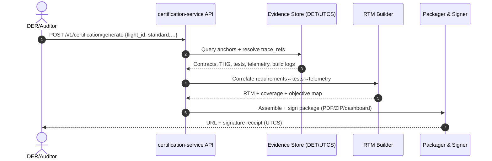

# Safety Automation: Compliance as Code & Certification as a Service

## 1. Executive Summary

The TFA (Trusted Federated Architecture) and AQUA OS platform are engineered to fundamentally redefine safety and compliance. We move beyond reactive, manual processes to a proactive, automated paradigm where safety is inherent and verifiable at every stage. This is achieved by implementing two transformative concepts:

1.  **Compliance as Code (CaC)**: Embedding regulatory and safety requirements directly into version-controlled, machine-executable specifications that are continuously validated.
2.  **Certification as a Service (CaaS)**: Automating the generation of a complete, auditable body of evidence, enabling on-demand certification for standards like DO-178C and ARP4754A.

This document details the architectural pillars that make this automation possible.

---

## 2. Compliance as Code: The Foundational Pillars

Compliance is transformed from a document-based checklist into a live, enforceable property of the system itself. This is built upon four core pillars:

### Pillar 1: Machine-Executable Contracts & Rules
Safety principles are codified into structured, testable artifacts, not just described in prose.

- **Implementation**:
    - **`mal.contract.json`**: Defines Design Assurance Level (DAL), latency budgets, and operational invariants for each service. Violations are automatically detectable.
    - **`thg.temporal.json`**: The Temporal Hazard Graph formalizes cause-effect relationships and hard deadlines. A missed `deadline_ms` is a directly testable safety event.
    - **`envelope.se.yaml`**: Encodes the verifiable safe operating boundaries for any station or environment. Operations outside this envelope are immediately flagged.
    - **`governance/policies/`**: Machine-readable governance rules (e.g., federation quorums) that are automatically enforced by the system.

### Pillar 2: Granular, Verifiable Traceability
Every artifact, from a line of code to a runtime event, is immutably linked to its source requirement and component.

- **Implementation**:
    - **Universal UTCS Identifiers**: Every entity (`CI`, `CE`, contract, anchor) possesses a unique `utcs_id`, creating an unbreakable digital thread from concept to operation.
    - **Structured Component Registry**: The `COMPONENTS/` hierarchy provides a verifiable map from a high-level function (`CC`) down to its specific hardware/firmware instantiation (`CI`) and vendor (`CV`).
    - **Deterministic Evidence Trace (DET) Anchors**: The `trace_refs` within each `DET-ANCHOR-*.json` file provide explicit, cryptographic links from runtime events back to the exact versioned specifications (`spec://`) and data (`telemetry://`) that governed them.

### Pillar 3: Continuous, Automated Validation
Compliance is verified at every stage of the development lifecycle, preventing non-compliant changes from progressing.

- **Implementation**:
    - **CI/CD Integration**: The `.github/workflows/validate-domains.yml` workflow acts as a gatekeeper for all changes.
    - **Automated Compliance Checks**: Smoke tests (`test_index_and_thg.py`, `test_contracts.py`) function as automated audits, validating structural and logical integrity.
    - **Schema Enforcement**: All JSON/YAML artifacts are validated against their schemas, ensuring syntactic and semantic correctness.
    - **Policy Enforcement**: Automated scripts (e.g., secret scanning) enforce foundational security and compliance policies on every commit.

### Pillar 4: Immutable, Tamper-Evident Evidence
The system autonomously generates a continuous, cryptographically secure audit trail that proves compliant operation.

- **Implementation**:
    - **Cryptographic Signing**: All DET Anchors are signed, providing non-repudiation and proof of origin.
    - **Content Addressing**: The `det_content_hash` guarantees the integrity of the event's data payload.
    - **Distributed Anchoring**: The `utcs-anchor` service's multi-signature workflow ensures that writing evidence to the blockchain is a controlled, auditable action, creating a permanent, tamper-proof record.

---

## 3. Certification as a Service (CaaS): The Automated Audit

The "Compliance as Code" foundation enables the ultimate automation: generating a certification package on demand. This turns a traditionally manual, high-effort, and error-prone process into a reliable, push-button service.

### The CaaS Workflow

1.  **Initiation**: An authorized user (e.g., a DER or auditor) submits a request to the `certification-service` via API or UI.
    - **Parameters**: `flight_id`, `component_utcs_id` (for granularity), `time_range`, `certification_standard` (e.g., "DO-178C_Level_A").

2.  **Evidence Aggregation**: The service queries the system's immutable evidence stores.
    - It collects all **DET Anchors** relevant to the request.
    - For each anchor, it resolves all `trace_refs` and `utcs_id`s to retrieve the exact versions of:
        - Requirements (`mal.contract.json`)
        - Design and Configuration Items (`CI/*.item.yaml`)
        - Test Cases and Results (`test_contracts.py`)
        - Safety Analysis Artifacts (`thg.temporal.json`)

3.  **Dynamic Report Generation**: The service compiles the evidence into a structured certification package.
    - **Automated Requirements Traceability Matrix (RTM)**: Generated by correlating DET-anchored events with their source requirements.
    - **Test Coverage Report**: Generated by analyzing telemetry-linked code execution against the test suite.
    - **Structural Compliance Summary**: A report on the pass/fail status of all CI/CD validation checks for the deployed software versions.
    - **Configuration Audit Log**: A complete bill of materials for all hardware and software components active during the operational period.

4.  **Delivery**: The final package is delivered as a signed, versioned artifact (e.g., PDF, ZIP, or interactive web dashboard), ready for regulatory submission.

### Example: CaaS API Request

```bash
curl -X POST "https://api.aqua.os/v1/certification/generate" \
  -H "Authorization: Bearer $AUTH_TOKEN" \
  -H "Content-Type: application/json" \
  -d '{
        "flight_id": "Q100-DEV-042",
        "standard": "DO-178C_Level_B",
        "components": ["utcs:ci:avionics:fnc:primary-flight-display:123456"],
        "time_range": {
          "start": "2023-10-26T10:00:00Z",
          "end": "2023-10-26T15:30:00Z"
        },
        "output_format": "pdf_interactive"
      }'
```

## 4. Conclusion: The Strategic Advantage

By implementing **Compliance as Code** and **Certification as a Service**, the TFA/AQUA OS platform delivers:

*   **Unprecedented Speed**: Reduce certification timelines from years to weeks or days.
*   **Radical Reduction in Cost**: Eliminate the immense manual labor traditionally associated with audit preparation.
*   **Highest Assurance of Safety**: Continuous validation creates a system that is *provably* compliant by construction, not just by periodic inspection.
*   **Business Agility**: New features and updates can be developed and certified with confidence and speed, unlocking innovation in traditionally stagnant domains.

This approach represents the necessary evolution for complex, safety-critical systems in the 21st century, transforming compliance from a bottleneck into a catalyst.

---

## 0) Document Control

* **UTCS–MI v5.0**: `utcs:cac:safety-automation:doc:CAA-0001:v1.0.0`
* **Lifecycle Level Context (LLC)**: CB (specs, CI), FE (governance quorum), QS (final signed package)
* **Standards in scope**: ARP4754A/4761, DO‑178C/330/331, DO‑254 (as applicable), DO‑326A/356A, DO‑200B, CS‑25, EASA Part‑21J DOA practices
* **Assurance target**: Level A–C (software), DAL‑A/B capable architecture with scalable partitions

---

## 1) Executive Summary

TFA · AQUA OS refactors safety and compliance from manual, retrospective paperwork into **live, enforceable properties** encoded in code, data, and governance. Two mechanisms power this:

1. **Compliance as Code (CaC)** — regulatory and safety rules are **machine‑executable** and **version‑controlled** (schemas, contracts, temporal hazards, operating envelopes, policies). CI/CD treats non‑compliance as a build failure.

2. **Certification as a Service (CaaS)** — the platform **assembles, signs, and delivers** a complete, auditable evidence package **on demand**, mapping artifacts to objectives in DO‑178C/ARP4754A, with immutable anchors (DET) and UTCS‑linked traceability.

Outcomes: shorter certification cycles, lower cost of assurance, higher confidence, and faster iteration without compromising safety.

---

## 2) Compliance as Code — Foundational Pillars

Compliance moves from static checklists to **active constraints** continuously verified across the lifecycle.

### Pillar 1 — Machine‑Executable Contracts & Rules

Safety principles are codified as **testable artifacts**:

* **`mal.contract.json`** — per function/service contract: DAL, latency budgets, resource ceilings, criticality, and **invariants**. A violated invariant is a testable safety event.
* **`thg.temporal.json`** — **Temporal Hazard Graph**: formalized cause→effect chains with deadlines, mandated mitigations, and required monitors.
* **`envelope.se.yaml`** — Station/Environment **operating envelopes**; crossing thresholds triggers declared mitigation or controlled stop.
* **`governance/policies/*.yaml`** — quorum and segregation rules for FE multi‑sig, key ceremonies, and deployment approvals.

**Example — `mal.contract.json` (excerpt)**

```json
{
  "utcs_id": "utcs:ci:avionics:fnc:primary-flight-display:000123:v2",
  "dal": "A",
  "partition": "ARINC653/PART1",
  "latency_budget_ms": 20,
  "wcet_ms": 8,
  "period_ms": 20,
  "criticality": "safety-critical",
  "inputs": [
    {"name": "irs_att", "utcs_id": "utcs:ce:irs:att:001"},
    {"name": "adc_airspeed", "utcs_id": "utcs:ce:adc:ias:007"}
  ],
  "outputs": [{"name": "pfd_symb", "utcs_id": "utcs:ci:pfd:bus:arinc429:tx"}],
  "invariants": [
    {
      "id": "INV-PFD-001",
      "kind": "temporal",
      "expr": "age(irs_att) < 80ms",
      "severity": "major",
      "rationale": "Prevent stale attitude rendering"
    },
    {
      "id": "INV-PFD-002",
      "kind": "range",
      "expr": "0 <= render_time_ms <= 10",
      "severity": "hazardous",
      "rationale": "Bound rendering latency within budget"
    }
  ]
}
```

**Example — `thg.temporal.json` (excerpt)**

```json
{
  "utcs_id": "utcs:thg:avionics:pfd:0001:v1",
  "nodes": [
    {"id": "H1", "hazard": "Loss of attitude display", "severity": "hazardous"},
    {"id": "C1", "cause": "IRS data stale > 80ms"},
    {"id": "M1", "mitigation": "Switch to standby attitude source"}
  ],
  "edges": [
    {"from": "C1", "to": "H1", "deadline_ms": 40},
    {"from": "H1", "to": "M1", "deadline_ms": 100}
  ],
  "monitors": [
    {"id": "MON-IRS-AGE", "signal": "age(irs_att)", "threshold_ms": 80}
  ],
  "responses": [
    {"trigger": "MON-IRS-AGE>80", "action": "failover('standby_att')", "max_reaction_ms": 40}
  ]
}
```

**Example — `envelope.se.yaml` (excerpt)**

```yaml
utcs_id: utcs:se:ironbird:avionics:e1:v3
name: IronBird Avionics Rig – Envelope E1
params:
  - key: cabin_temp_c
    min: 5
    max: 40
    sensor_ref: utcs:ce:env:temp:ib-01
  - key: supply_voltage_v
    min: 26
    max: 30
    sensor_ref: utcs:ce:psu:28v:ib-psu1
violations:
  - when: "supply_voltage_v < 26 or supply_voltage_v > 30"
    action: "hold-deployments && open-ticket('PSU-OVERVOLT') && freeze-cert-stream"
```

### Pillar 2 — Granular, Verifiable Traceability

* **UTCS identifiers** everywhere (CI/CE/CC/CV/SI/SE/…): 13‑field MI including domain, layer, role, version, and lifecycle event.
* **Component registry** (`COMPONENTS/` → `CC`→`CI`→`CV`) ensures **bidirectional** nav: requirement → implementation → vendor item → test → telemetry.
* **DET Anchors** bind runtime events and artifacts with cryptographic hashes and **trace\_refs** (`spec://`, `telemetry://`, `code://`, `test://`).

**Example — `DET-ANCHOR-2025-09-20T10_21_33Z.json` (excerpt)**

```json
{
  "anchor_id": "det:anchor:avionics:pfd:20250920T102133Z:001",
  "utcs_id": "utcs:ci:avionics:fnc:primary-flight-display:000123:v2",
  "event_time": "2025-09-20T10:21:33Z",
  "det_content_hash": "sha256:9c1d…",
  "trace_refs": [
    "spec://TFA/…/mal.contract.json@9a7e",
    "spec://TFA/…/thg.temporal.json@1b22",
    "telemetry://ops/flights/Q100-DEV-042/segment/0005.jsonl",
    "code://src/avionics/pfd/render.cpp@0f3a",
    "test://tests/test_contracts.py::test_pfd_latency"
  ],
  "signatures": {
    "multi_sig": [
      {"role": "SI", "signer": "utcs:key:si:buildbot", "sig": "eip712:…"},
      {"role": "DER", "signer": "utcs:key:der:avionics", "sig": "eip712:…"}
    ]
  }
}
```

### Pillar 3 — Continuous, Automated Validation

CI/CD rejects any change that breaks safety constraints.

* **Schema enforcement** for JSON/YAML (`jsonschema`, `yamllint`).
* **Automated audits** (`test_index_and_thg.py`, `test_contracts.py`) validate structure, deadlines, and invariant coverage.
* **Policy enforcement**: secret scanning, branch protection, FE quorum checks for releases.
* **Deterministic builds**: content addressing and lockfiles to ensure reproducibility.

**GitHub Action — `.github/workflows/validate-domains.yml` (excerpt)**

```yaml
name: Validate Domains
on:
  pull_request:
  push:
    branches: [ main ]
jobs:
  validate:
    runs-on: ubuntu-latest
    steps:
      - uses: actions/checkout@v4
      - uses: actions/setup-python@v5
        with: { python-version: '3.11' }
      - run: pip install -r requirements.txt -r requirements-dev.txt jsonschema yamllint pytest gitleaks
      - name: Lint UTCS structure
        run: python scripts/utcs_lint.py
      - name: Validate schemas
        run: python scripts/validate_schemas.py
      - name: Run compliance tests
        run: pytest -q
      - name: Secret scan
        run: gitleaks detect --no-banner --redact
      - name: Sign DET anchors (changed only)
        if: github.ref == 'refs/heads/main'
        run: python scripts/sign_det_anchors.py --changed
```

### Pillar 4 — Immutable, Tamper‑Evident Evidence

* **Cryptographic signing** (EIP‑712 style for FE multi‑sig) + **content addressing** for payload integrity.
* **Controlled anchoring** via `utcs-anchor` service: quorum, rate limits, and ledger proofs.
* **Provable lineage** from **spec** to **telemetry**, enforced by UTCS IDs and DET trace.

---

## 3) Certification as a Service (CaaS) — Automated Audit

The CaC substrate enables **push‑button certification packages** tailored by standard, component, and timeframe.

### 3.1 Workflow



### 3.2 API (OpenAPI 3.1 excerpt)

```yaml
openapi: 3.1.0
info: { title: AQUA · Certification Service, version: 1.0.0 }
paths:
  /v1/certification/generate:
    post:
      summary: Generate certification package
      requestBody:
        required: true
        content:
          application/json:
            schema:
              type: object
              properties:
                flight_id: { type: string }
                standard: { type: string, enum: [DO-178C_Level_A, DO-178C_Level_B, DO-178C_Level_C] }
                components: { type: array, items: { type: string } }
                time_range:
                  type: object
                  properties: { start: { type: string, format: date-time }, end: { type: string, format: date-time } }
                output_format: { type: string, enum: [pdf, pdf_interactive, zip, web] }
      responses:
        '202': { description: Accepted }
        '200': { description: Completed, content: { application/json: {} } }
  /v1/certification/status/{job_id}:
    get: { summary: Check status }
  /v1/certification/artifact/{job_id}:
    get: { summary: Download signed package }
```

**Example request**

```bash
curl -X POST "https://api.aqua.os/v1/certification/generate" \
 -H "Authorization: Bearer $AUTH_TOKEN" -H "Content-Type: application/json" \
 -d '{
   "flight_id": "Q100-DEV-042",
   "standard": "DO-178C_Level_B",
   "components": ["utcs:ci:avionics:fnc:primary-flight-display:123456"],
   "time_range": {"start": "2025-09-20T10:00:00Z", "end": "2025-09-20T15:30:00Z"},
   "output_format": "pdf_interactive"
 }'
```

### 3.3 Outputs

* **Automated RTM** — requirements ↔ design ↔ test ↔ telemetry ↔ objective mapping.
* **Coverage & Results** — code/test coverage (partition‑safe), pass/fail, temporal‑deadline pass rates.
* **Structural Compliance Summary** — CI/CD checks for the exact deployed versions.
* **Configuration Audit Log** — bill of materials (HW/SW), hashes, UTCS IDs, effectivity.
* **Signatures & Receipts** — FE multi‑sig record, anchor IDs, and ledger proof.

**Package layout (ZIP)**

```
CERT-PKG_Q100-DEV-042_LevelB_2025-09-20/
  00_MANIFEST.json
  01_RTM/rtm.csv
  02_OBJECTIVES/do178c_objective_map.csv
  03_TESTS/results.json
  04_COVERAGE/sw_partition_A/coverage.xml
  05_CONFIGURATION/bom.yaml
  06_EVIDENCE/anchors/*.json
  07_SIGNING/receipt.json
  99_APPENDICES/*
```

---

## 4) Standards Mapping (Objective‑to‑Artifact)

> Representative extract; the full matrix is generated programmatically in the RTM step.

| Standard Objective                               | Evidence Source            | CAC Artifact(s)                                   |
| ------------------------------------------------ | -------------------------- | ------------------------------------------------- |
| ARP4754A System Requirements defined & traceable | UTCS registry, RTM         | `mal.contract.json`, `COMPONENTS/*`, RTM CSV      |
| ARP4761 Safety Assessment (FHA/FTA/CCA)          | THG + analysis notes       | `thg.temporal.json`, monitors, responses          |
| DO‑178C A‑3 Plan for SW Aspects                  | Repo config + governance   | `governance/policies/*`, CI workflows, plans      |
| DO‑178C A‑5 High‑Level Reqs                      | Contracts + RTM            | `mal.contract.json` (invariants) + RTM            |
| DO‑178C A‑7 SW Design                            | Partition configs          | `partition.yaml`, interface stubs                 |
| DO‑178C A‑8 Code conforms to standards           | Linters/tests              | CI logs, style rules, static analysis reports     |
| DO‑178C A‑10 Verification of SW Outputs          | Tests + coverage           | `test_contracts.py`, coverage reports             |
| DO‑178C A‑11 Test Results                        | Test logs                  | `03_TESTS/results.json`                           |
| DO‑330 Tool Qualification (as applicable)        | TQL rationale              | `tool-qual/*.md`                                  |
| DO‑326A Security Process                         | Threat model + mitigations | `security/threat-model.md`, supply‑chain policies |
| DO‑200B Data Assurance                           | Data lineage               | DET anchors with telemetry trace\_refs            |

---

## 5) Tool Qualification Strategy (DO‑330)

* **Classification**:

  * *Verification tools* (linters, schema validators) → usually **TQL‑5/4** depending on process reliance.
  * *Development tools* (code generators, model compilers) → **TQL‑4/3** if output not fully re‑verified.
* **Artifacts**: Tool Operational Requirements (TOR), Tool Qualification Plan (TQP), Tool Accomplishment Summary (TAS).
* **Practice**: For each tool used in assurance claims, generate TOR/TQP/TAS stubs in `tool-qual/` and tie them into RTM.

---

## 6) Security‑by‑Design (DO‑326A/356A)

* **Threat model**: supply‑chain, key management, telemetry spoofing, build poisoning.
* **Countermeasures**: signed SBOMs, reproducible builds, FE multi‑sig for releases, runtime attestation, sensor plausibility checks.
* **Policy hooks**: `governance/policies/security.yaml` with **mandatory** checks gating deployment.

**Threat register (excerpt)**

```yaml
- id: T-001
  threat: Supply-chain injection via dependency
  control: sbom+sigstore+hash pin; offline cache; SLSA lvl>=3
- id: T-004
  threat: Telemetry spoofing
  control: signed sensor frames; cross-check via analytic redundancy; THG monitors
```

---

## 7) Runtime Monitors & Temporal Assurance

* **Monitors from THG** are deployed beside partitions (A653/BFMs) to watch deadlines and ranges.
* **Actions** are explicit and testable (failover, degrade mode, annunciation) with **max reaction times**.
* **Evidence**: Each violation or recovery emits a DET anchor with full trace.

**Monitor policy (pseudo‑DSL)**

```text
MON age(irs_att) < 80ms ELSE FAILOVER standby_att WITHIN 40ms
MON 0 <= render_time_ms <= 10 ELSE ANNUNCIATE PFD_LATENCY WITHIN 20ms
```

---

## 8) Governance & Federation Entanglement (FE)

* **Quorums**: Releases and anchor writes require FE quorum (e.g., `SI+QA`, or `DER+QA`).
* **EIP‑712 FE signature block (example with explicit placeholders)**:

<!-- The following JSON uses explicit placeholder values. Replace these with actual values in your implementation. -->
```json
{
  "domain": {
    "name": "AQUA-FE",
    "version": "1",
    "chainId": 777,
    "verifyingContract": "0x..."
  },
  "message": {
    "anchor_id": "REPLACE_WITH_ANCHOR_ID",
    "utcs_id": "utcs:det:anchor:example:001",
    "ts": "2025-09-20T10:21:33Z"
  },
  "primaryType": "Anchor",
  "types": {
    "Anchor": [
      {"name": "anchor_id", "type": "string"},
      {"name": "utcs_id", "type": "string"},
      {"name": "ts", "type": "string"}
    ]
  }
}
```

---

## 9) KPIs & Gates

* **MTE (Mean Time to Evidence)** — target < 5 min from event to signed anchor.
* **ECP (Evidence Coverage %)** — anchors covering ≥ 95% of safety‑relevant events.
* **ORR (Objective Ready Ratio)** — % of standard objectives with ready‑to‑submit evidence ≥ 90%.
* **CFR (Change Failure Rate)** — blocked by CI if ≥ threshold in rolling window.
* **TTC (Time‑to‑Certification)** — tracked per standard and release.

---

## 10) Roll‑Out Plan (Incremental)

1. **Baseline CaC**: land schemas, contracts, THG, envelopes; wire CI gates.
2. **DET Anchors**: enable signing + selective anchoring in pre‑prod ledger.
3. **RTM Generator**: correlate requirements↔tests↔telemetry; export CSV.
4. **CaaS Alpha**: zip package, internal review with DER.
5. **Tool‑Qual Hooks**: generate TOR/TQP/TAS stubs from CI; escalate TQL as needed.
6. **Security Hardening**: DO‑326A controls as CI policies.
7. **CaaS Beta**: web dashboard + PDF interactive; submit to authority sandbox.

---

## Appendix A — Minimal Schemas (extracts)

**`schemas/mal.contract.schema.json`**

```json
{
  "$schema": "https://json-schema.org/draft/2020-12/schema",
  "title": "MAL Contract",
  "type": "object",
  "required": ["utcs_id", "dal", "latency_budget_ms", "period_ms", "invariants"],
  "properties": {
    "utcs_id": {"type": "string"},
    "dal": {"type": "string", "enum": ["A","B","C","D","E"]},
    "partition": {"type": "string"},
    "latency_budget_ms": {"type": "number", "minimum": 0},
    "wcet_ms": {"type": "number", "minimum": 0},
    "period_ms": {"type": "number", "minimum": 0},
    "invariants": {
      "type": "array",
      "items": {
        "type": "object",
        "required": ["id","kind","expr"],
        "properties": {
          "id": {"type": "string"},
          "kind": {"type": "string", "enum": ["temporal","range","safety","security"]},
          "expr": {"type": "string"},
          "severity": {"type": "string"},
          "rationale": {"type": "string"}
        }
      }
    }
  }
}
```

**`schemas/thg.temporal.schema.json`**

```json
{
  "$schema": "https://json-schema.org/draft/2020-12/schema",
  "title": "Temporal Hazard Graph",
  "type": "object",
  "required": ["utcs_id","nodes","edges"],
  "properties": {
    "utcs_id": {"type": "string"},
    "nodes": {"type": "array", "items": {"type": "object"}},
    "edges": {"type": "array", "items": {"type": "object", "required": ["from","to","deadline_ms"]}},
    "monitors": {"type": "array"},
    "responses": {"type": "array"}
  }
}
```

**`schemas/det.anchor.schema.json`**

```json
{
  "$schema": "https://json-schema.org/draft/2020-12/schema",
  "title": "DET Anchor",
  "type": "object",
  "required": ["anchor_id","utcs_id","event_time","det_content_hash","trace_refs"],
  "properties": {
    "anchor_id": {"type": "string"},
    "utcs_id": {"type": "string"},
    "event_time": {"type": "string", "format": "date-time"},
    "det_content_hash": {"type": "string"},
    "trace_refs": {"type": "array", "items": {"type": "string"}},
    "signatures": {"type": "object"}
  }
}
```

**`schemas/envelope.se.schema.yaml`**

```yaml
$schema: https://json-schema.org/draft/2020-12/schema
$title: Station/Environment Envelope
required: [utcs_id, params]
type: object
properties:
  utcs_id: { type: string }
  name: { type: string }
  params:
    type: array
    items:
      type: object
      required: [key, min, max]
      properties:
        key: { type: string }
        min: { type: number }
        max: { type: number }
        sensor_ref: { type: string }
  violations:
    type: array
    items:
      type: object
      required: [when, action]
      properties:
        when: { type: string }
        action: { type: string }
```

---

## Appendix B — RTM Generation (pseudocode)

```python
# inputs: anchors, contracts, thg, tests, telemetry_index
rtm = []
for c in contracts:
    for inv in c.invariants:
        tests = find_tests_covering(inv.id)
        telem = find_telemetry_refs(inv.id)
        objs = map_to_do178c_objectives(inv)
        rtm.append({
            "requirement": inv.id,
            "contract": c.utcs_id,
            "tests": [t.id for t in tests],
            "telemetry": telem,
            "objectives": objs,
            "status": summarize_status(tests, telem)
        })
export_csv(rtm, "01_RTM/rtm.csv")
```

---

## Appendix C — Example FE Policy (quorum)

```yaml
name: release-quorum
applies_to: ["release", "anchor-write"]
quorums:
  release:
    require: ["role:SI", "role:QA"]
  anchor-write:
    require_any: [["role:DER", "role:QA"], ["role:SI", "role:DER"]]
separation_of_duties: true
```

---

### End of CAC · Safety Automation

