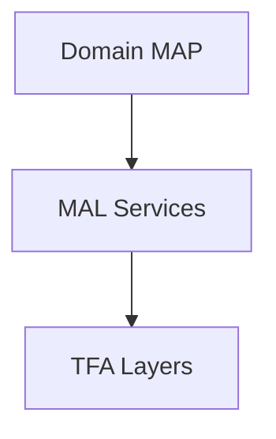

# TFA Diagrams

Sample Mermaid diagrams for embedding in TFA specifications and documentation.

## Available Diagrams

- `tfa-layer-stack.mmd` - Complete TFA layer architecture
- `quantum-classical-bridge.mmd` - QB/CB bridge patterns
- `map-mal-integration.mmd` - MAP and MAL service integration  
- `federation-topology.mmd` - Multi-org federation patterns

## Usage

Embed diagrams in specifications using:

```markdown

```

## Style Guidelines

- Use consistent color coding for layer types
- Follow TFA naming conventions
- Include legend for complex diagrams
- Keep diagrams focused and readable