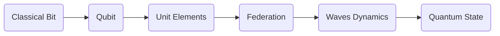

# TFA Architecture · V2

**Top Final Algorithm — canonical structure for multidomain aerospace programs**

**Status:** Stable · **Owners:** MAP-IIS / Governance
**Segments:** AIR · SPACE · GROUND · DEFENSE · CROSS
**Bridge Layers:** CB · QB · UE · FE · FWD · QS

> TFA is a **strict, testable folder+artifact architecture** that guarantees traceability from strategy → design → code → runtime → provenance across **15 domains** and the **Quantum–Classical Bridge**.

---

## 0) Quick Links

* **Bridge Overview:** `docs/quantum-classical-bridge.md`
* **PRO Spec (reference app):** `services/aqua-os-pro/AQUA-OS-PRO-SPEC.md`
* **Templates (all layers):** `8-RESOURCES/TEMPLATES/`
* **CI Workflows:** `.github/workflows/`
* **Domains Root:** `2-DOMAINS-LEVELS/`

---

## 1) Why TFA?

* **Deterministic structure** → every artifact has **one correct place**.
* **Program-scale reuse** → common Bridge services (MAL\*) shared by all MAPs.
* **CI-enforced** → PRs fail if structure, names, or layers drift.
* **Quantum-ready** → classical (CB) and quantum (QB) coexist with strict fallbacks.
* **Auditable** → states and evidence anchored via QS (+ optional UTCS).

---

## 2) Canonical Tree (per domain)

```
2-DOMAINS-LEVELS/<CODE>-<VERBATIM-NAME>/
└── TFA/
    ├── SYSTEMS/
    │   ├── SI/   # SYSTEM INTEGRATION
    │   └── DI/   # DOMAIN INTERFACE
    ├── STATIONS/
    │   └── SE/   # STATION ENVELOPE
    ├── COMPONENTS/
    │   ├── CV/   # COMPONENT VENDOR
    │   ├── CE/   # COMPONENT EQUIPMENT
    │   ├── CC/   # CONFIGURATION CELL
    │   ├── CI/   # CONFIGURATION ITEM
    │   └── CP/   # COMPONENT PART
    ├── BITS/
    │   └── CB/   # CLASSICAL BIT
    ├── QUBITS/
    │   └── QB/   # QUBIT
    ├── ELEMENTS/
    │   ├── UE/   # UNIT ELEMENT
    │   └── FE/   # FEDERATION ENTANGLEMENT
    ├── WAVES/
    │   └── FWD/  # Future/Waves Dynamics
    ├── STATES/
    │   └── QS/   # QUANTUM STATE
    └── META/
        └── README.md
```

**Strictness:** No files outside these buckets for domain work. CI rejects “flat” LLC folders.

---

## 3) Codes & Meanings (LLC)

| Code           | Meaning                 | Group      | Typical Content                        |
| -------------- | ----------------------- | ---------- | -------------------------------------- |
| SI             | System Integration      | SYSTEMS    | orchestration, cross-domain glue       |
| DI             | Domain Interface        | SYSTEMS    | schemas, APIs, adapters                |
| SE             | Station Envelope        | STATIONS   | physical/operational bounds, resources |
| CV/CE/CC/CI/CP | Components              | COMPONENTS | vendor/equipment/cell/item/part        |
| CB             | Classical Bit           | BITS       | deterministic algorithms/solvers       |
| QB             | Qubit                   | QUBITS     | quantum strategies, provider adapters  |
| UE             | Unit Element            | ELEMENTS   | types, units, primitives               |
| FE             | Federation Entanglement | ELEMENTS   | multi-asset coordination, policy       |
| FWD            | Waves Dynamics          | WAVES      | nowcasts, short-horizon prediction     |
| QS             | Quantum State           | STATES     | provenance, evidence, anchoring        |

**Terminology guard:** “Fine~~Element”, “Station~~Envelop” and other deprecated forms are rejected by CI.

---

## 4) Domain Set (15)

AAA · AAP · CCC · CQH · DDD · EDI · EEE · EER · IIF · IIS · LCC · LIB · MMM · OOO · PPP
(Names are **verbatim** under `2-DOMAINS-LEVELS/`.)

---

## 5) MAP / MAL Pattern

* **MAP** (Master Application Program) — **one per domain** (e.g., MAP-AAA). Hosts domain logic, owns SYSTEMS/COMPONENTS/SE artifacts.
* **MAL** (Main Application Layer) — **one per Bridge layer** across repo:

  * **MAL-CB** classical compute
  * **MAL-QB** quantum strategies (QAOA/VQE/annealing) with deadlines and fallbacks
  * **MAL-UE** units & safe primitives
  * **MAL-FE** federation scheduling/coalition policy
  * **MAL-FWD** nowcast/prediction services
  * **MAL-QS** state/provenance (+ UTCS anchor)

All MAPs **consume** MAL services; MALs remain **horizontally reusable**.

---

## 6) Quantum–Classical Bridge (flow)



* **Rule:** every QB path must define a **CB fallback** and a **deadline**.
* **QS** carries signatures, inputs, and evidence bundle; UTCS anchoring is optional but recommended for regulated programs.

See: `docs/quantum-classical-bridge.md`

---

## 7) UTCS IDs & Naming

* **Requirement ID:** `AAA/SI/REQ-0101`

  * domain/code: `AAA`, layer: `SI`, type: `REQ`, serial: `0101`
* **Artifacts** co-name with UTCS ID in headings or front-matter.
* **Filenames**: `AQUA-OS-PRO-SPEC.md`, `aqua_pro_implementation.py`, `specification.template.yaml` etc.
* **Hyphen-UPPER** for domain folder; **SCREAMING\_SNAKE** discouraged in files unless code requires.

---

## 8) Segments & Coverage

* **AIR**: aircraft, aero-ops (e.g., AMPEL360 BWB-Q100)
* **SPACE**: constellation, quantum links (e.g., GAIA Quantum SAT)
* **GROUND**: infrastructure, MRO robotics (Diagnostics & MRO Robbbo-t)
* **DEFENSE**: C2 overlays, ROE, two-man rule, mission assurance
* **CROSS**: inter-sector orchestration (air/road/port/grid/H2 corridors)

**TFA fits all five**: MAPs supply segment context; MALs remain shared.

---

## 9) Templates & Scaffolding

* **Source:** `8-RESOURCES/TEMPLATES/` (layer, CAx, and domain packs)
* **Scaffold (idempotent):**

```bash
make scaffold
```

* **Validate:**

```bash
make check
```

---

## 10) CI Rules (must pass)

* **Structure validator**: domain trees, groups, LLC codes present.
* **Bridge check**: CB/QB/UE/FE/FWD/QS present where required; terminology guard.
* **Link & quality**: no dead refs; linted docs.
* **UTCS anchor (optional)**: hashes/logs anchored when enabled.

Workflows under `.github/workflows/`.

---

## 11) Authoring Guidelines

* Put **system glue** in `SYSTEMS/SI`; **APIs/schemas** in `SYSTEMS/DI`.
* Keep **quantum provider code** in `QUBITS/QB`; **classical solvers** in `BITS/CB`.
* All **predictions/nowcasts** in `WAVES/FWD` with explicit horizons.
* **Fleet/coalition logic** in `ELEMENTS/FE` (policy separated from code).
* **States & evidence** in `STATES/QS`; do not mix with runtime caches.
* Use **UE** for units, conversions, and safety primitives repo-wide.

---

## 12) Program Use-Case Examples (stitched by TFA)

### AMPEL360 BWB-Q100 (AIR)

* MAPs: AAA, PPP, EDI, LCC, IIS (+ EEE/EER)
* Flow: CAD/CAE → OPTIMO-DT DT → PRO (CB→QB) → FE deconfliction → QS certification

### GAIA Quantum SAT (SPACE)

* MAPs: LCC, CQH, EDI, LIB, IIS
* Flow: mission/network design → QB scheduling + FWD space weather → QS mission ledger

### Diagnostics & MRO Robbbo-t (GROUND)

* MAPs: MMM, EDI, IIS, LIB
* Flow: alerts → triage → robotic action (UE-safe) → QS maintenance ledger

### ARES-X UAS Swarm (DEFENSE)

* FE with C2/ROE → QB combinatorics under deadline → QS mission assurance

### H2-CORRIDOR-X (CROSS)

* FE across air/road/port/grid, FWD energy flows, optional UTCS anchors

---

## 13) Compliance & Safety

* **Standards:** S1000D exports; MBSE alignment; DO-178C/DO-254 traceability hosted in TFA.
* **Security:** Zero-trust MALs (mTLS, signed envelopes, RBAC/ABAC).
* **Defense overlays:** ROE policies, **two-man rule** for high-impact actions.

---

## 14) Checklists

**PR Checklist**

* [ ] Files placed under correct `TFA/<GROUP>/<LLC>/`
* [ ] UTCS IDs present in specs/tests
* [ ] CB fallback + deadline for any QB path
* [ ] QS evidence bundle updated (+ UTCS if enabled)
* [ ] CI structure + bridge + links pass

**Release Checklist**

* [ ] Segment coverage declared
* [ ] Performance targets documented (P50/P95)
* [ ] Federation policies versioned
* [ ] Templates synced with `8-RESOURCES/TEMPLATES/`

---

## 15) FAQ

* **Can I add a new group?** Use `META/` for domain readmes. New groups require governance approval + CI update.
* **Where do dashboards live?** Outside domains (services/ui), but must reference QS/UTCS for provenance.
* **Can I bypass CB?** No. QB **must** have a deterministic CB fallback with deadlines.

---

## 16) Glossary

* **TFA**: Top Final Algorithm (repo-wide structure)
* **MAP/MAL**: Master App Program / Main App Layer (Bridge service)
* **Bridge**: CB/QB/UE/FE/FWD/QS stack
* **UTCS**: Universal Token Classification System (anchoring)
* **OPTIMO-DT**: Digital Thread backbone (Org→Process→Technical→AI)

---

## 17) See Also

* `docs/quantum-classical-bridge.md`
* `services/aqua-os-pro/AQUA-OS-PRO-SPEC.md`
* `8-RESOURCES/TEMPLATES/`
* `.github/workflows/`

---
