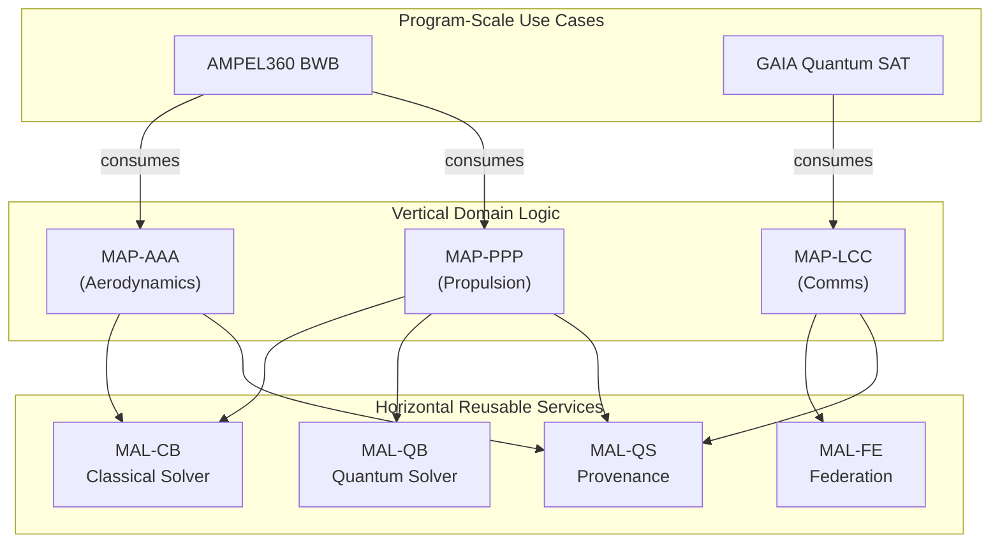

# Robbbo-T — ASI-T (Aerospace Super-Intelligence Transformers)

**Repository Slug:** `robbbo-t-asi-t-transition`
**Vision:** Aerospace Super-Intelligence Transformers enabling a Sustainable Industry Transition (ASI-T).

This repository contains the full-stack platform and engineering portfolio for the ASI-T initiative, organized under a strict TFA architecture with a quantum-classical bridge.

## Audience baselines

* Developers & SRE → `portfolio/platform/`
* Domain Experts → `portfolio/2-DOMAINS-LEVELS/` and `portfolio/1-CAX-METHODOLOGY/`
* Governance/Auditors → `portfolio/0-STRATEGY/` and `portfolio/7-GOVERNANCE/`

## Quickstart

```bash
make print-vars
make validate
```

---

## 1. 🚀 What This Is

This repository is the canonical map of **Amedeo Pelliccia's** professional portfolio. It is not just a collection of projects; it is a fully integrated **host platform** for developing, certifying, and operating complex aerospace programs. It unifies **15 engineering domains** under a strict **Top Final Algorithm (TFA)** architecture, features a production-ready **quantum–classical bridge**, and delivers **templates, validators, services, and CI/CD pipelines** that ensure deterministic, auditable, and drift-free development.

---

## 2. 🏗️ Architecture at a Glance

A modular, service-oriented architecture designed for safety, traceability, and scalability.

### 2.1 TFA Layers

Every domain follows deterministic traceability. See [**\_LLC-HIERARCHY.md**](./portfolio/2-DOMAINS-LEVELS/_LLC-HIERARCHY.md).

| Code                       | Meaning                   | Group      | Core Function                                   |
| -------------------------- | ------------------------- | ---------- | ----------------------------------------------- |
| **SI / DI**                | System / Domain Interface | SYSTEMS    | Orchestration, API contracts, domain boundaries |
| **SE**                     | Station Envelope          | STATIONS   | Safe operating limits for environments          |
| **CV / CE / CC / CI / CP** | Component Hierarchy       | COMPONENTS | Digital thread for HW/SW configuration          |
| **CB**                     | Classical Bit             | BITS       | Deterministic classical computation & solvers   |
| **QB**                     | Qubit                     | QUBITS     | Quantum algorithms (QUBO/Ising) & strategies    |
| **UE**                     | Unit Element              | ELEMENTS   | Reusable atomic functions (drivers, utilities)  |
| **FE**                     | Federation Entanglement   | ELEMENTS   | Governed multi-agent/multi-domain coordination  |
| **FWD**                    | Forward/Waves Dynamics    | WAVES      | Predictive modeling, simulation, nowcasting     |
| **QS**                     | Quantum State             | STATES     | Immutable, signed evidence and state provenance |

### 2.2 Quantum–Classical Bridge

Structured hybrid flow: **CB → QB → UE/FE → FWD → QS**.
See the [**Quantum–Classical Bridge documentation**](./docs/architecture/quantum-classical-bridge.md).

### 2.3 MAP/MAL (Master Application Program / Main Application Layer)

This pattern separates domain-specific business logic from reusable, cross-cutting services.

* **MAP (Vertical)**: Each domain's **master program** with a stable API (e.g., `MAP-AAA` for aero analysis).

  * **MAP process:** Crosswalk from **TFA domain** → **ATA/SNS chapters** → **regulatory annexes** (e.g., ICAO Annex 16). Outputs resolvable references (ReqIF/S1000D/ARINC) with CI-checked acceptance criteria.
* **MAL (Horizontal)**: Reusable **bridge services** (e.g., `MAL-CB` classical solver, `MAL-QS` provenance).

  * **CAx → LLC bridge:** Lifecycle artifacts (CAB…CAV) anchored to TFA layer codes (SI/DI, SE, CV…QS).
  * **gICD triad (ICN / PBS / IBS)**: The **General ICD** package.

    * **ICN** — Interface Control Network (logical/physical interfaces, constraints)
    * **PBS** — Product Breakdown Structure (configuration/product tree)
    * **IBS** — **Illustrated Breakdown** (exploded/illustrated views, callouts/tables for tech pubs & MRO)



## 3. 🎛️ Domains (15) & Structure

Browse all domains under [`portfolio/2-DOMAINS-LEVELS/`](./portfolio/2-DOMAINS-LEVELS/).

### Domains → TFA (Safe: fix titles, keep current paths)

| Code | Domain Name & Link to TFA Structure                                                                                                       |
| :--- | :---------------------------------------------------------------------------------------------------------------------------------------- |
| AAA  | [AERODYNAMICS-AND-AIRFRAMES-ARCHITECTURES](./portfolio/2-DOMAINS-LEVELS/AAA-AERODYNAMICS-AND-AIRFRAMES-ARCHITECTURES/TFA/)               |
| AAP  | [AIRPORTS-PLATFORMS-AND-HYDROGEN-ENABLERS](./portfolio/2-DOMAINS-LEVELS/AAP-AIRPORTS-PLATFORMS-AND-HYDROGEN-ENABLERS/TFA/)               |
| CCC  | [COCKPIT-CABIN-AND-CARGO](./portfolio/2-DOMAINS-LEVELS/CCC-COCKPIT-CABIN-AND-CARGO/TFA/)                                                 |
| CQH  | [CRYOGENICS-QUANTUM-AND-H2](./portfolio/2-DOMAINS-LEVELS/CQH-CRYOGENICS-QUANTUM-AND-H2/TFA/)                                             |
| DDD  | [DIGITAL-AND-DATA-DEFENSE](./portfolio/2-DOMAINS-LEVELS/DDD-DIGITAL-AND-DATA-DEFENSE/TFA/)                                               |
| EDI  | [ELECTRONICS-AND-DIGITAL-INSTRUMENTS](./portfolio/2-DOMAINS-LEVELS/EDI-ELECTRONICS-DIGITAL-INSTRUMENTS/TFA/)                             |
| EEE  | [ECOLOGY-EFFICIENCY-AND-ELECTRIFICATION](./portfolio/2-DOMAINS-LEVELS/EEE-ECOLOGICAL-EFFICIENT-ELECTRIFICATION/TFA/)                     |
| EER  | [ENVIRONMENTAL-EMISSIONS-AND-REMEDIATION](./portfolio/2-DOMAINS-LEVELS/EER-ENVIRONMENTAL-EMISSIONS-AND-REMEDIATION/TFA/)                 |
| IIF  | [INDUSTRIAL-INFRASTRUCTURE-AND-FACILITIES](./portfolio/2-DOMAINS-LEVELS/IIF-INDUSTRIAL-INFRASTRUCTURE-AND-FACILITIES/TFA/)               |
| IIS  | [INTEGRATED-INTELLIGENCE-AND-SOFTWARE](./portfolio/2-DOMAINS-LEVELS/IIS-INTEGRATED-INTELLIGENCE-AND-SOFTWARE/TFA/)                       |
| LCC  | [LINKAGES-CONTROL-AND-COMMUNICATIONS](./portfolio/2-DOMAINS-LEVELS/LCC-LINKAGES-CONTROL-AND-COMMUNICATIONS/TFA/)                         |
| LIB  | [LOGISTICS-INVENTORY-AND-BLOCKCHAIN](./portfolio/2-DOMAINS-LEVELS/LIB-LOGISTICS-INVENTORY-AND-BLOCKCHAIN/TFA/)                           |
| MMM  | [MECHANICS-MATERIALS-AND-MANUFACTURING](./portfolio/2-DOMAINS-LEVELS/MMM-MECHANICS-MATERIALS-AND-MANUFACTURING/TFA/)                     |
| OOO  | [OS-ONTOLOGIES-AND-OFFICE-INTERFACES](./portfolio/2-DOMAINS-LEVELS/OOO-OS-ONTOLOGIES-AND-OFFICE-INTERFACES/TFA/)                         |
| PPP  | [PROPULSION-AND-FUEL-SYSTEMS](./portfolio/2-DOMAINS-LEVELS/PPP-PROPULSION-AND-FUEL-SYSTEMS/TFA/)                                         |


---

### B) Canonical (unify titles and paths)

| Code | Canonical Name & Path                           |
| :--- | :---------------------------------------------- |
| AAA  | `AAA-AERODYNAMICS-AND-AIRFRAMES-ARCHITECTURES/` |
| AAP  | `AAP-AIRPORTS-PLATFORMS-AND-HYDROGEN-ENABLERS/` |
| CCC  | `CCC-COCKPIT-CABIN-AND-CARGO/`                  |
| CQH  | `CQH-CRYOGENICS-QUANTUM-AND-H2/`                |
| DDD  | `DDD-DIGITAL-AND-DATA-DEFENSE/`                 |
| EDI  | `EDI-ELECTRONICS-AND-DIGITAL-INSTRUMENTS/`      |
| EEE  | `EEE-ECOLOGY-EFFICIENCY-AND-ELECTRIFICATION/`   |
| EER  | `EER-ENVIRONMENTAL-EMISSIONS-AND-REMEDIATION/`  |
| IIF  | `IIF-INDUSTRIAL-INFRASTRUCTURE-AND-FACILITIES/` |
| IIS  | `IIS-INTEGRATED-INTELLIGENCE-AND-SOFTWARE/`     |
| LCC  | `LCC-LINKAGES-CONTROL-AND-COMMUNICATIONS/`      |
| LIB  | `LIB-LOGISTICS-INVENTORY-AND-BLOCKCHAIN/`       |
| MMM  | `MMM-MECHANICS-MATERIALS-AND-MANUFACTURING/`    |
| OOO  | `OOO-OS-ONTOLOGIES-AND-OFFICE-INTERFACES/`      |
| PPP  | `PPP-PROPULSION-AND-FUEL-SYSTEMS/`              |

---

# gATA · Integration Map across ASI-T Domains

## Domains → Sustainability Focus

| Code | Domain Focus (gATA)                                        |
| :--- | :--------------------------------------------------------- |
| AAA  | Lightweight, recyclable airframe materials                 |
| AAP  | Green ground support and hydrogen refueling infrastructure |
| CCC  | Eco-friendly cabin systems and waste management            |
| CQH  | Hydrogen fuel systems and quantum optimization             |
| DDD  | Sustainable data governance and integrity                  |
| EDI  | Energy-efficient avionics and sensors                      |
| EEE  | All-electric aircraft systems                              |
| EER  | Environmental compliance and emissions reduction           |
| IIF  | Sustainable manufacturing and facilities                   |
| IIS  | AI-optimized eco-operations                                |
| LCC  | Green flight operations and communications                 |
| LIB  | Sustainable supply chain management                        |
| MMM  | Efficient mechanical systems                               |
| OOO  | Green governance and semantic frameworks                   |
| PPP  | Clean propulsion technologies                              |

### ATA Chapter Extensions (gATA Alignment)

* **ATA 70–79 (Propulsion)** → Hybrid-electric, hydrogen, and SAF integrations
* **ATA 50–59 (Structures)** → Lightweight materials, circularity, recyclability
* **ATA 20–49 (Systems)** → Energy efficiency, environmental monitoring, eco-modes
* **ICAO Annex 16 (Environmental Protection)** → Full compliance on noise, emissions, CO₂

---

## 4. 🌐 AQUA-OS Applications

* **Predictive Route Optimizer (PRO)** — *Implemented*
  **Function:** Optimizes flight paths in a 10-minute loop using live meteorology, aircraft performance, and hybrid QB/CB solvers.
  **Links:** [`Service Root`](./services/aqua-os-pro/) · [`API Schema`](./services/aqua-os-pro/schemas/route_optimization.json) · [`Orchestrator`](./services/aqua-os-pro/core/aqua_pro_orchestrator.py) · [`Validator`](./services/aqua-os-pro/validation/aqua_pro_validator.py)

* **UTCS Anchor Service** — *Implemented*
  **Function:** Manages the "CI-prepares / multisig-approves" workflow for anchoring DET evidence to a blockchain.
  **Links:** [`Smart Contracts`](./contracts/) · [`Framework Doc`](./6-UTCS-BLOCKCHAIN/utcs-blockchain-framework.md) · [`CI Workflow`](./.github/workflows/anchor_utcs.yml)

* **CaaS (Certification as a Service) Engine** — *Planned*
  **Function:** Assembles auditable evidence packages (e.g., DO-178C) by tracing UTCS links from requirements to telemetry.
  **Links:** [`Methodology`](portfolio/1-CAX-METHODOLOGY/CAC-COMPLIANCE-SAFETY-CODE/safety-automation.md)

---

## 5. 🚀 Program-Scale Use Cases

* **AMPEL360 BWB-Q100** — Advanced Blended Wing Body (AIR) · [`OPTIMO-DT`](./3-PROJECTS-USE-CASES/OPTIMO-DT/)
* **GAIA Quantum SAT** — Space constellation with quantum links (SPACE)
* **Diagnostics & MRO Robbbo-t** — Robotic maintenance (GROUND)
* **ARES-X UAS SWARM** — Defense segment (DEFENSE)
* **H2-CORRIDOR-X** — Cross-sector hydrogen corridor (CROSS)

---

## 6. 🧠 Why This Is a Host Platform for New Programs

* **Deterministic Structure:** Uniform [`TFA/` trees](./portfolio/2-DOMAINS-LEVELS/) across 15 domains
* **Hybrid Compute Built-in:** CB/QB for optimization; FE for coordination; FWD for nowcasts; QS for audit-grade states
* **Digital Thread:** [OPTIMO-DT](./3-PROJECTS-USE-CASES/OPTIMO-DT/) across AIR / SPACE / GROUND / DEFENSE / CROSS
* **Compliance-as-Code:** CI enforcement of structure and lexicon
* **Immutable Provenance:** Optional **UTCS** anchoring
* **Rapid Composition:** MAP/MAL pattern for program assembly
* **Ecosystem Scalability:** Shared contracts in [`schemas/`](./schemas/)

---

## 7. 📂 Repo Structure

* [`0-STRATEGY/`](./portfolio/0-STRATEGY/) — Strategy, governance, mission & vision
* [`1-CAX-METHODOLOGY/`](./portfolio/1-CAX-METHODOLOGY/) — CAx lifecycle (CAB…CAV)
* [`2-DOMAINS-LEVELS/`](./portfolio/2-DOMAINS-LEVELS/) — 15 engineering domains with strict `TFA/` trees; **MAP** (TFA→ATA/SNS/reg annex) and **MAL** bridges (CAx→LLC + gICD)
* [`3-PROJECTS-USE-CASES/`](./3-PROJECTS-USE-CASES/) — Program implementations and demos
* [`4-RESEARCH-DEVELOPMENT/`](./4-RESEARCH-DEVELOPMENT/) — R&D and experiments
* [`5-ARTIFACTS-IMPLEMENTATION/`](./5-ARTIFACTS-IMPLEMENTATION/) — Language-specific code buckets
* [`6-UTCS-BLOCKCHAIN/`](./6-UTCS-BLOCKCHAIN/) — UTCS integration, contracts, services
* [`7-GOVERNANCE/`](./portfolio/7-GOVERNANCE/) — Governance policies and community processes
* [`8-RESOURCES/`](./8-RESOURCES/) — Templates, assets, references
* [`services/`](./services/) — Deployed AQUA-OS microservices
* [`docs/`](./docs/) — High-level architecture and methodology documentation

### 7.1 📚 Docs Structure

> Canonical layout of [`docs/`](./docs/) for architecture, bridges, and standards crosswalks. All files are Markdown unless noted.

```text
docs/
├── index.md                          # Landing page (overview + pointers)
├── architecture/
│   ├── tfa-overview.md               # TFA layers, roles, invariants
│   ├── quantum-classical-bridge.md   # CB→QB→UE/FE→FWD→QS (detail & patterns)
│   ├── map-mal-pattern.md            # MAP (vertical) / MAL (horizontal) pattern
│   └── reference-models.md           # Reference stacks, deployment topologies
├── domains/
│   ├── domains-index.md              # 15-domain index with short blurbs
Here’s the **conflict-free, path-consistent** README block. I normalized everything to the `portfolio/` namespace (as per your Audience baselines), fixed the AAP/MMM links, and removed the merge markers.

---

# Robbbo-T — ASI-T (Aerospace Super-Intelligence Transformers)

**Repository Slug:** `robbbo-t-asi-t-transition`
**Vision:** Aerospace Super-Intelligence Transformers enabling a Sustainable Industry Transition (ASI-T).

This repository contains the full-stack platform and engineering portfolio for the ASI-T initiative, organized under a strict TFA architecture with a quantum-classical bridge.

## Audience baselines

* Developers & SRE → `portfolio/platform/`
* Domain Experts → `portfolio/2-DOMAINS-LEVELS/` and `portfolio/1-CAX-METHODOLOGY/`
* Governance/Auditors → `portfolio/0-STRATEGY/` and `portfolio/7-GOVERNANCE/`

## Quickstart

```bash
make print-vars
make validate
```

---

## 1. 🚀 What This Is

This repository is the canonical map of **Amedeo Pelliccia's** professional portfolio. It is not just a collection of projects; it is a fully integrated **host platform** for developing, certifying, and operating complex aerospace programs. It unifies **15 engineering domains** under a strict **Top Final Algorithm (TFA)** architecture, features a production-ready **quantum–classical bridge**, and delivers **templates, validators, services, and CI/CD pipelines** that ensure deterministic, auditable, and drift-free development.

---

## 2. 🏗️ Architecture at a Glance

A modular, service-oriented architecture designed for safety, traceability, and scalability.

### 2.1 TFA Layers

Every domain follows deterministic traceability. See [**\_LLC-HIERARCHY.md**](./portfolio/2-DOMAINS-LEVELS/_LLC-HIERARCHY.md).

| Code                       | Meaning                   | Group      | Core Function                                   |
| -------------------------- | ------------------------- | ---------- | ----------------------------------------------- |
| **SI / DI**                | System / Domain Interface | SYSTEMS    | Orchestration, API contracts, domain boundaries |
| **SE**                     | Station Envelope          | STATIONS   | Safe operating limits for environments          |
| **CV / CE / CC / CI / CP** | Component Hierarchy       | COMPONENTS | Digital thread for HW/SW configuration          |
| **CB**                     | Classical Bit             | BITS       | Deterministic classical computation & solvers   |
| **QB**                     | Qubit                     | QUBITS     | Quantum algorithms (QUBO/Ising) & strategies    |
| **UE**                     | Unit Element              | ELEMENTS   | Reusable atomic functions (drivers, utilities)  |
| **FE**                     | Federation Entanglement   | ELEMENTS   | Governed multi-agent/multi-domain coordination  |
| **FWD**                    | Forward/Waves Dynamics    | WAVES      | Predictive modeling, simulation, nowcasting     |
| **QS**                     | Quantum State             | STATES     | Immutable, signed evidence and state provenance |

### 2.2 Quantum–Classical Bridge

Structured hybrid flow: **CB → QB → UE/FE → FWD → QS**.
See the [**Quantum–Classical Bridge documentation**](./docs/architecture/quantum-classical-bridge.md).

### 2.3 MAP/MAL (Master Application Program / Main Application Layer)

This pattern separates domain-specific business logic from reusable, cross-cutting services.

* **MAP (Vertical)**: Each domain's **master program** with a stable API (e.g., `MAP-AAA` for aero analysis).

  * **MAP process:** Crosswalk from **TFA domain** → **ATA/SNS chapters** → **regulatory annexes** (e.g., ICAO Annex 16). Outputs resolvable references (ReqIF/S1000D/ARINC) with CI-checked acceptance criteria.
* **MAL (Horizontal)**: Reusable **bridge services** (e.g., `MAL-CB` classical solver, `MAL-QS` provenance).

  * **CAx → LLC bridge:** Lifecycle artifacts (CAB…CAV) anchored to TFA layer codes (SI/DI, SE, CV…QS).
  * **gICD triad (ICN / PBS / IBS)**: The **General ICD** package.

    * **ICN** — Interface Control Network (logical/physical interfaces, constraints)
    * **PBS** — Product Breakdown Structure (configuration/product tree)
    * **IBS** — **Illustrated Breakdown** (exploded/illustrated views, callouts/tables for tech pubs & MRO)


---

## 3. 🎛️ Domains (15) & Structure

Browse all domains under [`portfolio/2-DOMAINS-LEVELS/`](./portfolio/2-DOMAINS-LEVELS/).

### Domains → TFA (Safe: fix titles, keep current paths)

| Code | Domain Name & Link to TFA Structure                                                                                        |
| :--- | :------------------------------------------------------------------------------------------------------------------------- |
| AAA  | [AERODYNAMICS-AND-AIRFRAMES-ARCHITECTURES](./portfolio/2-DOMAINS-LEVELS/AAA-AERODYNAMICS-AND-AIRFRAMES-ARCHITECTURES/TFA/) |
| AAP  | [AIRPORTS-PLATFORMS-AND-HYDROGEN-ENABLERS](./portfolio/2-DOMAINS-LEVELS/AAP-AIRPORTS-PLATFORMS-AND-HYDROGEN-ENABLERS/TFA/) |
| CCC  | [COCKPIT-CABIN-AND-CARGO](./portfolio/2-DOMAINS-LEVELS/CCC-COCKPIT-CABIN-AND-CARGO/TFA/)                                   |
| CQH  | [CRYOGENICS-QUANTUM-AND-H2](./portfolio/2-DOMAINS-LEVELS/CQH-CRYOGENICS-QUANTUM-AND-H2/TFA/)                               |
| DDD  | [DIGITAL-AND-DATA-DEFENSE](./portfolio/2-DOMAINS-LEVELS/DDD-DIGITAL-AND-DATA-DEFENSE/TFA/)                                 |
| EDI  | [ELECTRONICS-AND-DIGITAL-INSTRUMENTS](./portfolio/2-DOMAINS-LEVELS/EDI-ELECTRONICS-DIGITAL-INSTRUMENTS/TFA/)               |
| EEE  | [ECOLOGY-EFFICIENCY-AND-ELECTRIFICATION](./portfolio/2-DOMAINS-LEVELS/EEE-ECOLOGICAL-EFFICIENT-ELECTRIFICATION/TFA/)       |
| EER  | [ENVIRONMENTAL-EMISSIONS-AND-REMEDIATION](./portfolio/2-DOMAINS-LEVELS/EER-ENVIRONMENTAL-EMISSIONS-AND-REMEDIATION/TFA/)   |
| IIF  | [INDUSTRIAL-INFRASTRUCTURE-AND-FACILITIES](./portfolio/2-DOMAINS-LEVELS/IIF-INDUSTRIAL-INFRASTRUCTURE-AND-FACILITIES/TFA/) |
| IIS  | [INTEGRATED-INTELLIGENCE-AND-SOFTWARE](./portfolio/2-DOMAINS-LEVELS/IIS-INTEGRATED-INTELLIGENCE-AND-SOFTWARE/TFA/)         |
| LCC  | [LINKAGES-CONTROL-AND-COMMUNICATIONS](./portfolio/2-DOMAINS-LEVELS/LCC-LINKAGES-CONTROL-AND-COMMUNICATIONS/TFA/)           |
| LIB  | [LOGISTICS-INVENTORY-AND-BLOCKCHAIN](./portfolio/2-DOMAINS-LEVELS/LIB-LOGISTICS-INVENTORY-AND-BLOCKCHAIN/TFA/)             |
| MMM  | [MECHANICS-MATERIALS-AND-MANUFACTURING](./portfolio/2-DOMAINS-LEVELS/MMM-MECHANICS-MATERIALS-AND-MANUFACTURING/TFA/)       |
| OOO  | [OS-ONTOLOGIES-AND-OFFICE-INTERFACES](./portfolio/2-DOMAINS-LEVELS/OOO-OS-ONTOLOGIES-AND-OFFICE-INTERFACES/TFA/)           |
| PPP  | [PROPULSION-AND-FUEL-SYSTEMS](./portfolio/2-DOMAINS-LEVELS/PPP-PROPULSION-AND-FUEL-SYSTEMS/TFA/)                           |

---

### B) Canonical (unify titles and paths)

| Code | Canonical Name & Path                           |
| :--- | :---------------------------------------------- |
| AAA  | `AAA-AERODYNAMICS-AND-AIRFRAMES-ARCHITECTURES/` |
| AAP  | `AAP-AIRPORTS-PLATFORMS-AND-HYDROGEN-ENABLERS/` |
| CCC  | `CCC-COCKPIT-CABIN-AND-CARGO/`                  |
| CQH  | `CQH-CRYOGENICS-QUANTUM-AND-H2/`                |
| DDD  | `DDD-DIGITAL-AND-DATA-DEFENSE/`                 |
| EDI  | `EDI-ELECTRONICS-AND-DIGITAL-INSTRUMENTS/`      |
| EEE  | `EEE-ECOLOGY-EFFICIENCY-AND-ELECTRIFICATION/`   |
| EER  | `EER-ENVIRONMENTAL-EMISSIONS-AND-REMEDIATION/`  |
| IIF  | `IIF-INDUSTRIAL-INFRASTRUCTURE-AND-FACILITIES/` |
| IIS  | `IIS-INTEGRATED-INTELLIGENCE-AND-SOFTWARE/`     |
| LCC  | `LCC-LINKAGES-CONTROL-AND-COMMUNICATIONS/`      |
| LIB  | `LIB-LOGISTICS-INVENTORY-AND-BLOCKCHAIN/`       |
| MMM  | `MMM-MECHANICS-MATERIALS-AND-MANUFACTURING/`    |
| OOO  | `OOO-OS-ONTOLOGIES-AND-OFFICE-INTERFACES/`      |
| PPP  | `PPP-PROPULSION-AND-FUEL-SYSTEMS/`              |

---

# gATA · Integration Map across ASI-T Domains

## Domains → Sustainability Focus

| Code | Domain Focus (gATA)                                        |
| :--- | :--------------------------------------------------------- |
| AAA  | Lightweight, recyclable airframe materials                 |
| AAP  | Green ground support and hydrogen refueling infrastructure |
| CCC  | Eco-friendly cabin systems and waste management            |
| CQH  | Hydrogen fuel systems and quantum optimization             |
| DDD  | Sustainable data governance and integrity                  |
| EDI  | Energy-efficient avionics and sensors                      |
| EEE  | All-electric aircraft systems                              |
| EER  | Environmental compliance and emissions reduction           |
| IIF  | Sustainable manufacturing and facilities                   |
| IIS  | AI-optimized eco-operations                                |
| LCC  | Green flight operations and communications                 |
| LIB  | Sustainable supply chain management                        |
| MMM  | Efficient mechanical systems                               |
| OOO  | Green governance and semantic frameworks                   |
| PPP  | Clean propulsion technologies                              |

### ATA Chapter Extensions (gATA Alignment)

* **ATA 70–79 (Propulsion)** → Hybrid-electric, hydrogen, and SAF integrations
* **ATA 50–59 (Structures)** → Lightweight materials, circularity, recyclability
* **ATA 20–49 (Systems)** → Energy efficiency, environmental monitoring, eco-modes
* **ICAO Annex 16 (Environmental Protection)** → Full compliance on noise, emissions, CO₂

---

## 4. 🌐 AQUA-OS Applications

* **Predictive Route Optimizer (PRO)** — *Implemented*
  **Function:** Optimizes flight paths in a 10-minute loop using live meteorology, aircraft performance, and hybrid QB/CB solvers.
  **Links:** [`Service Root`](./services/aqua-os-pro/) · [`API Schema`](./services/aqua-os-pro/schemas/route_optimization.json) · [`Orchestrator`](./services/aqua-os-pro/core/aqua_pro_orchestrator.py) · [`Validator`](./services/aqua-os-pro/validation/aqua_pro_validator.py)

* **UTCS Anchor Service** — *Implemented*
  **Function:** Manages the "CI-prepares / multisig-approves" workflow for anchoring DET evidence to a blockchain.
  **Links:** [`Smart Contracts`](./contracts/) · [`Framework Doc`](./portfolio/6-UTCS-BLOCKCHAIN/utcs-blockchain-framework.md) · [`CI Workflow`](./.github/workflows/anchor_utcs.yml)

* **CaaS (Certification as a Service) Engine** — *Planned*
  **Function:** Assembles auditable evidence packages (e.g., DO-178C) by tracing UTCS links from requirements to telemetry.
  **Links:** [`Methodology`](./portfolio/1-CAX-METHODOLOGY/CAC-COMPLIANCE-SAFETY-CODE/safety-automation.md)

---

## 5. 🚀 Program-Scale Use Cases

* **AMPEL360 BWB-Q100** — Advanced Blended Wing Body (AIR) · [`OPTIMO-DT`](./portfolio/3-PROJECTS-USE-CASES/OPTIMO-DT/)
* **GAIA Quantum SAT** — Space constellation with quantum links (SPACE)
* **Diagnostics & MRO Robbbo-t** — Robotic maintenance (GROUND)
* **ARES-X UAS SWARM** — Defense segment (DEFENSE)
* **H2-CORRIDOR-X** — Cross-sector hydrogen corridor (CROSS)

---

## 6. 🧠 Why This Is a Host Platform for New Programs

* **Deterministic Structure:** Uniform [`TFA/` trees](./portfolio/2-DOMAINS-LEVELS/) across 15 domains
* **Hybrid Compute Built-in:** CB/QB for optimization; FE for coordination; FWD for nowcasts; QS for audit-grade states
* **Digital Thread:** [OPTIMO-DT](./portfolio/3-PROJECTS-USE-CASES/OPTIMO-DT/) across AIR / SPACE / GROUND / DEFENSE / CROSS
* **Compliance-as-Code:** CI enforcement of structure and lexicon
* **Immutable Provenance:** Optional **UTCS** anchoring
* **Rapid Composition:** MAP/MAL pattern for program assembly
* **Ecosystem Scalability:** Shared contracts in [`schemas/`](./schemas/)

---

## 7. 📂 Repo Structure

* [`portfolio/platform/`](./portfolio/platform/) — Runtime, infra, SRE tooling
* [`portfolio/0-STRATEGY/`](./portfolio/0-STRATEGY/) — Strategy, governance, mission & vision
* [`portfolio/1-CAX-METHODOLOGY/`](./portfolio/1-CAX-METHODOLOGY/) — CAx lifecycle (CAB…CAV)
* [`portfolio/2-DOMAINS-LEVELS/`](./portfolio/2-DOMAINS-LEVELS/) — 15 engineering domains with strict `TFA/` trees; **MAP** (TFA→ATA/SNS/reg annex) and **MAL** bridges (CAx→LLC + gICD)
* [`portfolio/3-PROJECTS-USE-CASES/`](./portfolio/3-PROJECTS-USE-CASES/) — Program implementations and demos
* [`portfolio/4-RESEARCH-DEVELOPMENT/`](./portfolio/4-RESEARCH-DEVELOPMENT/) — R\&D and experiments
* [`portfolio/5-ARTIFACTS-IMPLEMENTATION/`](./portfolio/5-ARTIFACTS-IMPLEMENTATION/) — Language-specific code buckets
* [`portfolio/6-UTCS-BLOCKCHAIN/`](./portfolio/6-UTCS-BLOCKCHAIN/) — UTCS integration, contracts, services
* [`portfolio/7-GOVERNANCE/`](./portfolio/7-GOVERNANCE/) — Governance policies and community processes
* [`portfolio/8-RESOURCES/`](./portfolio/8-RESOURCES/) — Templates, assets, references
* [`services/`](./services/) — Deployed AQUA-OS microservices
* [`docs/`](./docs/) — High-level architecture and methodology documentation

### 7.1 📚 Docs Structure

> Canonical layout of [`docs/`](./docs/) for architecture, bridges, and standards crosswalks. All files are Markdown unless noted.

```text
docs/
├── index.md                          # Landing page (overview + pointers)
├── architecture/
│   ├── tfa-overview.md               # TFA layers, roles, invariants
│   ├── quantum-classical-bridge.md   # CB→QB→UE/FE→FWD→QS (detail & patterns)
│   ├── map-mal-pattern.md            # MAP (vertical) / MAL (horizontal) pattern
│   └── reference-models.md           # Reference stacks, deployment topologies
├── domains/
│   ├── domains-index.md              # 15-domain index with short blurbs
│   ├── AAA-aerodynamics.md
│   ├── AAP-airports.md
│   ├── … (one file per domain) …
│   └── PPP-propulsion.md
├── bridges/
│   ├── map-process.md                # TFA domain ↔ ATA/SNS ↔ regulation annex (MAP)
│   ├── mal-bridge.md                 # CAx → LLC alignment + gICD triad
│   ├── gICD/
│   │   ├── icn-spec.md               # ICN (Interface Control Network)
│   │   ├── pbs-spec.md               # PBS (Product Breakdown Structure)
│   │   └── ibs-spec.md               # IBS (Illustrated Breakdown)
│   └── schemas/                      # JSON Schema/XSD for bridge contracts
│       ├── icn.schema.json
│       ├── pbs.schema.json
│       └── ibs.schema.json
├── compliance/
│   ├── icao-annex-16.md              # Noise, emissions, CO₂ alignment
│   ├── ata-sns-crosswalk.md          # ATA/SNS crosswalk tables to MAP
│   ├── s1000d-guidance.md            # DM structure, CSDB, applicability rules
│   └── do330-tool-qualification.md   # Tool qualification playbook (TQL)
├── programs/
│   ├── programs-index.md             # Five programs overview + status
│   ├── ampel360-bwb-q100.md
│   ├── gaia-quantum-sat.md
│   ├── diagnostics-mro-robbbo-t.md
│   ├── ares-x-uas-swarm.md
│   └── h2-corridor-x.md
├── guides/
│   ├── authoring-guide.md            # Conventions, link hygiene, glossary use
│   ├── contribution-guide.md         # How to PR docs & run link checks
│   └── style.md                      # Style, naming, abbreviations (TFA/LLC/CB/QB…)
└── glossary.md                       # Central glossary (gICD=ICN+PBS+IBS; TFA; LLC; CAx…)
```

**Key pointers**

* **MAP process:** [`bridges/map-process.md`](./docs/bridges/map-process.md) — domain → ATA/SNS → regulation annex.
* **MAL bridge:** [`bridges/mal-bridge.md`](./docs/bridges/mal-bridge.md) — **CAx → LLC** + **gICD** triad (**ICN/PBS/IBS**).
* **Quantum–Classical Bridge:** [`architecture/quantum-classical-bridge.md`](./docs/architecture/quantum-classical-bridge.md).
* **Compliance crosswalks:** [`compliance/ata-sns-crosswalk.md`](./docs/compliance/ata-sns-crosswalk.md), [`compliance/icao-annex-16.md`](./docs/compliance/icao-annex-16.md).
* **Domains index:** [`domains/domains-index.md`](./docs/domains/domains-index.md).
* **Programs index:** [`programs/programs-index.md`](./docs/programs/programs-index.md).
* **Glossary:** [`glossary.md`](./docs/glossary.md) (includes **IBS = Illustrated Breakdown** and **gICD** = ICN+PBS+IBS).

---

## 8. 💻 Getting Started

```bash
# 1) Create any missing TFA trees and bridge buckets (idempotent)
make scaffold

# 2) Validate the full TFA structure, quantum layers, and terminology
make check
```

**Run the PRO orchestrator (demo):**

```bash
python3 services/aqua-os-pro/core/aqua_pro_orchestrator.py
```

**Validate system coverage:**

```bash
python3 services/aqua-os-pro/validation/aqua_pro_validator.py
```

---

## 9. 🔍 CI/CD & Quality Gates

* **TFA Structure Validator:** `./.github/workflows/tfa_structure_validator.yml`
* **Quantum Layers Check:** `./.github/workflows/quantum-layers-check.yml`
* **Lexicon Guard:** `./.github/workflows/lexicon-guard.yml`
* **UTCS Anchor:** `./.github/workflows/anchor_utcs.yml`

---

## 10. 📈 Roadmap

| Phase | Milestone                       | ETA        |
| ----- | ------------------------------- | ---------- |
| v2.2  | UTCS Smart Contracts (Alpha)    | Q4 2025    |
| v2.5  | CAI/IIS AGI Modules Integration | Mid 2026   |
| v3.0  | OPTIMO-DT ↔ Digital Twin Sync   | Early 2027 |
| v4.0  | Quantum Extension (QS Full)     | 2028       |

See the detailed [**Roadmap**](./portfolio/0-STRATEGY/ROADMAP.md) and [**Live Dashboard**](./portfolio/0-STRATEGY/dashboards/index.html).

---

## 11. 🤝 Contributing & Governance

* Start with [`CONTRIBUTING.md`](./CONTRIBUTING.md)
* **STRICT TFA-ONLY:** Never create flat LLC folders under `portfolio/2-DOMAINS-LEVELS/<DOMAIN>/`
* Governance in [`portfolio/0-STRATEGY/GOVERNANCE.md`](./portfolio/0-STRATEGY/GOVERNANCE.md) and [`portfolio/7-GOVERNANCE/COMMUNITY/`](./portfolio/7-GOVERNANCE/COMMUNITY/)

---

## 12. 📄 License & Quick Links

Licensed under **MIT** — see [`LICENSE`](./LICENSE).

* [**Strategy & Vision**](./portfolio/0-STRATEGY/VISION.md)
* [**Master's Project Framework**](./portfolio/0-STRATEGY/MASTER-PROJECT-FRAMEWORK.md)
* [**CAx Methodology**](./portfolio/1-CAX-METHODOLOGY/)
* [**AQUA-OS PRO Application**](./services/aqua-os-pro/)
* [**Blockchain (UTCS)**](./portfolio/6-UTCS-BLOCKCHAIN/utcs-blockchain-framework.md)
* [**High-Level Docs**](./docs/)

### 🎓 Master's Project Integration

This portfolio is the practical backbone for the **Máster en Dirección y Gestión de Proyectos**.

```bash
make master-progress
# latest report: ./portfolio/0-STRATEGY/MASTER-PROJECT-FRAMEWORK/PROGRESS-REPORT.md
```

---

## 13. 🤖 Automation Contract (Cascade Rules)

This section is the **machine-readable contract** for all automation agents. It defines canonical paths, naming, metadata, schemas, and trigger rules so CI can infer intent without guesswork.

### 13.1 Canonical Roots

* **Portfolio roots**

  * `portfolio/platform/` — runtime/infra/SRE ("platform")
  * `portfolio/0-STRATEGY/ … 8-RESOURCES/` — governance, methods, domains, programs, research, etc.
* **Docs root:** `docs/`
* **Services root:** `services/`

Automation MUST treat these as **authoritative namespaces**. Any content outside is non-canonical.

---

### 13.2 Path Grammar (deterministic)

#### 13.2.1 Domain Capsule

```
portfolio/2-DOMAINS-LEVELS/<DOMAIN-SLUG>/
  programs/<program-key>/conf_base/<baseline-id>/<track>/<map-chapter>/<bridge>/<process>/<LAYER>/<CODE>/
```

* `<DOMAIN-SLUG>` — e.g., `AAA-AERODYNAMICS-AND-AIRFRAMES-ARCHITECTURES`
* `<program-key>` — kebab/compact key, e.g., `ampel360bwbq`
* `<baseline-id>` — zero-padded int, e.g., `0001`
* `<track>` — `gata` (sustainability) or other explicit tracks
* `<map-chapter>` — `ata-<NN>-<slug>` (e.g., `ata-51-structures`)
* `<bridge>` — `cax-bridges`
* `<process>` — CAx process bucket (e.g., `cad-design`, `fea`, `cfd`)
* `<LAYER>` — **ALL CAPS** TFA group: `SYSTEMS|STATIONS|COMPONENTS|BITS|QUBITS|ELEMENTS|WAVES|STATES`
* `<CODE>`  — TFA code inside group: e.g., `SI|DI|SE|CV|CE|CC|CI|CP|CB|QB|UE|FE|FWD|QS`

**Regex (POSIX ERE):**

```
^portfolio/2-DOMAINS-LEVELS/[A-Z0-9-]+/programs/[a-z0-9-]+/conf_base/[0-9]{4}/[a-z0-9-]+/ata-[0-9]{2}-[a-z0-9-]+/cax-bridges/[a-z0-9-]+/(SYSTEMS|STATIONS|COMPONENTS|BITS|QUBITS|ELEMENTS|WAVES|STATES)/(SI|DI|SE|CV|CE|CC|CI|CP|CB|QB|UE|FE|FWD|QS)/
```

Examples:

```
.../AAA-.../programs/ampel360bwbq/conf_base/0001/gata/ata-51-structures/cax-bridges/cad-design/BITS/CB/
.../PPP-.../programs/ampel360bwbq/conf_base/0001/gata/ata-72-engine/cax-bridges/fea/QUBITS/QB/
```

#### 13.2.2 gICD Location (ICN/PBS/IBS)

* Default: `docs/bridges/gICD/` (**reference specs & schemas**)
* Domain-specific instances: `.../cax-bridges/gicd/` (generated artifacts tied to the leaf)

---

### 13.3 Mandatory Leaf Metadata

Each TFA leaf directory (`<LAYER>/<CODE>/`) MUST contain a `meta.yaml`.

**`meta.yaml` (example):**

```yaml
tfa:
  domain: "AAA"        # 3-letter domain code
  layer: "CB"          # one of SI, DI, SE, CV, CE, CC, CI, CP, CB, QB, UE, FE, FWD, QS
map:
  scheme: "ATA"
  chapter: "51"
  label: "Standard Practices—Structures"
gata:
  focus: "lightweight-recyclable-structures"
program:
  key: "ampel360bwbq"
  baseline: "0001"
mal:
  bridge: "cax-llc"
  process: "cad-design"
gicd:
  icn_ref: "../../gicd/icn.v1.json"     # relative path allowed
  pbs_ref: "../../gicd/pbs.v1.json"
  ibs_ref: "../../gicd/ibs.v1.json"
provenance:
  qs_required: true
  utcs_anchor: "optional"
```

**JSON Schema for `meta.yaml` (YAML-encoded for readability):**

```yaml
$schema: "https://json-schema.org/draft/2020-12/schema"
type: object
required: [tfa, map, program, mal, provenance]
properties:
  tfa:
    type: object
    required: [domain, layer]
    properties:
      domain: { type: string, pattern: "^[A-Z]{3}$" }
      layer:
        type: string
        enum: [SI,DI,SE,CV,CE,CC,CI,CP,CB,QB,UE,FE,FWD,QS]
  map:
    type: object
    required: [scheme, chapter]
    properties:
      scheme: { type: string, enum: [ATA, SNS] }
      chapter: { type: string, pattern: "^[0-9]{2}$" }
      label: { type: string }
  program:
    type: object
    required: [key, baseline]
    properties:
      key:   { type: string, pattern: "^[a-z0-9-]+$" }
      baseline: { type: string, pattern: "^[0-9]{4}$" }
  mal:
    type: object
    required: [bridge, process]
    properties:
      bridge: { type: string, enum: [cax-llc] }
      process:{ type: string, pattern: "^[a-z0-9-]+$" }
  gicd:
    type: object
    properties:
      icn_ref: { type: string }
      pbs_ref: { type: string }
      ibs_ref: { type: string }
  provenance:
    type: object
    required: [qs_required, utcs_anchor]
    properties:
      qs_required: { type: boolean }
      utcs_anchor: { type: string, enum: ["required","optional","forbidden"] }
additionalProperties: false
```

Place the schema at: `docs/bridges/schemas/meta.schema.json` (same structure).

---

### 13.4 Required Leaf Files (by TFA layer)

* **BITS/CB**: `cb-config.json`, `validate_cb_leaf.py`
* **QUBITS/QB**: `qb-config.json`, `validate_qb_leaf.py`
* **ELEMENTS/UE**: `ue-contract.json`, `validate_ue_contract.py`
* **ELEMENTS/FE**: `fe-policy.yaml`, `validate_fe_policy.py`
* **WAVES/FWD**: `fwd-model.yaml`, `validate_fwd_model.py`
* **STATES/QS**: `qs-proof.json`, `validate_qs_proof.py`

Automation MUST fail if the required files for a leaf are missing.

---

### 13.5 Commit/PR Signaling (labels & titles)

* **PR title prefixes**:

  * `feat(domain):` changes under `portfolio/2-DOMAINS-LEVELS/`
  * `feat(platform):` changes under `portfolio/platform/` or `services/`
  * `docs:` changes under `docs/`
  * `ci:` changes under `.github/`
* **PR labels** (CI triggers):

  * `domain-change` — any diff matching the Path Grammar regex
  * `map-change` — diffs touching `ata-<NN>-<slug>/`
  * `schema-change` — diffs under `docs/bridges/schemas/`
  * `provenance` — diffs touching `QS` leaves or UTCS workflows

---

### 13.6 CI: Guards & Cascades

**A) Path Guard (case & grammar)** — `.github/workflows/path-guard.yml`

```yaml
name: path-guard
on: [pull_request]
jobs:
  guard:
    runs-on: ubuntu-latest
    steps:
      - uses: actions/checkout@v4
      - name: Enforce TFA path & case rules
        run: |
          set -euo pipefail
          CHANGES="$(git diff --name-only origin/${{ github.base_ref }}...)"
          # 1) forbid lowercase 'bits/' under domains
          if echo "$CHANGES" | grep -E '/2-DOMAINS-LEVELS/.*/bits/CB' ; then
            echo "::error::Use 'BITS/CB' (uppercase) for TFA layer folders."
            exit 1
          fi
          # 2) require ATA chapter naming when 'ata-' present
          if echo "$CHANGES" | grep -E '/ata-[0-9]{2}-[a-z0-9-]+/' -q ; then
            echo "ATA naming OK"
          fi
          # 3) grammar check for canonical leaf
          echo "$CHANGES" | awk '1' | while read -r p; do
            case "$p" in
              portfolio/2-DOMAINS-LEVELS/*/programs/*/conf_base/[0-9][0-9][0-9][0-9]/*/ata-[0-9][0-9]-*/cax-bridges/*/*/*) true ;;
              portfolio/2-DOMAINS-LEVELS/*) true ;; # allow non-leaf edits
              *) continue ;;
            esac
          done
```

**B) Metadata & Schema Check** — `.github/workflows/meta-validate.yml`

```yaml
name: meta-validate
on: [pull_request]
jobs:
  meta:
    runs-on: ubuntu-latest
    steps:
      - uses: actions/checkout@v4
      - uses: actions/setup-python@v5
        with: { python-version: '3.11' }
      - run: pip install jsonschema pyyaml
      - name: Validate meta.yaml against meta.schema.json
        run: |
          set -euo pipefail
          SCHEMA="docs/bridges/schemas/meta.schema.json"
          if [ ! -f "$SCHEMA" ]; then
            echo "::error::$SCHEMA not found"; exit 1
          fi
          python - <<'PY'
import os, yaml, json, sys
from jsonschema import validate, Draft202012Validator
SCHEMA_PATH="docs/bridges/schemas/meta.schema.json"
schema=json.load(open(SCHEMA_PATH))
errors=0
for root,_,files in os.walk("portfolio/2-DOMAINS-LEVELS"):
  if "meta.yaml" in files and any(seg in {"BITS","QUBITS","ELEMENTS","WAVES","STATES"} for seg in root.split(os.sep)):
    data=yaml.safe_load(open(os.path.join(root,"meta.yaml")))
    v=Draft202012Validator(schema)
    for e in v.iter_errors(data):
      print(f"::error file={os.path.join(root,'meta.yaml')}::{e.message}")
      errors+=1
if errors: sys.exit(1)
PY
```

**C) Leaf Required Files** — `.github/workflows/leaf-files.yml`

```yaml
name: leaf-files
on: [pull_request]
jobs:
  leaf:
    runs-on: ubuntu-latest
    steps:
      - uses: actions/checkout@v4
      - name: Enforce required leaf files
        run: |
          set -euo pipefail
          missing=0
          find portfolio/2-DOMAINS-LEVELS -type d -regex '.*/BITS/CB$' -print0 | while IFS= read -r -d '' d; do
            for f in meta.yaml cb-config.json validate_cb_leaf.py; do
              [ -f "$d/$f" ] || { echo "::error file=$d/$f::missing"; missing=1; }
            done
          done
          # add analogous loops for other layers if needed
          exit $missing
```

---

### 13.7 Deterministic IDs (for agents)

* **Program key**: `^[a-z0-9-]+$`
* **Baseline id**: `^[0-9]{4}$` (monotonic)
* **Artifact IDs** inside leaf files SHOULD include: `{program}-{baseline}-{domain}-{layer}-{code}-{mapChapter}`

Example: `ampel360bwbq-0001-AAA-CB-ata51`

---

### 13.8 Cascade Semantics

When a PR touches:

* `docs/bridges/schemas/` → **re-validate all meta.yaml** + **all leaf required files**
* `portfolio/2-DOMAINS-LEVELS/**/ata-**/` → **rebuild MAP crosswalk tables** in `docs/compliance/ata-sns-crosswalk.md`
* `**/STATES/QS/` or `.github/workflows/anchor_utcs.yml` → run **provenance/UTCS** jobs

Automation MUST **short-circuit** unrelated pipelines.

---

### 13.9 Error Messaging (human+bot friendly)

All CI steps MUST emit **GitHub Annotation format** with precise file paths:

```
::error file=PATH:LINE::Message
::warning file=PATH::Message
```

Messages MUST reference this section's rule number (e.g., "violates 13.2.1 Path Grammar").

---

This contract ensures agents can **parse, validate, and act** on changes deterministically—no heuristics, no ambiguity.

---

next: generate a small **link-check GitHub Action** to prevent path drift and catch future merge artifacts automatically.
