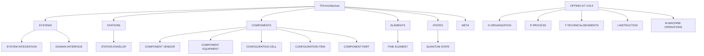

# Amedeo Pelliccia · Professional Portfolio

> **Assembling General Intelligence (AGI) for Aerospace Knowledge Competencies**  
> *A comprehensive framework for next-generation aerospace engineering and AI integration*


<!-- Optional: replace ORG/REPO to enable CI badge
[](https://github.com/ORG/REPO/actions/workflows/tfa_structure_validator.yml)
-->

---

## 🚀 About This Portfolio

This repository represents a cutting-edge approach to aerospace engineering through the lens of **General Artificial Intelligence (AGI)**. It combines traditional aerospace methodologies with modern AI/ML techniques, blockchain technology, and advanced systems engineering practices.

**Author**: Amedeo Pelliccia  
**Started**: November 25, 2024  
**Last Updated**: September 10, 2025

### 🎯 Mission Statement

To create a unified, intelligent framework that bridges the gap between traditional aerospace engineering and next-generation AI systems, enabling more efficient, safer, and innovative aerospace solutions.

---

## 🏗️ Architecture Overview

This portfolio follows the **TFA (Top Final Algorithm)** methodology—a strict organizational pattern that enforces:
- **Strict TFA-Only** containers per domain
- **Deterministic traceability** across Systems, **Stations**, Components, Elements, and States
- **AI-first** integrations with robust governance and auditability

**STRICT TFA-ONLY policy**  
- Each domain uses `TFA/` as the canonical container.  
- **NO FLAT LLC FOLDERS** under `2-DOMAINS-LEVELS/<DOMAIN>/`.  
- All work targets `TFA/<GROUP>/<LLC>/`.

---

## 📂 Portfolio Structure

### 🎯 [0-STRATEGY](./0-STRATEGY/)
Strategic planning, governance, mission, and vision documents.

### 🔧 [1-CAX-METHODOLOGY](./1-CAX-METHODOLOGY/)
Comprehensive Computer-Aided X (CAx) methodology covering:
- **CAB** – Brainstorming & Innovation  
- **CAC** – Compliance & Safety Codes  
- **CAD** – Design & MBSE  
- **CAE** – Engineering & Simulation  
- **CAF** – Finance & Blockchain Economics  
- **CAI** – AI Integration & Orchestration  
- **CAM** – Manufacturing & Production  
- **CAO** – Organization & Governance  
- **CAP** – Production Planning  
- **CAS** – Sustainment & S1000D  
- **CAT** – Testing & Validation  
- **CAV** – Verification & V&V  

### 🎛️ [2-DOMAINS-LEVELS](./2-DOMAINS-LEVELS/)
15 specialized aerospace domains following strict TFA architecture (names **verbatim** as provided):

| Code | Precise Domain Name (verbatim) | TFA Structure |
|---|---|---|
| **AAA** | AERODYNAMICS AND AIRFRAMES ARCHITECTURES | ✅ TFA/SYSTEMS/STATIONS/COMPONENTS/ELEMENTS/STATES |
| **AAP** | AIRPORT ADAPTABLE PLATFORMS | ✅ TFA/SYSTEMS/STATIONS/COMPONENTS/ELEMENTS/STATES |
| **CCC** | COCKPIT CABIN AND CARGO | ✅ TFA/SYSTEMS/STATIONS/COMPONENTS/ELEMENTS/STATES |
| **CQH** | CRYOGENICS, QUANTUM AND H2 | ✅ TFA/SYSTEMS/STATIONS/COMPONENTS/ELEMENTS/STATES |
| **EDI** | ELECTRONICS DIGITAL INSTRUMENTS | ✅ TFA/SYSTEMS/STATIONS/COMPONENTS/ELEMENTS/STATES |
| **DDD** | DIGITAL  AND DATA DEFENSE | ✅ TFA/SYSTEMS/STATIONS/COMPONENTS/ELEMENTS/STATES |
| **EEE** | ECOLOGICAL EFFICIENT ELECTRIFICATION | ✅ TFA/SYSTEMS/STATIONS/COMPONENTS/ELEMENTS/STATES |
| **EER** | ENVIRONMENTAL EMISSIONS AND REMEDIATION | ✅ TFA/SYSTEMS/STATIONS/COMPONENTS/ELEMENTS/STATES |
| **IIF** | INDUSTRIAL INFRASTRUCTURE FACILITIES | ✅ TFA/SYSTEMS/STATIONS/COMPONENTS/ELEMENTS/STATES |
| **IIS** | INTEGRATED INTELLIGENCE SOFTWARE | ✅ TFA/SYSTEMS/STATIONS/COMPONENTS/ELEMENTS/STATES |
| **LCC** | LINKAGES CONTROL AND COMMUNICATIONS | ✅ TFA/SYSTEMS/STATIONS/COMPONENTS/ELEMENTS/STATES |
| **LIB** | LOGISTICS INVENTORY AND BLOCKCHAIN | ✅ TFA/SYSTEMS/STATIONS/COMPONENTS/ELEMENTS/STATES |
| **MMM** | MECHANICAL AND MATERIAL  MODULES | ✅ TFA/SYSTEMS/STATIONS/COMPONENTS/ELEMENTS/STATES |
| **OOO** | OS, ONTOLOGIES AND OFFICE INTERFACES | ✅ TFA/SYSTEMS/STATIONS/COMPONENTS/ELEMENTS/STATES |
| **PPP** | PROPULSION & FUEL SYSTEMS | ✅ TFA/SYSTEMS/STATIONS/COMPONENTS/ELEMENTS/STATES |


### 🚀 [3-PROJECTS-USE-CASES](./3-PROJECTS-USE-CASES/)
Real-world applications and use case implementations.

### 🔬 [4-RESEARCH-DEVELOPMENT](./4-RESEARCH-DEVELOPMENT/)
Ongoing research initiatives and experimental developments.

### ⚙️ [5-ARTIFACTS-IMPLEMENTATION](./5-ARTIFACTS-IMPLEMENTATION/)
Code implementations in multiple languages:
- **Python** – AI/ML and data processing  
- **C** – Real-time and embedded systems  
- **Rust** – High-performance and safety-critical systems  
- **TypeScript** – Web interfaces and APIs  
- **Julia** – Scientific computing  
- **XSLT** – Data transformation  
- **Solidity** – Blockchain smart contracts  

### ⛓️ [6-UTCS-BLOCKCHAIN](./6-UTCS-BLOCKCHAIN/)
Universal Token Classification System (UTCS) blockchain integration.

### 🏛️ [7-GOVERNANCE](./7-GOVERNANCE/)
Governance frameworks, policies, community management.  
See also: `7-GOVERNANCE/COMMUNITY/`.

### 📚 [8-RESOURCES](./8-RESOURCES/)
Templates, references, assets, and Teknia token resources.

---

## 🧵 OPTIMO-DT — Digital Thread (V10.0)

**OPTIMO-DT** provides the Digital Thread backbone:

```

OPTIMO-DT/
├── O-ORGANIZATION/          # Enterprise governance (V10.0)
├── P-PROCESS/               # Process management (V10.0)
├── T-TECHNICAL/             # Technical implementation (V10.0)
│   └── SEGMENTS/
│       ├── AIR/
│       ├── SPACE/
│       ├── GROUND/
│       ├── DEFENSE/
│       └── CROSS/
├── I-INSTRUCTION/           # AI/ML systems (V10.0)
├── M-MACHINE OPERATIONS/    # Digital Twin implementation (V10.0)
├── config/                  # Configuration files
├── docs/                    # Documentation
├── scripts/                 # Automation scripts
└── tests/                   # Testing framework

```

---

## 🛠️ TFA Architecture Explained

### TFA Hierarchy (per domain)

```

DOMAIN/
└── TFA/
├── SYSTEMS/
│   ├── SI/  (SYSTEM INTEGRATION)
│   └── DI/  (DOMAIN INTERFACE)
├── STATIONS/
│   └── SE/  (STATION ENVELOP)
├── COMPONENTS/
│   ├── CV/  (COMPONENT VENDOR)
│   ├── CE/  (COMPONENT EQUIPMENT)
│   ├── CC/  (CONFIGURATION CELL)
│   ├── CI/  (CONFIGURATION ITEM)
│   └── CP/  (COMPONENT PART)
├── ELEMENTS/
│   └── FE/  (FINE ELEMENT)
├── STATES/
│   └── QS/  (QUANTUM STATE)
└── META/
└── README.md

```

### LLC Codes — Canonical Meanings (verbatim)

| Code | Meaning |
|---|---|
| **SI** | SYSTEM INTEGRATION |
| **DI** | DOMAIN INTERFACE |
| **SE** | STATION ENVELOP |
| **CV** | COMPONENT VENDOR |
| **CE** | COMPONENT EQUIPMENT |
| **CC** | CONFIGURATION CELL |
| **CI** | CONFIGURATION ITEM |
| **CP** | COMPONENT PART |
| **FE** | FINE ELEMENT |
| **QS** | QUANTUM STATE |

---

## 📊 TFA + OPTIMO-DT Overview (Mermaid)



---

## 🧠 AGI-Oriented Architecture (IIS + CAI)

* `1-CAX-METHODOLOGY/CAI-AI-INTEGRATION/`: multi-agent orchestration, generative design agents, validation harnesses.
* `2-DOMAINS-LEVELS/IIS-AI-SYSTEMS/`: integrated intelligence stacks (onboard/ground), quantum-inference pipelines.
* `*/TFA/STATES/QS/`: AI-derived state evaluations and quantum-state artifacts.
* Future hooks: federation with air/ground "infranet" cognition layers.

---

## 🔧 Technology Stack

* **Languages**: Python, C, Rust, TypeScript, Julia, XSLT, Solidity
* **AI/ML**: Custom AGI frameworks, model orchestration, validation suites
* **Blockchain**: Ethereum-compatible smart contracts, UTCS tokens
* **Standards**: S1000D, MBSE, Industry 4.0
* **Tooling**: Git, GitHub Actions (structure enforcement), Docker, Kubernetes

---

## 📈 Roadmap Snapshot

| Phase | Key Milestone                   | ETA         |
| ----- | ------------------------------- | ----------- |
| v1.0  | TFA Core Bootstrapped           | ✅ Sept 2025 |
| v1.2  | UTCS Smart Contracts Alpha      | Q4 2025     |
| v2.0  | CAI/IIS AGI Modules Integration | Mid 2026    |
| v2.5  | OPTIMO-DT ↔ Digital Twin Sync   | Early 2027  |
| v3.0  | Quantum Extension (QS Full)     | 2028        |

---

## 📊 Key Features

* ✅ **Strict TFA Architecture** — deterministic structure & traceability
* ✅ **15 Domains** — coverage from **AAA** to **PPP**
* ✅ **AI Integration** — built-in orchestration & validation (CAI/IIS)
* ✅ **Blockchain Ready** — UTCS token system & contracts
* ✅ **Standards** — S1000D, MBSE-aligned artifacts
* ✅ **CI Enforcement** — prevents flat LLC paths

---

## 🤝 Contributing

Please see [CONTRIBUTING.md](./CONTRIBUTING.md).

**Architecture Rules**

* ⚠️ **STRICT TFA-ONLY**: Never create flat LLC folders under `2-DOMAINS-LEVELS/<DOMAIN>/`.
* ✅ Always use `2-DOMAINS-LEVELS/<DOMAIN>/TFA/<GROUP>/<LLC>/`.
* ✅ Respect the **LLC canonical meanings** listed above.

---

## 🏛️ Governance

The governance framework (`0-STRATEGY/GOVERNANCE.md`) aligns leadership accountability, compliance-as-code, and continuous auditability across all domains and LLC layers. Community processes live in `7-GOVERNANCE/COMMUNITY/`.

---

## 📄 License

This project is licensed under the MIT License — see the [LICENSE](./LICENSE) file for details.

---

## 🔗 Quick Links

* [Strategy & Vision](./0-STRATEGY/)
* [CAx Methodology](./1-CAX-METHODOLOGY/)
* [Aerospace Domains](./2-DOMAINS-LEVELS/)
* [Code Implementations](./5-ARTIFACTS-IMPLEMENTATION/CODE/)
* [Blockchain Framework](./6-UTCS-BLOCKCHAIN/)
* [Governance & Community](./7-GOVERNANCE/)

---

*Built with ❤️ for the future of aerospace engineering and artificial intelligence*


