# Amedeo Pelliccia · Professional Portfolio

> **Assembling General Intelligence (AGI) for Aerospace Knowledge Competencies**  
> *A comprehensive framework for next-generation aerospace engineering and AI integration*


---

## 🚀 About This Portfolio

This repository represents a cutting-edge approach to aerospace engineering through the lens of **General Artificial Intelligence (AGI)**. It combines traditional aerospace methodologies with modern AI/ML techniques, blockchain technology, and advanced systems engineering practices.

**Author**: Amedeo Pelliccia  
**Started**: November 25, 2024  
**Last Updated**: September 10, 2025

### 🎯 Mission Statement

To create a unified, intelligent framework that bridges the gap between traditional aerospace engineering and next-generation AI systems, enabling more efficient, safer, and innovative aerospace solutions.

---

## 🏗️ Architecture Overview

This portfolio follows the **TFA (Top Final Algorithm)** methodology - a strict architectural pattern that ensures optimal organization and scalability:

### Core Principles
- **Strict TFA-Only**: All work organized under `TFA/` containers
- **Domain Segregation**: 15 specialized aerospace domains
- **Hierarchical Structure**: Clear separation of Systems, Components, Elements, and States
- **AI-First Approach**: Every domain integrates artificial intelligence capabilities

### 📊 Portfolio Structure Visualization

```mermaid
graph TD
  A[0-STRATEGY] --> A1("📋 MISSION.md")
  A --> A2("🎯 VISION.md")
  A --> A3("🛣️ ROADMAP.md")

  B[1-CAX-METHODOLOGY] --> B1(CAB-BRAINSTORMING)
  B --> B2(CAC-COMPLIANCE-SAFETY-CODE)
  B --> B3(CAD-DESIGN)
  B --> B4(CAE-ENGINEERING)
  B --> B5(CAF-FINANCE)
  B --> B6(CAI-AI-INTEGRATION)
  B --> B7(CAM-MANUFACTURING)
  B --> B8(CAO-ORGANIZATION)
  B --> B9(CAP-PRODUCTION)
  B --> B10(CAS-SUSTAINMENT)
  B --> B11(CAT-TESTING)
  B --> B12(CAV-VERIFICATION)

  C[2-DOMAINS-LEVELS] --> C1(AAA-STRUCTURES-AERO)
  C --> C2(CCC-CABIN-COCKPIT)
  C --> C3(PPP-PROPULSION-FUEL)
  C --> C4(IIS-AI-SYSTEMS)
  C --> C5("... 11 more domains")
  
  C1 --> C1TFA("TFA/")
  C1TFA --> C1SYS("SYSTEMS/")
  C1TFA --> C1COMP("COMPONENTS/")
  C1TFA --> C1ELEM("ELEMENTS/")
  C1TFA --> C1STATE("STATES/")
  
  C1SYS --> C1SI("SI/")
  C1SYS --> C1SE("SE/")
  C1SYS --> C1DI("DI/")
  
  C1COMP --> C1CE("CE/")
  C1COMP --> C1CC("CC/")
  C1COMP --> C1CI("CI/")
  C1COMP --> C1CP("CP/")
  C1COMP --> C1CV("CV/")

  D[5-ARTIFACTS-IMPLEMENTATION] --> D1("🐍 Python")
  D --> D2("🦀 Rust")
  D --> D3("💎 Solidity")
  D --> D4("📜 TypeScript")
  D --> D5("🔬 Julia")
  D --> D6("⚙️ C")

  E[6-UTCS-BLOCKCHAIN] --> E1("⛓️ Token Framework")
  F[7-GOVERNANCE] --> F1("🏛️ Community Policies")
  G[8-RESOURCES] --> G1("📚 Templates & Assets")
```

<details>
<summary>📁 Click to expand: Portfolio Structure Tree</summary>



</details>

---

## 📂 Portfolio Structure

### 🎯 [0-STRATEGY](./0-STRATEGY/)
Strategic planning, governance, mission, and vision documents.

### 🔧 [1-CAX-METHODOLOGY](./1-CAX-METHODOLOGY/)
Comprehensive Computer-Aided X (CAx) methodology covering:
- **CAB** - Brainstorming & Innovation
- **CAC** - Compliance & Safety Codes
- **CAD** - Design & MBSE
- **CAE** - Engineering & Simulation
- **CAF** - Finance & Blockchain Economics
- **CAI** - AI Integration & Orchestration
- **CAM** - Manufacturing & Production
- **CAO** - Organization & Governance
- **CAP** - Production Planning
- **CAS** - Sustainment & S1000D
- **CAT** - Testing & Validation
- **CAV** - Verification & V&V

### 🎛️ [2-DOMAINS-LEVELS](./2-DOMAINS-LEVELS/)
15 specialized aerospace domains following strict TFA architecture:

| Domain | Focus Area | TFA Structure |
|--------|------------|---------------|
| **AAA-STRUCTURES-AERO** | Aerospace Structures | ✅ TFA/SYSTEMS/COMPONENTS/ELEMENTS/STATES |
| **AAP-GROUND-SUPPORT** | Ground Support Equipment | ✅ TFA/SYSTEMS/COMPONENTS/ELEMENTS/STATES |
| **CCC-CABIN-COCKPIT** | Cabin & Cockpit Systems | ✅ TFA/SYSTEMS/COMPONENTS/ELEMENTS/STATES |
| **CQH-CRYO-H2** | Cryogenic Hydrogen Systems | ✅ TFA/SYSTEMS/COMPONENTS/ELEMENTS/STATES |
| **DDD-SAFETY-CYBER** | Safety & Cybersecurity | ✅ TFA/SYSTEMS/COMPONENTS/ELEMENTS/STATES |
| **EDI-ELECTRONICS** | Electronic Systems | ✅ TFA/SYSTEMS/COMPONENTS/ELEMENTS/STATES |
| **EEE-ENVIRONMENTAL** | Environmental Systems | ✅ TFA/SYSTEMS/COMPONENTS/ELEMENTS/STATES |
| **EER-ENERGY-BATTERY** | Energy & Battery Systems | ✅ TFA/SYSTEMS/COMPONENTS/ELEMENTS/STATES |
| **IIF-INFRASTRUCTURE** | Infrastructure Systems | ✅ TFA/SYSTEMS/COMPONENTS/ELEMENTS/STATES |
| **IIS-AI-SYSTEMS** | AI & Intelligent Systems | ✅ TFA/SYSTEMS/COMPONENTS/ELEMENTS/STATES |
| **LCC-CONTROLS-COMMS** | Control & Communication | ✅ TFA/SYSTEMS/COMPONENTS/ELEMENTS/STATES |
| **LIB-LOGISTICS-CHAIN** | Logistics & Supply Chain | ✅ TFA/SYSTEMS/COMPONENTS/ELEMENTS/STATES |
| **MMM-MECHANICAL** | Mechanical Systems | ✅ TFA/SYSTEMS/COMPONENTS/ELEMENTS/STATES |
| **OOO-OS-NAVIGATION** | OS & Navigation Systems | ✅ TFA/SYSTEMS/COMPONENTS/ELEMENTS/STATES |
| **PPP-PROPULSION-FUEL** | Propulsion & Fuel Systems | ✅ TFA/SYSTEMS/COMPONENTS/ELEMENTS/STATES |

### 🚀 [3-PROJECTS-USE-CASES](./3-PROJECTS-USE-CASES/)
Real-world applications and use case implementations.

### 🔬 [4-RESEARCH-DEVELOPMENT](./4-RESEARCH-DEVELOPMENT/)
Ongoing research initiatives and experimental developments.

### ⚙️ [5-ARTIFACTS-IMPLEMENTATION](./5-ARTIFACTS-IMPLEMENTATION/)
Code implementations in multiple languages:
- **Python** - AI/ML and data processing
- **C** - Real-time and embedded systems
- **Rust** - High-performance and safety-critical systems
- **TypeScript** - Web interfaces and APIs
- **Julia** - Scientific computing
- **XSLT** - Data transformation
- **Solidity** - Blockchain smart contracts

### ⛓️ [6-UTCS-BLOCKCHAIN](./6-UTCS-BLOCKCHAIN/)
Universal Token Classification System (UTCS) blockchain integration.

### 🏛️ [7-GOVERNANCE](./7-GOVERNANCE/)
Governance frameworks, policies, and community management.

### 📚 [8-RESOURCES](./8-RESOURCES/)
Templates, references, assets, and Teknia token resources.

---

## 🛠️ TFA Architecture Explained

### What is TFA?
**TFA (Top Final Algorithm)** is our proprietary architectural methodology that ensures:
- **Consistency**: Every domain follows the same structural pattern
- **Scalability**: Easy to extend and maintain
- **Traceability**: Clear relationships between systems, components, and elements
- **AI-Readiness**: Structure optimized for machine learning and AI processing

### TFA Hierarchy
```
DOMAIN/
├── TFA/
│   ├── SYSTEMS/
│   │   ├── SI/ (System Integration)
│   │   ├── SE/ (System Engineering)
│   │   └── DI/ (Digital Integration)
│   ├── COMPONENTS/
│   │   ├── CE/ (Component Engineering)
│   │   ├── CC/ (Component Control)
│   │   ├── CI/ (Component Integration)
│   │   ├── CP/ (Component Production)
│   │   └── CV/ (Component Verification)
│   ├── ELEMENTS/
│   │   └── FE/ (Finite Elements)
│   ├── STATES/
│   │   └── QS/ (Quality States)
│   └── META/
│       └── README.md
```

---

## 🧠 AGI Design Philosophy

Our AGI approach integrates cutting-edge artificial intelligence with aerospace engineering excellence:

- **Autonomous Design Agents** - AMPELLLM and HADA frameworks for intelligent design automation
- **Self-Adaptive Verification Workflows** - Dynamic validation systems that evolve with project complexity
- **Quantum-Extensible Reasoning** - QML (Quantum Machine Learning) and hybrid inference capabilities
- **Simulation-Aware Cognitive Modeling** - QIE (Quantum Intelligence Engine) and TWIN-BRAIN digital twins
- **Emergent Knowledge Graphs** - Built for traceability, feedback loops, and continuous learning

This philosophy ensures that every aerospace system is not just engineered, but intelligently evolved through AI-human collaboration.

---

## 🚦 Getting Started

### For Aerospace Engineers
1. Start with [2-DOMAINS-LEVELS](./2-DOMAINS-LEVELS/) to explore domain-specific work
2. Review [1-CAX-METHODOLOGY](./1-CAX-METHODOLOGY/) for process frameworks
3. Check [3-PROJECTS-USE-CASES](./3-PROJECTS-USE-CASES/) for practical applications

### For AI/ML Researchers
1. Explore [2-DOMAINS-LEVELS/IIS-AI-SYSTEMS](./2-DOMAINS-LEVELS/IIS-AI-SYSTEMS/) for AI-specific implementations
2. Review [1-CAX-METHODOLOGY/CAI-AI-INTEGRATION](./1-CAX-METHODOLOGY/CAI-AI-INTEGRATION/) for integration patterns
3. Check [5-ARTIFACTS-IMPLEMENTATION/CODE](./5-ARTIFACTS-IMPLEMENTATION/CODE/) for implementation examples

### For Blockchain Developers
1. Start with [6-UTCS-BLOCKCHAIN](./6-UTCS-BLOCKCHAIN/) for blockchain frameworks
2. Review [1-CAX-METHODOLOGY/CAF-FINANCE/TEKNIA-TOKENS](./1-CAX-METHODOLOGY/CAF-FINANCE/TEKNIA-TOKENS/) for tokenomics
3. Explore smart contract implementations in [5-ARTIFACTS-IMPLEMENTATION/CODE/solidity](./5-ARTIFACTS-IMPLEMENTATION/CODE/solidity/)

### For General Visitors
1. Read this README for overview
2. Check [0-STRATEGY](./0-STRATEGY/) for mission and vision
3. Browse [8-RESOURCES](./8-RESOURCES/) for templates and references

---

## 🛣️ Roadmap Snapshot (2024–2027)

| Milestone | Description | Status | ETA |
|-----------|-------------|--------|-----|
| `v1.0` | Full TFA structure bootstrapped | ✅ Complete | Sept 2024 |
| `v1.1` | AI integration across all domains | 🔄 In Progress | Q1 2025 |
| `v1.2` | Blockchain/UTCS token registry | 📋 Planned | Q2 2025 |
| `v2.0` | Full AGI integration (CAI/IIS) | 📋 Planned | 2026 |
| `v2.5` | S1000D compliance framework | 📋 Planned | Q3 2026 |
| `v3.0` | Quantum-AI hybrid simulation pipelines | 🔮 Research | 2027 |

*See [ROADMAP.md](./ROADMAP.md) for detailed development plans and technical specifications.*

---

## 🔧 Technology Stack

- **Languages**: Python, C, Rust, TypeScript, Julia, XSLT, Solidity
- **AI/ML**: Custom AGI frameworks, machine learning models
- **Blockchain**: Ethereum-compatible smart contracts, UTCS tokens
- **Standards**: S1000D, MBSE, Industry 4.0
- **Tools**: Git, GitHub Actions, Docker, Kubernetes

---

## 📊 Key Features

- ✅ **Strict TFA Architecture** - Consistent, scalable organization
- ✅ **15 Aerospace Domains** - Comprehensive coverage
- ✅ **Multi-Language Support** - From Python to Solidity
- ✅ **AI Integration** - Built-in artificial intelligence capabilities
- ✅ **Blockchain Ready** - UTCS token system and smart contracts
- ✅ **Industry Standards** - S1000D, MBSE compliance
- ✅ **Continuous Integration** - Automated quality assurance

---

## ⚛️ Quantum-Extensible Readiness

This portfolio is quantum-ready for next-generation aerospace applications:

- 🧠 **Quantum AI Agents** - QIE (Quantum Intelligence Engine) and AQUA Kernel integration
- 📡 **QNS Navigation Interfaces** - Quantum Navigation Systems for advanced positioning
- 🧬 **Quantum Digital Twin Encoding** - ψ/φ state representations for complex system modeling
- 🔗 **UTCS-Q Token Bindings** - Quantum-enhanced blockchain token classification
- 🔍 **Quantum Simulation API Hooks** - Compatible with Qiskit, PennyLane, IonQ platforms
- 🌊 **Hybrid Quantum-Classical Workflows** - Seamless integration of quantum algorithms with classical aerospace engineering

All quantum elements are tagged for QCSAA (Quantum Computational Safety Assurance Architecture) compliance under the AQUA.V ecosystem framework.

---

## 🤝 Contributing

We welcome contributions! Please see [CONTRIBUTING.md](./CONTRIBUTING.md) for guidelines.

**Architecture Rules**:
- ⚠️ **STRICT TFA-ONLY**: Never create flat LLC folders under `2-DOMAINS-LEVELS/<DOMAIN>/`
- ✅ Always use `2-DOMAINS-LEVELS/<DOMAIN>/TFA/<GROUP>/<LLC>/` structure
- ✅ Follow the established patterns for Systems, Components, Elements, States

---

## 📈 Roadmap

See [ROADMAP.md](./ROADMAP.md) for detailed development plans and milestones.

---

## 📄 License

This project is licensed under the MIT License - see the [LICENSE](./LICENSE) file for details.

---

## 🔗 Quick Links

- [Strategy & Vision](./0-STRATEGY/)
- [CAx Methodology](./1-CAX-METHODOLOGY/)
- [Aerospace Domains](./2-DOMAINS-LEVELS/)
- [Code Implementations](./5-ARTIFACTS-IMPLEMENTATION/CODE/)
- [Blockchain Framework](./6-UTCS-BLOCKCHAIN/)
- [Technical Documentation](./README_ORIGINAL_BACKUP.md) (Full technical tree)

---

*Built with ❤️ for the future of aerospace engineering and artificial intelligence*


