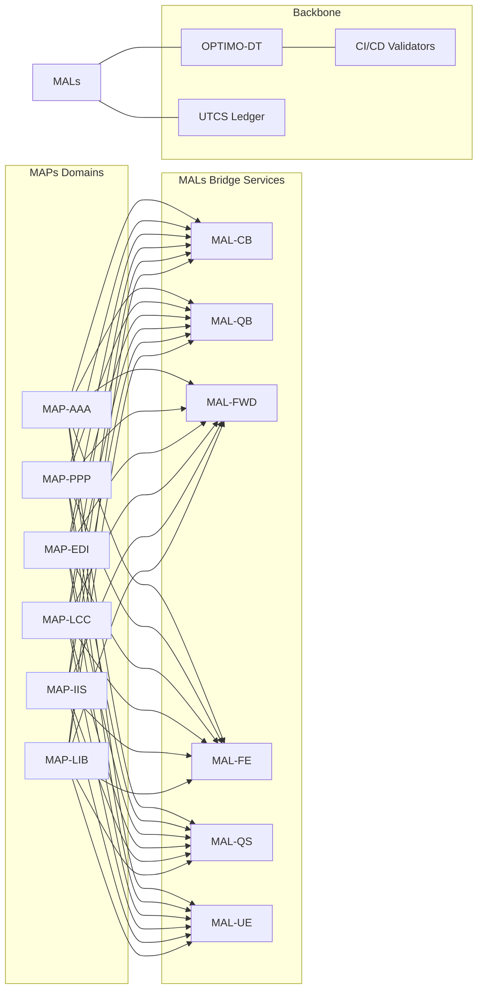

# Amedeo Pelliccia · Professional Portfolio

> **Classical–Quantum Extensible Aerospace**
> Strict **TFA** hierarchy across **15 domains**, quantum bridge layers (**CB/QB/UE/FE/FWD/QS**), **OPTIMO-DT** digital thread, template packs, and **CI** validation.


---

## Table of Contents

1. [What This Is](#-what-this-is)
2. [Architecture at a Glance](#-architecture-at-a-glance)
   2.1 [TFA Layers](#tfa-layers) · 2.2 [Quantum–Classical Bridge](#quantumclassical-bridge) · 2.3 [MAP/MAL](#mapmal-master-application-program--main-application-layer)
3. [Domains (15) & Structure](#-domains-15--structure)
4. [AQUA-OS Applications](#-aqua-os-applications)
5. [Program-Scale Use Cases](#-program-scale-use-cases)
6. [Why This Is a Host Platform for New Programs](#-why-this-is-a-host-platform-for-new-programs)
7. [Repo Structure](#-repo-structure)
8. [Getting Started](#-getting-started)
9. [CI/CD & Quality Gates](#-cicd--quality-gates)
10. [Roadmap](#-roadmap)
11. [Contributing & Governance](#-contributing--governance)
12. [License & Quick Links](#-license--quick-links)

---

## 🚀 What This Is

This repository is the canonical map of **Amedeo Pelliccia’s** aerospace portfolio under a **Top Final Algorithm (TFA)** architecture. It unifies **15 engineering domains** with a **quantum–classical bridge**, delivering **ready-to-use templates**, **validators**, **services**, and **CI** to prevent drift.

**Highlights**

* **FE = Federation Entanglement** (authoritative coordination)
* **Quantum bridge**: **CB** (Classical Bit) → **QB** (Qubit)
* **Dual elements**: **UE** (Unit Element, classical) + **FE** (Federation, distributed)
* **Wave dynamics**: **FWD** for predictive/retrodictive modeling
* **CI-enforced** structure, terminology, and quantum layers

**Author**: Amedeo Pelliccia · **Started**: Nov 25, 2024 · **Last Updated**: Sept 10, 2025 (TFA V2)

---

## 🏗️ Architecture at a Glance

### TFA Layers

Each domain is organized under `TFA/` with deterministic traceability:

| Code                       | Meaning                                   | Group      | Purpose                    |
| -------------------------- | ----------------------------------------- | ---------- | -------------------------- |
| **SI**                     | System Integration                        | SYSTEMS    | Cross-domain orchestration |
| **DI**                     | Domain Interface                          | SYSTEMS    | Boundary management & APIs |
| **SE**                     | Station Envelope                          | STATIONS   | Physical/logical envelopes |
| **CV / CE / CC / CI / CP** | Component Vendor/Equipment/Cell/Item/Part | COMPONENTS | Hierarchical components    |
| **CB**                     | Classical Bit                             | BITS       | Deterministic computation  |
| **QB**                     | Qubit                                     | QUBITS     | Quantum computation        |
| **UE**                     | Unit Element                              | ELEMENTS   | Classical fundamentals     |
| **FE**                     | Federation Entanglement                   | ELEMENTS   | Distributed orchestration  |
| **FWD**                    | Future/Waves Dynamics                     | WAVES      | Predictive/retrodictive    |
| **QS**                     | Quantum State                             | STATES     | State/provenance           |

**STRICT TFA-ONLY policy**
All work lives under `2-DOMAINS-LEVELS/<DOMAIN>/TFA/<GROUP>/<LLC>/`.
**No flat LLC folders**.

### Quantum–Classical Bridge

Flow: **CB → QB → UE/FE → FWD → QS**, enabling hybrid compute, federation, predictive waves, and audit-grade state.

### MAP/MAL (Master Application Program / Main Application Layer)

* **MAP** (one per domain): the domain’s **master program** exposing stable SI/DI interfaces (e.g., **MAP-AAA** for aerodynamics, **MAP-PPP** for propulsion).
* **MAL** (one per bridge layer): a **horizontal service** per layer (e.g., **MAL-CB** for classical solvers, **MAL-QB** for quantum strategies, **MAL-FWD** for nowcasts, **MAL-QS** for state/provenance, **MAL-FE** for federation).
  Together, **MAPs** consume **MALs** to compose full programs across AIR/SPACE/GROUND/**DEFENSE**/**CROSS**.

---

## 🎛️ Domains (15) & Structure

Browse all domains under [`2-DOMAINS-LEVELS/`](./2-DOMAINS-LEVELS/):

| Code                                                                                                                       | Precise Domain Name (verbatim) |
| -------------------------------------------------------------------------------------------------------------------------- | ------------------------------ |
| **AAA** – [AERODYNAMICS-AND-AIRFRAMES-ARCHITECTURES](./2-DOMAINS-LEVELS/AAA-AERODYNAMICS-AND-AIRFRAMES-ARCHITECTURES/TFA/) |                                |
| **AAP** – [AIRPORT-ADAPTABLE-PLATFORMS](./2-DOMAINS-LEVELS/AAP-AIRPORT-ADAPTABLE-PLATFORMS/TFA/)                           |                                |
| **CCC** – [COCKPIT-CABIN-AND-CARGO](./2-DOMAINS-LEVELS/CCC-COCKPIT-CABIN-AND-CARGO/TFA/)                                   |                                |
| **CQH** – [CRYOGENICS-QUANTUM-AND-H2](./2-DOMAINS-LEVELS/CQH-CRYOGENICS-QUANTUM-AND-H2/TFA/)                               |                                |
| **DDD** – [DIGITAL-AND-DATA-DEFENSE](./2-DOMAINS-LEVELS/DDD-DIGITAL-AND-DATA-DEFENSE/TFA/)                                 |                                |
| **EDI** – [ELECTRONICS-DIGITAL-INSTRUMENTS](./2-DOMAINS-LEVELS/EDI-ELECTRONICS-DIGITAL-INSTRUMENTS/TFA/)                   |                                |
| **EEE** – [ECOLOGICAL-EFFICIENT-ELECTRIFICATION](./2-DOMAINS-LEVELS/EEE-ECOLOGICAL-EFFICIENT-ELECTRIFICATION/TFA/)         |                                |
| **EER** – [ENVIRONMENTAL-EMISSIONS-AND-REMEDIATION](./2-DOMAINS-LEVELS/EER-ENVIRONMENTAL-EMISSIONS-AND-REMEDIATION/TFA/)   |                                |
| **IIF** – [INDUSTRIAL-INFRASTRUCTURE-FACILITIES](./2-DOMAINS-LEVELS/IIF-INDUSTRIAL-INFRASTRUCTURE-FACILITIES/TFA/)         |                                |
| **IIS** – [INTEGRATED-INTELLIGENCE-SOFTWARE](./2-DOMAINS-LEVELS/IIS-INTEGRATED-INTELLIGENCE-SOFTWARE/TFA/)                 |                                |
| **LCC** – [LINKAGES-CONTROL-AND-COMMUNICATIONS](./2-DOMAINS-LEVELS/LCC-LINKAGES-CONTROL-AND-COMMUNICATIONS/TFA/)           |                                |
| **LIB** – [LOGISTICS-INVENTORY-AND-BLOCKCHAIN](./2-DOMAINS-LEVELS/LIB-LOGISTICS-INVENTORY-AND-BLOCKCHAIN/TFA/)             |                                |
| **MMM** – [MECHANICAL-AND-MATERIAL-MODULES](./2-DOMAINS-LEVELS/MMM-MECHANICAL-AND-MATERIAL-MODULES/TFA/)                   |                                |
| **OOO** – [OS-ONTOLOGIES-AND-OFFICE-INTERFACES](./2-DOMAINS-LEVELS/OOO-OS-ONTOLOGIES-AND-OFFICE-INTERFACES/TFA/)           |                                |
| **PPP** – [PROPULSION-AND-FUEL-SYSTEMS](./2-DOMAINS-LEVELS/PPP-PROPULSION-AND-FUEL-SYSTEMS/TFA/)                           |                                |

---

## 🌐 AQUA-OS Applications

* **Predictive Route Optimizer (PRO)** — *Implemented*
  Optimize aero-aware routes in a **10-minute loop** with **30s cadence**, **hybrid QB/CB**, and **federated** coordination.
  → [`services/aqua-os-pro/`](./services/aqua-os-pro/) · [schema](./services/aqua-os-pro/schemas/route_optimization.json) · [orchestrator](./services/aqua-os-pro/core/aqua_pro_orchestrator.py) · [validator](./services/aqua-os-pro/validation/aqua_pro_validator.py)

* **WaveTiles Nowcast (FWD)** — *Planned*
  Environmental nowcasts and wave dynamics for short-horizon operations. *(FWD/MAL integration)*

* **Entangled Fleet Scheduler (FE)** — *Planned*
  Multi-asset, multi-org coordination & deconfliction via federation primitives. *(FE/MAL)*

* **State Ledger & Provenance (QS)** — *Planned*
  Immutable states, exportable evidence, optional anchoring via **UTCS**. *(QS/MAL)*

> All apps follow the same service skeleton: `core/`, `schemas/`, `validation/`, with CI hooks.

---

## 🚀 Program-Scale Use Cases

### A) **AMPEL360 BWB-Q100** — Advanced Blended Wing Body (AIR)

**MAPs**: AAA, PPP, EDI, LCC, EEE, EER, DDD, IIS
**Flow**: CAD/CAE → **OPTIMO-DT** digital twins → **AQUA-OS PRO** cycles → certification packages (S1000D) → ops monitoring (QS/FE)

```yaml
program: AMPEL360-BWB-Q100
segments: [AIR]
maps: [AAA, PPP, EDI, LCC, EEE, EER, DDD, IIS]
mals: [CB, QB, FWD, QS, FE, UE]
policies:
  ci_required: [tfa_structure_validator, quantum-layers-check]
  export_standards: [S1000D, MBSE]
apps:
  - services/aqua-os-pro
```

### B) **GAIA Quantum SAT** — Space Constellation with Quantum Links (SPACE)

**MAPs**: LCC, CQH, EDI, LIB, IIS
**Flow**: Mission design → network planning (FE/FWD) → in-orbit experiments (QB) → state capture (QS) → UTCS anchoring

```yaml
program: GAIA-QUANTUM-SAT
segments: [SPACE]
maps: [LCC, CQH, EDI, LIB, IIS]
mals: [QB, CB, FE, FWD, QS, UE]
policies:
  ci_required: [tfa_structure_validator, quantum-layers-check]
apps:
  - services/aqua-os-pro
```

### C) **Diagnostics & MRO Robbbo-t** — Robotic Maintenance (GROUND)

**MAPs**: MMM, EDI, IIS, LIB (+ CAS/CAV from CAx)
**Flow**: Detection → triage → robotic execution → QS logging → regulatory reporting

```yaml
program: ROBBBO-T-MRO
segments: [GROUND]
maps: [MMM, EDI, IIS, LIB]
mals: [CB, FE, QS, FWD]
apps:
  - services/aqua-os-pro
```

### D) **ARES-X UAS SWARM** — Defense Segment (DEFENSE)

**MAPs**: DDD, LCC, EDI, MMM, IIS, LIB
**MALs**: FE, QS, FWD, QB, CB, UE
**Apps** *(planned)*: Spectrum/EW Orchestrator (SEWO), SwarmOps FE, Mission Assurance QS

```yaml
program: ARES-X-UAS-SWARM
segments: [DEFENSE]
maps: [DDD, LCC, EDI, MMM, IIS, LIB]
mals: [FE, QS, FWD, QB, CB, UE]
policies:
  ci_required: [tfa_structure_validator, quantum-layers-check, defense-segment-check]
apps:
  - services/aqua-os-pro
  # - services/aqua-os-sewo (planned)
  # - services/aqua-os-swarmops (planned)
```

### E) **H2-CORRIDOR-X** — Cross-Sector Hydrogen Corridor (CROSS)

**MAPs**: IIF, OOO, LIB, EEE, EER, IIS, LCC
**MALs**: FE, QS, FWD, CB/QB, UE
**Apps** *(planned)*: Resilience Stressor Engine (RSE), Cross-Sector Impact Graph (CSIG), Supply & Provenance

```yaml
program: H2-CORRIDOR-X
segments: [CROSS]
maps: [IIF, OOO, LIB, EEE, EER, IIS, LCC]
mals: [FE, QS, FWD, CB, QB, UE]
policies:
  ci_required: [tfa_structure_validator, quantum-layers-check, cross-segment-check]
apps:
  - services/aqua-os-pro
  # - services/aqua-os-rse (planned)
  # - services/aqua-os-csig (planned)
```

---

## 🧠 Why This Is a Host Platform for New Programs

**One platform, many programs.** This repo is designed to **host entire aerospace programs** end-to-end:

* **Deterministic structure** (TFA): uniform trees across 15 domains with explicit LLC meanings.
* **Hybrid compute built-in**: CB/QB for deterministic + quantum optimization; FE for multi-asset/coalition coordination; FWD for nowcasts; QS for audit-grade states.
* **Digital thread** (**OPTIMO-DT**): organizational/process/technical **coherence** from concept to sustainment across **AIR/SPACE/GROUND/DEFENSE/CROSS**.
* **Compliance-as-code**: S1000D/MBSE scaffolds; CI enforces structure, terms, and quantum layers.
* **Immutable provenance**: optional **UTCS** anchoring for states, BOMs, missions, and supply chain.
* **MAP/MAL pattern**: MAPs (per domain) + MALs (per bridge) compose programs rapidly; improvements in MALs benefit **all** MAPs.
* **Scales to multi-tenant ecosystems**: cross-program interoperability through **FE/QS/FWD** and shared schema contracts.

Result: a **coherent, intelligent, multidimensional, multisectoral, interconnected** ecosystem for **design → develop → certify → operate → sustain** complex assets.

---

## 📂 Repo Structure

* [`0-STRATEGY/`](./0-STRATEGY/) — Strategy, governance, mission & vision
* [`1-CAX-METHODOLOGY/`](./1-CAX-METHODOLOGY/) — CAx lifecycle (CAB…CAV)
* [`2-DOMAINS-LEVELS/`](./2-DOMAINS-LEVELS/) — **15 domains** with strict `TFA/` trees
* [`3-PROJECTS-USE-CASES/`](./3-PROJECTS-USE-CASES/) — Programs, demos, scenarios
* [`4-RESEARCH-DEVELOPMENT/`](./4-RESEARCH-DEVELOPMENT/) — R\&D
* [`5-ARTIFACTS-IMPLEMENTATION/`](./5-ARTIFACTS-IMPLEMENTATION/) — Code buckets by language
* [`6-UTCS-BLOCKCHAIN/`](./6-UTCS-BLOCKCHAIN/) — UTCS integration
* [`7-GOVERNANCE/`](./7-GOVERNANCE/) — Governance & community
* [`8-RESOURCES/`](./8-RESOURCES/) — Templates, references, assets
* **AQUA-OS**: [`services/aqua-os-pro/`](./services/aqua-os-pro/) *(implemented)*

---

## 💻 Getting Started

```bash
# 1) Create any missing TFA trees (idempotent) + bridge buckets
make scaffold

# 2) Validate full TFA structure + quantum layers + terminology
make check
```

**Run the PRO orchestrator (demo):**

```bash
python3 services/aqua-os-pro/core/aqua_pro_orchestrator.py
```

**Validate system coverage:**

```bash
python3 services/aqua-os-pro/validation/aqua_pro_validator.py
```

---

## 🔍 CI/CD & Quality Gates

* **TFA Structure Validator** — enforces domain trees, layers, META, code buckets
* **Quantum Layers Check** — enforces **CB/QB/UE/FE/FWD/QS** presence and terminology
* **Link & Quality** — broken links, linting, formatting
* **UTCS Anchor** — optional provenance anchoring pipelines

Workflows live in [`.github/workflows/`](./.github/workflows/).
*(DEFENSE/CROSS segment checks can be added similarly.)*

---

## 📈 Roadmap

| Phase | Milestone                       | ETA         |
| ----- | ------------------------------- | ----------- |
| v1.0  | TFA Core Bootstrapped           | ✅ Sept 2025 |
| v2.0  | TFA V2 Quantum–Classical Bridge | ✅ Sept 2025 |
| v2.2  | UTCS Smart Contracts (Alpha)    | Q4 2025     |
| v2.5  | CAI/IIS AGI Modules Integration | Mid 2026    |
| v3.0  | OPTIMO-DT ↔ Digital Twin Sync   | Early 2027  |
| v4.0  | Quantum Extension (QS Full)     | 2028        |

---

## 🤝 Contributing & Governance

* Start with [`CONTRIBUTING.md`](./CONTRIBUTING.md).
* **STRICT TFA-ONLY**: never create flat LLC folders under `2-DOMAINS-LEVELS/<DOMAIN>/`.
* Always use: `2-DOMAINS-LEVELS/<DOMAIN>/TFA/<GROUP>/<LLC>/`.
* Respect canonical LLC meanings.
* Governance: see [`0-STRATEGY/`](./0-STRATEGY/) and community in [`7-GOVERNANCE/COMMUNITY/`](./7-GOVERNANCE/COMMUNITY/).

---

## 📄 License & Quick Links

Licensed under **MIT** — see [`LICENSE`](./LICENSE).

**Quick Links**

* [Strategy & Vision](./0-STRATEGY/)
* [CAx Methodology](./1-CAX-METHODOLOGY/)
* [Aerospace Domains](./2-DOMAINS-LEVELS/)
* [AQUA-OS PRO App](./services/aqua-os-pro/)
* [Blockchain (UTCS)](./6-UTCS-BLOCKCHAIN/)
* [Governance & Community](./7-GOVERNANCE/)

---

### Appendix — Mermaid Overview



**MAPs** (domains) that expose stable APIs  
**MALs** (bridge services) that provide horizontal services  
**Backbone** (OPTIMO-DT, UTCS, CI/CD) that maintains coherence  

## 💡 Unique Value as a Host Platform  

This platform positions itself as an **intelligent, multidimensional, and multisectoral ecosystem** that enables:  

1. **Deterministic structure** with uniform TFA trees  
2. **Integrated hybrid computing** (CB/QB/FE/FWD/QS)  
3. **Native digital thread** with OPTIMO-DT  
4. **Compliance as code** (S1000D/MBSE)  
5. **Immutable provenance** with UTCS  
6. **Multi-tenant scalability** through federation  