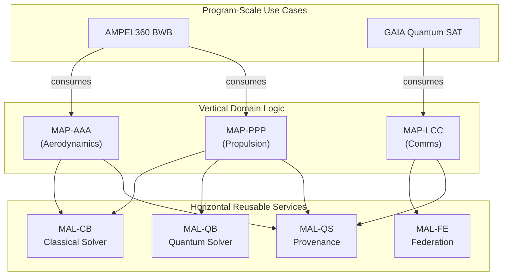

# Robbbo-T — ASI-T (Aerospace Super-Intelligence Transformers)

**Repository Slug:** `robbbo-t-asi-t-transition`

**Vision:** Aerospace Super-Intelligence Transformers enabling a Sustainable Industry Transition (ASI-T).

This repository contains the full-stack platform and engineering portfolio for the ASI-T initiative, organized under a strict TFA architecture with a quantum-classical bridge.

## Audience baselines
- Developers & SRE → `platform/`
- Domain Experts → `portfolio/2-domains-levels/` and `portfolio/1-cax-methodology/`
- Governance/Auditors → `portfolio/0-strategy/` and `portfolio/7-governance/`

## Quickstart
```bash
make print-vars
make validate
```

---

## 1. 🚀 What This Is

This repository is the canonical map of **Amedeo Pelliccia’s** professional portfolio. It is not just a collection of projects; it is a fully integrated **host platform** for developing, certifying, and operating complex aerospace programs. It unifies **15 engineering domains** under a strict **Top Final Algorithm (TFA)** architecture, featuring a production-ready **quantum–classical bridge** and delivering a suite of ready-to-use **templates, validators, services, and CI/CD pipelines** to ensure deterministic, auditable, and drift-free development.

---

## 2. 🏗️ Architecture at a Glance

The entire ecosystem is built on a modular, service-oriented architecture designed for safety, traceability, and scalability.

### 2.1 TFA Layers

Every domain is organized with deterministic traceability using the following layers. The full hierarchy is detailed in the [**_LLC-HIERARCHY.md**](./2-DOMAINS-LEVELS/_LLC-HIERARCHY.md) document.

| Code                       | Meaning                                   | Group      | Core Function                                      |
| -------------------------- | ----------------------------------------- | ---------- | -------------------------------------------------- |
| **SI / DI**                | System / Domain Interface                 | SYSTEMS    | Orchestration, API contracts, and domain boundaries.   |
| **SE**                     | Station Envelope                          | STATIONS   | Defines safe operating limits for environments.    |
| **CV / CE / CC / CI / CP** | Component Hierarchy                       | COMPONENTS | Manages the digital thread for HW/SW configuration.  |
| **CB**                     | Classical Bit                             | BITS       | Deterministic, classical computation and solvers.  |
| **QB**                     | Qubit                                     | QUBITS     | Quantum algorithms (QUBO/Ising) and strategies.    |
| **UE**                     | Unit Element                              | ELEMENTS   | Reusable, atomic software functions (drivers, utils).|
| **FE**                     | Federation Entanglement                   | ELEMENTS   | Governed, multi-agent/multi-domain coordination.   |
| **FWD**                    | Forward/Waves Dynamics                    | WAVES      | Predictive modeling, simulation, and nowcasting.   |
| **QS**                     | Quantum State                             | STATES     | Immutable, signed evidence and state provenance.   |

### 2.2 Quantum–Classical Bridge

The architecture enables powerful hybrid computation via a structured flow: **CB → QB → UE/FE → FWD → QS**. This provides a complete pathway from deterministic classical inputs to quantum-enhanced optimization, federated coordination, predictive analysis, and immutable, audit-grade evidence.
> See the [**Quantum-Classical Bridge documentation**](./docs/quantum-classical-bridge.md) for a detailed explanation.

### 2.3 MAP/MAL (Master Application Program / Main Application Layer)

This powerful pattern separates domain-specific business logic from reusable, cross-cutting services, enabling rapid development and platform-wide upgrades.

*   **MAP (Vertical)**: A domain’s **master program**. It encapsulates the unique logic of that domain and exposes a stable API. (e.g., `MAP-AAA` provides aerodynamic analysis services).
*   **MAL (Horizontal)**: A reusable **bridge layer service**. It provides a core capability that any MAP can consume. (e.g., `MAL-CB` is the classical solver service, `MAL-QS` is the provenance service).



---

## 3. 🎛️ Domains (15) & Structure

The platform integrates 15 core aerospace domains, each with a standardized and validated TFA structure. Browse all domains under [`2-DOMAINS-LEVELS/`](./2-DOMAINS-LEVELS/).

# Domains → TFA

## A) Safe (fix titles, keep current paths)

| Code | Domain Name & Link to TFA Structure                                                                              |
| :--- | :--------------------------------------------------------------------------------------------------------------- |
| AAA  | [AERODYNAMICS-AND-AIRFRAMES-ARCHITECTURES](./portfolio/2-DOMAINS-LEVELS/AAA-AERODYNAMICS-AND-AIRFRAMES-ARCHITECTURES/TFA/) |
| AAP  | [AIRPORTS-PLATFORMS-AND-HYDROGEN-ENABLERS](./portfolio/2-DOMAINS-LEVELS/AAP-AIRPORTS-PLATFORMS-AND-HYDROGEN-ENABLERS/TFA/)              |
| CCC  | [COCKPIT-CABIN-AND-CARGO](./portfolio/2-DOMAINS-LEVELS/CCC-COCKPIT-CABIN-AND-CARGO/TFA/)                                   |
| CQH  | [CRYOGENICS-QUANTUM-AND-H2](./portfolio/2-DOMAINS-LEVELS/CQH-CRYOGENICS-QUANTUM-AND-H2/TFA/)                               |
| DDD  | [DIGITAL-AND-DATA-DEFENSE](./portfolio/2-DOMAINS-LEVELS/DDD-DIGITAL-AND-DATA-DEFENSE/TFA/)                                 |
| EDI  | [ELECTRONICS-AND-DIGITAL-INSTRUMENTS](./portfolio/2-DOMAINS-LEVELS/EDI-ELECTRONICS-DIGITAL-INSTRUMENTS/TFA/)               |
| EEE  | [ECOLOGY-EFFICIENCY-AND-ELECTRIFICATION](./portfolio/2-DOMAINS-LEVELS/EEE-ECOLOGICAL-EFFICIENT-ELECTRIFICATION/TFA/)       |
| EER  | [ENVIRONMENTAL-EMISSIONS-AND-REMEDIATION](./portfolio/2-DOMAINS-LEVELS/EER-ENVIRONMENTAL-EMISSIONS-AND-REMEDIATION/TFA/)   |
| IIF  | [INDUSTRIAL-INFRASTRUCTURE-AND-FACILITIES](./portfolio/2-DOMAINS-LEVELS/IIF-INDUSTRIAL-INFRASTRUCTURE-FACILITIES/TFA/)     |
| IIS  | [INTEGRATED-INTELLIGENCE-AND-SOFTWARE](./portfolio/2-DOMAINS-LEVELS/IIS-INTEGRATED-INTELLIGENCE-SOFTWARE/TFA/)             |
| LCC  | [LINKAGES-CONTROL-AND-COMMUNICATIONS](./portfolio/2-DOMAINS-LEVELS/LCC-LINKAGES-CONTROL-AND-COMMUNICATIONS/TFA/)           |
| LIB  | [LOGISTICS-INVENTORY-AND-BLOCKCHAIN](./portfolio/2-DOMAINS-LEVELS/LIB-LOGISTICS-INVENTORY-AND-BLOCKCHAIN/TFA/)             |
| MMM  | [MECHANICS-MATERIALS-AND-MANUFACTURING](./portfolio/2-DOMAINS-LEVELS/MMM-MECHANICS-MATERIALS-AND-MANUFACTURING/TFA/)             |
| OOO  | [OS-ONTOLOGIES-AND-OFFICE-INTERFACES](./portfolio/2-DOMAINS-LEVELS/OOO-OS-ONTOLOGIES-AND-OFFICE-INTERFACES/TFA/)           |
| PPP  | [PROPULSION-AND-FUEL-SYSTEMS](./portfolio/2-DOMAINS-LEVELS/PPP-PROPULSION-AND-FUEL-SYSTEMS/TFA/)                           |

---

## B) Canonical (unify titles and paths)

| Code | Canonical Name & Path                           |
| :--- | :---------------------------------------------- |
| AAA  | `AAA-AERODYNAMICS-AND-AIRFRAMES-ARCHITECTURES/` |
| AAP  | `AAP-AIRPORTS-PLATFORMS-AND-HYDROGEN-ENABLERS/` |
| CCC  | `CCC-COCKPIT-CABIN-AND-CARGO/`                  |
| CQH  | `CQH-CRYOGENICS-QUANTUM-AND-H2/`                |
| DDD  | `DDD-DIGITAL-AND-DATA-DEFENSE/`                 |
| EDI  | `EDI-ELECTRONICS-AND-DIGITAL-INSTRUMENTS/`      |
| EEE  | `EEE-ECOLOGY-EFFICIENCY-AND-ELECTRIFICATION/`   |
| EER  | `EER-ENVIRONMENTAL-EMISSIONS-AND-REMEDIATION/`  |
| IIF  | `IIF-INDUSTRIAL-INFRASTRUCTURE-AND-FACILITIES/` |
| IIS  | `IIS-INTEGRATED-INTELLIGENCE-AND-SOFTWARE/`     |
| LCC  | `LCC-LINKAGES-CONTROL-AND-COMMUNICATIONS/`      |
| LIB  | `LIB-LOGISTICS-INVENTORY-AND-BLOCKCHAIN/`       |
| MMM  | `MMM-MECHANICS-MATERIALS-AND-MANUFACTURING/`    |
| OOO  | `OOO-OS-ONTOLOGIES-AND-OFFICE-INTERFACES/`      |
| PPP  | `PPP-PROPULSION-AND-FUEL-SYSTEMS/`              |

---

## 4. 🌐 AQUA-OS Applications

AQUA-OS provides a suite of high-level applications built upon the MAL services.

*   **Predictive Route Optimizer (PRO)** — *Implemented*
    *   **Function**: Optimizes flight paths in a **10-minute loop** using live meteorology, aircraft performance, and hybrid QB/CB solvers.
    *   **Links**: [`Service Root`](./services/aqua-os-pro/) · [`API Schema`](./services/aqua-os-pro/schemas/route_optimization.json) · [`Orchestrator`](./services/aqua-os-pro/core/aqua_pro_orchestrator.py) · [`Validator`](./services/aqua-os-pro/validation/aqua_pro_validator.py)

*   **UTCS Anchor Service** — *Implemented*
    *   **Function**: Manages the "CI-prepares / multisig-approves" workflow for anchoring DET evidence to a blockchain, providing immutable provenance.
    *   **Links**: [`Smart Contracts`](./contracts/) · [`Framework Doc`](./6-UTCS-BLOCKCHAIN/utcs-blockchain-framework.md) · [`CI Workflow`](./.github/workflows/anchor_utcs.yml)

*   **CaaS (Certification as a Service) Engine** — *Planned*
    *   **Function**: Automatically assembles and delivers auditable evidence packages for standards like DO-178C by tracing UTCS links from requirements to telemetry.
    *   **Links**: [`Methodology`](./1-CAX-METHODOLOGY/CAC-COMPLIANCE-SAFETY-CODE/safety-automation.md)

---

## 5. 🚀 Program-Scale Use Cases

This platform is validated against real-world, program-scale use cases.

*   [**AMPEL360 BWB-Q100**](./3-PROJECTS-USE-CASES/OPTIMO-DT/): Advanced Blended Wing Body (AIR)
*   **GAIA Quantum SAT**: Space Constellation with Quantum Links (SPACE)
*   **Diagnostics & MRO Robbbo-t**: Robotic Maintenance (GROUND)
*   **ARES-X UAS SWARM**: Defense Segment (DEFENSE)
*   **H2-CORRIDOR-X**: Cross-Sector Hydrogen Corridor (CROSS)

---

## 6. 🧠 Why This Is a Host Platform for New Programs

This repository is designed to **host entire aerospace programs** from end to end, providing:

*   **Deterministic Structure**: Uniform [`TFA/` trees](./2-DOMAINS-LEVELS/) across 15 domains.
*   **Hybrid Compute Built-in**: CB/QB for optimization, FE for coordination, FWD for nowcasts, and QS for audit-grade states.
*   **Digital Thread (**[OPTIMO-DT](./3-PROJECTS-USE-CASES/OPTIMO-DT/)**)**: Coherence across **AIR / SPACE / GROUND / DEFENSE / CROSS** segments.
*   **Compliance-as-Code**: [CI enforcement](./.github/workflows/tfa_structure_validator.yml) of structure, terms, and quantum layers.
*   **Immutable Provenance**: Optional **UTCS** anchoring via the [`utcs-anchor-service`](./6-UTCS-BLOCKCHAIN/utcs-blockchain-framework.md).
*   **Rapid Composition**: The MAP/MAL pattern allows programs to be built quickly.
*   **Ecosystem Scalability**: Cross-program interoperability through shared contracts in [`schemas/`](./schemas/).

The result is a **coherent, intelligent, and multisectoral** ecosystem for the complete lifecycle: **design → develop → certify → operate → sustain**.

---

## 7. 📂 Repo Structure

*   [`0-STRATEGY/`](./0-STRATEGY/) — Strategy, governance, mission & vision.
*   [`1-CAX-METHODOLOGY/`](./1-CAX-METHODOLOGY/) — The proprietary CAx lifecycle (CAB…CAV).
*   [`2-DOMAINS-LEVELS/`](./2-DOMAINS-LEVELS/) — The 15 engineering domains with strict `TFA/` trees.
*   [`3-PROJECTS-USE-CASES/`](./3-PROJECTS-USE-CASES/) — Program implementations and demos.
*   [`4-RESEARCH-DEVELOPMENT/`](./4-RESEARCH-DEVELOPMENT/) — R&D and experimental work.
*   [`5-ARTIFACTS-IMPLEMENTATION/`](./5-ARTIFACTS-IMPLEMENTATION/) — Language-specific code buckets.
*   [`6-UTCS-BLOCKCHAIN/`](./6-UTCS-BLOCKCHAIN/) — UTCS integration, contracts, and services.
*   [`7-GOVERNANCE/`](./7-GOVERNANCE/) — Governance policies and community processes.
*   [`8-RESOURCES/`](./8-RESOURCES/) — Reusable templates, assets, and references.
*   [`services/`](./services/) — Deployed AQUA-OS microservices.
*   [`docs/`](./docs/) — High-level architecture and methodology documentation.

---

## 8. 💻 Getting Started

```bash
# 1) Create any missing TFA trees and bridge buckets (idempotent)
make scaffold

# 2) Validate the full TFA structure, quantum layers, and terminology
make check
```

**Run the PRO orchestrator (demo):**
```bash
python3 services/aqua-os-pro/core/aqua_pro_orchestrator.py
```

**Validate system coverage:**
```bash
python3 services/aqua-os-pro/validation/aqua_pro_validator.py
```

---

## 9. 🔍 CI/CD & Quality Gates

Our quality gates are automated via GitHub Actions. Key workflows include:
*   [**TFA Structure Validator**](./.github/workflows/tfa_structure_validator.yml): Enforces domain trees, layers, and META folders.
*   [**Quantum Layers Check**](./.github/workflows/quantum-layers-check.yml): Enforces CB/QB/UE/FE/FWD/QS presence and correct terminology.
*   [**Lexicon Guard**](./.github/workflows/lexicon-guard.yml): Prevents use of deprecated terms.
*   [**UTCS Anchor**](./.github/workflows/anchor_utcs.yml): Manages provenance anchoring pipelines.

All workflows are defined in [`.github/workflows/`](./.github/workflows/).

---

## 10. 📈 Roadmap

| Phase | Milestone                       | ETA         |
| ----- | ------------------------------- | ----------- |
| v2.2  | UTCS Smart Contracts (Alpha)    | Q4 2025     |
| v2.5  | CAI/IIS AGI Modules Integration | Mid 2026    |
| v3.0  | OPTIMO-DT ↔ Digital Twin Sync   | Early 2027  |
| v4.0  | Quantum Extension (QS Full)     | 2028        |

See the detailed [**Roadmap Document**](./0-STRATEGY/ROADMAP.md) and [**Live Dashboard**](./0-STRATEGY/dashboards/index.html) for more information.

---

## 11. 🤝 Contributing & Governance

*   Start with [`CONTRIBUTING.md`](./CONTRIBUTING.md).
*   **STRICT TFA-ONLY**: Never create flat LLC folders under `2-DOMAINS-LEVELS/<DOMAIN>/`.
*   Governance details are in [`0-STRATEGY/GOVERNANCE.md`](./0-STRATEGY/GOVERNANCE.md) and [`7-GOVERNANCE/COMMUNITY/`](./7-GOVERNANCE/COMMUNITY/).

---

## 12. 📄 License & Quick Links

Licensed under **MIT** — see [`LICENSE`](./LICENSE).

*   [**Strategy & Vision**](./0-STRATEGY/VISION.md)
*   [**Master's Project Framework**](./0-STRATEGY/MASTER-PROJECT-FRAMEWORK.md)
*   [**CAx Methodology**](./1-CAX-METHODOLOGY/)
*   [**AQUA-OS PRO Application**](./services/aqua-os-pro/)
*   [**Blockchain (UTCS)**](./6-UTCS-BLOCKCHAIN/utcs-blockchain-framework.md)
*   [**High-Level Docs**](./docs/)

### 🎓 Master's Project Integration

This portfolio serves as the practical implementation backbone for the **"Máster en Dirección y Gestión de Proyectos"**.
*   **Progress Tracking**: Use `make master-progress` to generate comprehensive progress reports ([see latest](./0-STRATEGY/MASTER-PROJECT-FRAMEWORK/PROGRESS-REPORT.md)).
