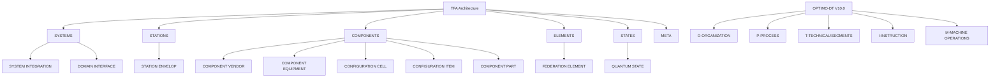

# Amedeo Pelliccia · Professional Portfolio

> **Classical–Quantum Extensible Aerospace**  
> Strict TFA hierarchy across 15 domains with quantum layers (CB/QB/UE/FE/FWD/QS), OPTIMO Digital Thread, template packs, and CI validation.


---

## 🚀 About This Portfolio

This repository is the canonical map of Amedeo Pelliccia's aerospace portfolio under a **Top Final Algorithm (TFA)** architecture.  
It integrates **15 engineering domains** with a **quantum–classical bridge** and provides **ready-to-use templates**, **validators**, and **CI** to prevent drift.

**Highlights**
- **FE = Federation Element** (authoritative)  
- **Quantum bridge**: CB (Classical Bit) → QB (Qubit)  
- **Dual elements**: UE (Unit Element, classical) + FE (Federation, distributed)  
- **Wave dynamics**: FWD layer for predictive/retrodictive modeling  
- Enforced by CI: structure, terminology, and quantum layers.

**Author**: Amedeo Pelliccia  
**Started**: November 25, 2024  
**Last Updated**: September 10, 2025 (TFA V2)

### 🎯 Mission Statement

To create a unified, intelligent framework that bridges the gap between traditional aerospace engineering and next-generation AI systems, enabling more efficient, safer, and innovative aerospace solutions.

---

## 🏗️ Architecture Overview

This portfolio follows the **TFA (Top Final Algorithm)** methodology—a strict organizational pattern that enforces:
- **Strict TFA-Only** containers per domain
- **Deterministic traceability** across Systems, **Stations**, Components, Elements, and States
- **AI-first** integrations with robust governance and auditability

**STRICT TFA-ONLY policy**  
- Each domain uses `TFA/` as the canonical container.  
- **NO FLAT LLC FOLDERS** under `2-DOMAINS-LEVELS/<DOMAIN>/`.  
- All work targets `TFA/<GROUP>/<LLC>/`.

---

## 🔮 Quantum-Classical Bridge (TFA V2)

The architecture implements a **quantum-classical extensible bridge** with these layers:

| Code | Canonical Meaning | Layer | Purpose |
|------|------------------|-------|---------|
| **SI** | SYSTEM INTEGRATION | SYSTEMS | Cross-domain integration |
| **DI** | DOMAIN INTERFACE | SYSTEMS | Domain boundary management |
| **SE** | STATION ENVELOPE | STATIONS | Physical/logical boundaries |
| **CV/CE/CC/CI/CP** | COMPONENT [VENDOR/EQUIPMENT/CELL/ITEM/PART] | COMPONENTS | Hierarchical components |
| **CB** | CLASSICAL BIT | BITS | Classical computation layer |
| **QB** | QUBIT | QUBITS | Quantum computation layer |
| **UE** | UNIT ELEMENT | ELEMENTS | Classical fundamental units |
| **FE** | FEDERATION ELEMENT | ELEMENTS | Distributed orchestration |
| **FWD** | Future/Waves Dynamics | WAVES | Predictive/retrodictive modeling |
| **QS** | QUANTUM STATE | STATES | State management |

**Quantum Bridge Flow**: CB (Classical Bit) → QB (Qubit) → UE/FE (Elements) → FWD (Wave Dynamics) → QS (States)

---

## 📂 Portfolio Structure

### 🎯 [0-STRATEGY](./0-STRATEGY/)
Strategic planning, governance, mission, and vision documents.

### 🔧 [1-CAX-METHODOLOGY](./1-CAX-METHODOLOGY/)
Comprehensive Computer-Aided X (CAx) methodology covering:
- **CAB** – Brainstorming & Innovation  
- **CAC** – Compliance & Safety Codes  
- **CAD** – Design & MBSE  
- **CAE** – Engineering & Simulation  
- **CAF** – Finance & Blockchain Economics  
- **CAI** – AI Integration & Orchestration  
- **CAM** – Manufacturing & Production  
- **CAO** – Organization & Governance  
- **CAP** – Production Planning  
- **CAS** – Sustainment & S1000D  
- **CAT** – Testing & Validation  
- **CAV** – Verification & V&V  

### 🎛️ [2-DOMAINS-LEVELS](./2-DOMAINS-LEVELS/)
15 specialized aerospace domains following strict TFA architecture (names **verbatim** as provided):

| Code | Precise Domain Name (verbatim) | TFA Structure |
|---|---|---|
| **AAA** | AERODYNAMICS-AND-AIRFRAMES-ARCHITECTURES | ✅ TFA/SYSTEMS/STATIONS/COMPONENTS/BITS/QUBITS/ELEMENTS/WAVES/STATES |
| **AAP** | AIRPORT-ADAPTABLE-PLATFORMS | ✅ TFA/SYSTEMS/STATIONS/COMPONENTS/BITS/QUBITS/ELEMENTS/WAVES/STATES |
| **CCC** | COCKPIT-CABIN-AND-CARGO | ✅ TFA/SYSTEMS/STATIONS/COMPONENTS/BITS/QUBITS/ELEMENTS/WAVES/STATES |
| **CQH** | CRYOGENICS-QUANTUM-AND-H2 | ✅ TFA/SYSTEMS/STATIONS/COMPONENTS/BITS/QUBITS/ELEMENTS/WAVES/STATES |
| **DDD** | DIGITAL-AND-DATA-DEFENSE | ✅ TFA/SYSTEMS/STATIONS/COMPONENTS/BITS/QUBITS/ELEMENTS/WAVES/STATES |
| **EDI** | ELECTRONICS-DIGITAL-INSTRUMENTS | ✅ TFA/SYSTEMS/STATIONS/COMPONENTS/BITS/QUBITS/ELEMENTS/WAVES/STATES |
| **EEE** | ECOLOGICAL-EFFICIENT-ELECTRIFICATION | ✅ TFA/SYSTEMS/STATIONS/COMPONENTS/BITS/QUBITS/ELEMENTS/WAVES/STATES |
| **EER** | ENVIRONMENTAL-EMISSIONS-AND-REMEDIATION | ✅ TFA/SYSTEMS/STATIONS/COMPONENTS/BITS/QUBITS/ELEMENTS/WAVES/STATES |
| **IIF** | INDUSTRIAL-INFRASTRUCTURE-FACILITIES | ✅ TFA/SYSTEMS/STATIONS/COMPONENTS/BITS/QUBITS/ELEMENTS/WAVES/STATES |
| **IIS** | INTEGRATED-INTELLIGENCE-SOFTWARE | ✅ TFA/SYSTEMS/STATIONS/COMPONENTS/BITS/QUBITS/ELEMENTS/WAVES/STATES |
| **LCC** | LINKAGES-CONTROL-AND-COMMUNICATIONS | ✅ TFA/SYSTEMS/STATIONS/COMPONENTS/BITS/QUBITS/ELEMENTS/WAVES/STATES |
| **LIB** | LOGISTICS-INVENTORY-AND-BLOCKCHAIN | ✅ TFA/SYSTEMS/STATIONS/COMPONENTS/BITS/QUBITS/ELEMENTS/WAVES/STATES |
| **MMM** | MECHANICAL-AND-MATERIAL-MODULES | ✅ TFA/SYSTEMS/STATIONS/COMPONENTS/BITS/QUBITS/ELEMENTS/WAVES/STATES |
| **OOO** | OS-ONTOLOGIES-AND-OFFICE-INTERFACES | ✅ TFA/SYSTEMS/STATIONS/COMPONENTS/BITS/QUBITS/ELEMENTS/WAVES/STATES |
| **PPP** | PROPULSION-AND-FUEL-SYSTEMS | ✅ TFA/SYSTEMS/STATIONS/COMPONENTS/BITS/QUBITS/ELEMENTS/WAVES/STATES |

### 🚀 [3-PROJECTS-USE-CASES](./3-PROJECTS-USE-CASES/)
Real-world applications and use case implementations.

### 🔬 [4-RESEARCH-DEVELOPMENT](./4-RESEARCH-DEVELOPMENT/)
Ongoing research initiatives and experimental developments.

### ⚙️ [5-ARTIFACTS-IMPLEMENTATION](./5-ARTIFACTS-IMPLEMENTATION/)
Code implementations in multiple languages:
- **Python** – AI/ML and data processing  
- **C** – Real-time and embedded systems  
- **Rust** – High-performance and safety-critical systems  
- **TypeScript** – Web interfaces and APIs  
- **Julia** – Scientific computing  
- **XSLT** – Data transformation  
- **Solidity** – Blockchain smart contracts  

### ⛓️ [6-UTCS-BLOCKCHAIN](./6-UTCS-BLOCKCHAIN/)
Universal Token Classification System (UTCS) blockchain integration.

### 🏛️ [7-GOVERNANCE](./7-GOVERNANCE/)
Governance frameworks, policies, community management.  
See also: `7-GOVERNANCE/COMMUNITY/`.

### 📚 [8-RESOURCES](./8-RESOURCES/)
Templates, references, assets, and Teknia token resources.

---

## 🧵 OPTIMO-DT — Digital Thread (V10.0)

**OPTIMO-DT** provides the Digital Thread backbone:

```

OPTIMO-DT/
├── O-ORGANIZATION/          # Enterprise governance (V10.0)
├── P-PROCESS/               # Process management (V10.0)
├── T-TECHNICAL/             # Technical implementation (V10.0)
│   └── SEGMENTS/
│       ├── AIR/
│       ├── SPACE/
│       ├── GROUND/
│       ├── DEFENSE/
│       └── CROSS/
├── I-INSTRUCTION/           # AI/ML systems (V10.0)
├── M-MACHINE OPERATIONS/    # Digital Twin implementation (V10.0)
├── config/                  # Configuration files
├── docs/                    # Documentation
├── scripts/                 # Automation scripts
└── tests/                   # Testing framework

```

---

## 🛠️ TFA Architecture Explained

### TFA Hierarchy (per domain)

```
DOMAIN/
└── TFA/
    ├── SYSTEMS/
    │   ├── SI/  (SYSTEM INTEGRATION)
    │   └── DI/  (DOMAIN INTERFACE)
    ├── STATIONS/
    │   └── SE/  (STATION ENVELOPE)
    ├── COMPONENTS/
    │   ├── CV/  (COMPONENT VENDOR)
    │   ├── CE/  (COMPONENT EQUIPMENT)
    │   ├── CC/  (CONFIGURATION CELL)
    │   ├── CI/  (CONFIGURATION ITEM)
    │   └── CP/  (COMPONENT PART)
    ├── BITS/
    │   └── CB/  (CLASSICAL BIT)
    ├── QUBITS/
    │   └── QB/  (QUBIT)
    ├── ELEMENTS/
    │   ├── UE/  (UNIT ELEMENT)
    │   └── FE/  (FEDERATION ELEMENT)
    ├── WAVES/
    │   └── FWD/ (Future/Foresight/Fluctuant/Functional Waves Dynamics)
    ├── STATES/
    │   └── QS/  (QUANTUM STATE)
    └── META/
        └── README.md
```

### Quantum-Classical Bridge Architecture

The TFA V2 implementation includes a complete quantum-classical bridge:

- **Classical Layer**: CB (Classical Bit) for traditional computation
- **Quantum Layer**: QB (Qubit) for quantum processing and entanglement  
- **Element Bridge**: UE (Unit Element) ↔ FE (Federation Element)
- **Wave Dynamics**: FWD for predictive/retrodictive analysis
- **State Management**: QS for quantum state definitions and measurements
├── STATES/
│   └── QS/  (QUANTUM STATE)
└── META/
└── README.md

```

### LLC Codes — Canonical Meanings (TFA V2)

| Code | Meaning |
|---|---|
| **SI** | SYSTEM INTEGRATION |
| **DI** | DOMAIN INTERFACE |
| **SE** | STATION ENVELOPE |
| **CV** | COMPONENT VENDOR |
| **CE** | COMPONENT EQUIPMENT |
| **CC** | CONFIGURATION CELL |
| **CI** | CONFIGURATION ITEM |
| **CP** | COMPONENT PART |
| **CB** | CLASSICAL BIT |
| **QB** | QUBIT |
| **UE** | UNIT ELEMENT |
| **FE** | FEDERATION ELEMENT |
| **FWD** | Future/Foresight/Fluctuant/Functional Waves Dynamics |
| **QS** | QUANTUM STATE |

**Terminology guard:** Deprecated terms (`Fine~Element` and `Station~Envelop`) are rejected by CI.

---

## 🎯 Template System

The TFA V2 architecture includes a comprehensive template system in `8-RESOURCES/TEMPLATES/`:

### Template Categories

- **TFA Layer Templates**: Standard templates for each LLC code (SI, DI, SE, CV, CE, CC, CI, CP, CB, QB, UE, FE, FWD, QS)
- **CAx Lifecycle Templates**: Process templates for all 12 CAx phases (CAB through CAV)
- **Domain-Specific Templates**: Specialized templates for unique domain requirements

### Key Features

- **Quantum-Classical Aware**: Templates include quantum/classical bridge configurations
- **Validation Ready**: All templates validate successfully with TFA structure requirements
- **Standardized Placeholders**: Consistent placeholder system across all templates
- **CI/CD Integration**: Templates integrate with automated validation workflows

### Usage

```bash
# Use templates from the system
cp -r 8-RESOURCES/TEMPLATES/TFA-LAYER-TEMPLATES/ELEMENTS-TEMPLATES/FE-FEDERATION-ELEMENT/* \\
      2-DOMAINS-LEVELS/[DOMAIN]/TFA/ELEMENTS/FE/

# Create missing structures automatically  
make scaffold

# Validate implementation
make check
```

See `8-RESOURCES/TEMPLATES/USAGE-GUIDE.md` for complete documentation.

---

## 📊 TFA + OPTIMO-DT Overview (Mermaid)



---

## 🧠 AGI-Oriented Architecture (IIS + CAI)

* `1-CAX-METHODOLOGY/CAI-AI-INTEGRATION/`: multi-agent orchestration, generative design agents, validation harnesses.
* `2-DOMAINS-LEVELS/IIS-AI-SYSTEMS/`: integrated intelligence stacks (onboard/ground), quantum-inference pipelines.
* `*/TFA/STATES/QS/`: AI-derived state evaluations and quantum-state artifacts.
* Future hooks: federation with air/ground "infranet" cognition layers.

---

## 🔧 Technology Stack

* **Languages**: Python, C, Rust, TypeScript, Julia, XSLT, Solidity
* **AI/ML**: Custom AGI frameworks, model orchestration, validation suites
* **Blockchain**: Ethereum-compatible smart contracts, UTCS tokens
* **Standards**: S1000D, MBSE, Industry 4.0
* **Tooling**: Git, GitHub Actions (structure enforcement), Docker, Kubernetes

---

## 💻 Local Usage

```bash
# Create any missing folders (idempotent)
make scaffold

# Validate full TFA structure + quantum layers
make check
```

## 🔍 CI Validation

- **TFA Structure Validator:** checks domain trees, layers, META, and code buckets
- **Quantum Layers Check:** rejects bad terminology and enforces CB/QB/UE/FE/FWD/QS presence

See `.github/workflows/`.

---

## 📈 Roadmap Snapshot

| Phase | Key Milestone                   | ETA         |
| ----- | ------------------------------- | ----------- |
| v1.0  | TFA Core Bootstrapped           | ✅ Sept 2025 |
| v2.0  | TFA V2 Quantum-Classical Bridge | ✅ Sept 2025 |
| v2.2  | UTCS Smart Contracts Alpha      | Q4 2025     |
| v2.5  | CAI/IIS AGI Modules Integration | Mid 2026    |
| v3.0  | OPTIMO-DT ↔ Digital Twin Sync   | Early 2027  |
| v4.0  | Quantum Extension (QS Full)     | 2028        |

---

## 📊 Key Features

* ✅ **Strict TFA Architecture** — deterministic structure & traceability
* ✅ **15 Domains** — coverage from **AAA** to **PPP**
* ✅ **Quantum-Classical Bridge** — CB/QB/UE/FE/FWD/QS layers
* ✅ **AI Integration** — built-in orchestration & validation (CAI/IIS)
* ✅ **Blockchain Ready** — UTCS token system & contracts
* ✅ **Standards** — S1000D, MBSE-aligned artifacts
* ✅ **CI Enforcement** — prevents flat LLC paths & validates quantum layers

---

## 🤝 Contributing

Please see [CONTRIBUTING.md](./CONTRIBUTING.md).

**Architecture Rules**

* ⚠️ **STRICT TFA-ONLY**: Never create flat LLC folders under `2-DOMAINS-LEVELS/<DOMAIN>/`.
* ✅ Always use `2-DOMAINS-LEVELS/<DOMAIN>/TFA/<GROUP>/<LLC>/`.
* ✅ Respect the **LLC canonical meanings** listed above.

---

## 🏛️ Governance

The governance framework (`0-STRATEGY/GOVERNANCE.md`) aligns leadership accountability, compliance-as-code, and continuous auditability across all domains and LLC layers. Community processes live in `7-GOVERNANCE/COMMUNITY/`.

---

## 📄 License

This project is licensed under the MIT License — see the [LICENSE](./LICENSE) file for details.

---

## 🔗 Quick Links

* [Strategy & Vision](./0-STRATEGY/)
* [CAx Methodology](./1-CAX-METHODOLOGY/)
* [Aerospace Domains](./2-DOMAINS-LEVELS/)
* [Code Implementations](./5-ARTIFACTS-IMPLEMENTATION/CODE/)
* [Blockchain Framework](./6-UTCS-BLOCKCHAIN/)
* [Governance & Community](./7-GOVERNANCE/)

---

*Built with ❤️ for the future of aerospace engineering and artificial intelligence*


