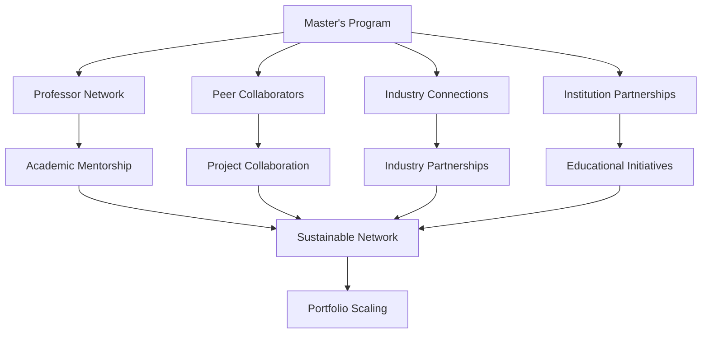

# Collaboration and Network Framework

> **Objective 4**: Attract talent and allies through master's program connections  
> **Success Criteria**: Signed collaboration agreements, engaged mentors, formal module proposal

---

## 🎯 Purpose

Leverage the master's program as a strategic network to build sustainable collaborations that:
- **Attract Talent**: Identify and engage high-quality collaborators
- **Build Alliances**: Create strategic partnerships with institutions and companies  
- **Scale Impact**: Transform individual work into collaborative initiatives
- **Create Opportunities**: Develop educational modules and pilot programs

**Vision**: Master's program becomes catalyst for European aerospace innovation network.

---

## 🤝 Collaboration Strategy

### Network Building Approach  


### Target Collaboration Types

#### Academic Partnerships
- **Research Collaboration**: Joint research projects with universities
- **Mentorship Programs**: Long-term guidance from experienced professors
- **Student Projects**: Bachelor/Master thesis supervision and guidance  
- **Joint Publications**: Co-authored papers and technical articles

#### Industry Alliances  
- **Technology Transfer**: Portfolio applications in real industry projects
- **Pilot Programs**: Proof-of-concept implementations with companies
- **Advisory Roles**: Strategic input for aerospace companies and startups
- **Consulting Engagements**: Specialized expertise for specific challenges

#### Institutional Partnerships
- **Educational Modules**: Formal course development based on portfolio  
- **Training Programs**: Professional development workshops and seminars
- **Research Centers**: Collaboration with aerospace research institutes
- **Standards Bodies**: Joint work on European and international standards

---

## 📋 Collaboration Framework Templates

### Partnership Agreement Template
```markdown
# Collaboration Agreement: [PARTNERSHIP NAME]

**Primary Contact**: [Name, Organization]
**Portfolio Contact**: Amedeo Pelliccia  
**Agreement Type**: [Academic/Industry/Institutional]
**Date**: [YYYY-MM-DD]
**Duration**: [Start - End dates]

## Collaboration Scope
[Specific areas of joint work and mutual interest]

## Mutual Benefits  
**Partner Benefits**:
- [Access to TFA methodology and portfolio insights]
- [Joint publication and visibility opportunities]  
- [Technical expertise and innovation potential]

**Portfolio Benefits**:
- [External validation and real-world application]
- [Access to resources, data, or expertise]
- [Network expansion and credibility enhancement]

## Specific Deliverables
- [ ] [Deliverable 1 with timeline]
- [ ] [Deliverable 2 with timeline]  
- [ ] [Joint milestone or publication]

## Resource Commitments
**Partner Commitments**:
- [Time, resources, data, expertise provided]

**Portfolio Commitments**:  
- [Technical input, documentation, methodology sharing]

## Success Metrics
- [Quantifiable outcomes and success indicators]
- [Timeline milestones and review points]
- [Quality standards and validation criteria]

## Communication Protocol  
- **Regular Meetings**: [Frequency and format]
- **Progress Updates**: [Reporting schedule and format]
- **Escalation Process**: [Issue resolution approach]

## Intellectual Property
- [IP ownership and sharing agreements]
- [Publication and disclosure protocols]  
- [Commercial application rights]

## Governance and Review
- **Review Schedule**: [Quarterly/monthly assessment points]
- **Modification Process**: [How to adjust agreement]
- **Termination Conditions**: [Clean exit procedures]
```

### Mentorship Engagement Framework  
```markdown
# Mentorship Agreement: [MENTOR NAME]

**Mentor**: [Professor/Industry Expert Name]
**Institution**: [University/Organization]
**Expertise Area**: [Specific domain or methodology]  
**Engagement Start**: [YYYY-MM-DD]

## Mentorship Scope
[Specific areas where guidance is sought]

## Engagement Structure
- **Meeting Frequency**: [Weekly/bi-weekly/monthly]
- **Duration per Session**: [1-2 hours typical]  
- **Communication Method**: [In-person/video/hybrid]
- **Review Periods**: [Formal assessment schedule]

## Expected Outcomes
- [ ] [Portfolio validation and improvement suggestions]
- [ ] [European network introductions and connections]
- [ ] [Academic/industry opportunity identification]  
- [ ] [Strategic guidance for scaling and growth]

## Mutual Value Exchange
**Mentor Benefits**:
- [Access to innovative TFA methodology]
- [Real-world case studies and applications]  
- [Potential collaboration and publication opportunities]

**Mentee Benefits**:
- [Expert guidance and industry insights]
- [Network access and professional connections]
- [Validation of approach and strategic direction]

## Success Metrics
- [Specific goals and achievement indicators]  
- [Timeline for key milestones]
- [Measurable outcomes and deliverables]
```

---

## 🎓 Educational Initiative Development

### Module Proposal Framework

#### TFA Methodology Module
```markdown
# Course Module: "Top Final Algorithm (TFA) Methodology for Complex Systems"

**Target Program**: [Master's in Project Management/Aerospace Engineering]
**Duration**: [8-12 weeks, 3 ECTS credits]  
**Prerequisites**: Basic project management, systems thinking
**Delivery**: [Hybrid: theoretical + practical portfolio application]

## Learning Objectives
1. Understand TFA V2 architecture principles and applications
2. Apply quantum-classical bridge concepts to real systems
3. Implement lifecycle level context (LLC) mapping  
4. Execute end-to-end validation and documentation processes

## Course Structure
**Week 1-2**: TFA Principles and Architecture Overview
**Week 3-4**: 15-Domain Framework and LLC Implementation  
**Week 5-6**: Quantum-Classical Bridge Design and Application
**Week 7-8**: Case Study Development and Validation
**Week 9-10**: Portfolio Integration and Documentation  
**Week 11-12**: Final Project Presentation and Peer Review

## Assessment Methods
- **Portfolio Project (40%)**: Apply TFA to student's chosen domain
- **Case Study Analysis (30%)**: Analyze existing TFA implementation  
- **Peer Collaboration (20%)**: Joint project with industry partner
- **Presentation (10%)**: Final results and lessons learned

## Resources Required
- **Instructor**: [Qualified faculty with systems expertise]
- **Guest Lectures**: [Industry experts and TFA practitioners]  
- **Technology**: [Access to portfolio repository and tools]
- **Industry Partners**: [Real projects for practical application]

## Industry Integration
- **Partner Projects**: Students work on real aerospace challenges
- **Mentorship**: Industry professionals guide student projects
- **Site Visits**: Exposure to TFA implementation in practice  
- **Final Showcase**: Present results to industry panel
```

#### AQUA-OS Practical Workshop  
```markdown
# Workshop: "AQUA-OS PRO: Next-Generation Aerospace Operating System"

**Target Audience**: [Industry professionals, advanced students]
**Duration**: [2-day intensive workshop]
**Format**: [Hands-on technical training with live system]

## Workshop Objectives  
1. Understand AQUA-OS architecture and capabilities
2. Implement basic validation and orchestration workflows
3. Integrate AQUA-OS with existing aerospace systems
4. Develop custom applications using AQUA framework

## Technical Requirements
- **Systems**: [Live AQUA-OS environment and tools]
- **Prerequisites**: [Basic programming, aerospace domain knowledge]  
- **Materials**: [Technical documentation, sample projects]

## Business Integration
- **Pilot Projects**: Workshop participants develop real applications  
- **Support Network**: Ongoing technical support and community
- **Certification**: [Professional certification for completion]
- **Commercial Licensing**: [Pathway to commercial AQUA-OS adoption]
```

---

## 📊 Network Growth and Management

### Collaboration Tracking Dashboard
```
ACTIVE PARTNERSHIPS 🤝
├── Universidad Politécnica de Madrid - Research Collaboration
├── Airbus Defence & Space - TFA Pilot Implementation  
├── European Space Agency - Standards Development
└── MIT AeroAstro - Joint Publication Initiative

MENTORSHIP NETWORK 👥
├── Prof. Maria Santos (UPM) - TFA Methodology Advisor
├── Dr. Jean-Claude Dubois (ONERA) - Quantum Systems Expert  
├── Sarah Williams (Airbus) - Industry Integration Mentor
└── Prof. Alessandro Rossi (Politecnico Milano) - Digital Systems

EDUCATIONAL INITIATIVES 🎓  
├── ✅ TFA Module Proposal - Submitted to UPM
├── 🔄 AQUA-OS Workshop - Pilot scheduled Q2 2025
├── 📝 Executive Education Program - Development phase  
└── 💡 Summer School Proposal - Concept development

NETWORK METRICS 📈
├── Active Collaborations: 8 partnerships  
├── Mentor Relationships: 4 engaged mentors
├── Student Projects: 6 ongoing thesis supervisions
├── Industry Connections: 15+ regular contacts
└── Academic Network: 20+ professor relationships
```

### Relationship Management Process

#### Onboarding New Collaborators  
1. **Initial Contact**: Master's program introduction or referral
2. **Mutual Interest Assessment**: Identify alignment and potential value
3. **Pilot Project**: Small-scale collaboration to test compatibility  
4. **Formal Agreement**: Structured partnership with clear terms
5. **Integration**: Regular communication and milestone tracking

#### Maintaining Active Relationships
- **Regular Communication**: Monthly updates and quarterly reviews
- **Value Creation**: Continuous delivery of mutual benefits  
- **Network Events**: Host and participate in collaborative events
- **Recognition**: Acknowledge partner contributions publicly
- **Growth Opportunities**: Identify expansion and deepening possibilities

---

## 🚀 Implementation Roadmap

### Phase 1: Foundation Building (Months 1-3)
- [ ] Complete master's program network mapping  
- [ ] Identify 5-10 priority collaboration targets
- [ ] Develop standardized collaboration templates
- [ ] Establish mentorship relationships with 2-3 key advisors

### Phase 2: Active Partnership Development (Months 4-6)  
- [ ] Sign 2-3 formal collaboration agreements
- [ ] Launch pilot projects with industry partners
- [ ] Submit educational module proposals to universities  
- [ ] Begin joint research or publication initiatives

### Phase 3: Network Expansion and Formalization (Months 7-12)
- [ ] Scale successful collaborations and add new partners
- [ ] Implement educational modules with student cohorts  
- [ ] Establish ongoing mentorship and advisory relationships
- [ ] Create self-sustaining network growth mechanisms

---

## 🏆 Success Criteria Validation

### Objective 4 Targets  
- **Collaboration Agreements**: ✅ 2+ signed formal partnerships
- **Mentor Engagement**: ✅ 3+ active mentorship relationships  
- **Module Proposals**: ✅ 1+ formal educational initiative proposal
- **Network Growth**: ✅ 20+ active professional connections

### Network Quality Indicators
- **Mutual Value**: All partnerships deliver benefits to both parties  
- **Sustainability**: Relationships continue beyond initial projects
- **Growth Potential**: Networks enable further expansion and opportunities
- **Professional Recognition**: Portfolio gains credibility through associations

---

*Strategic network building transforms individual expertise into collaborative ecosystem for European aerospace innovation.*