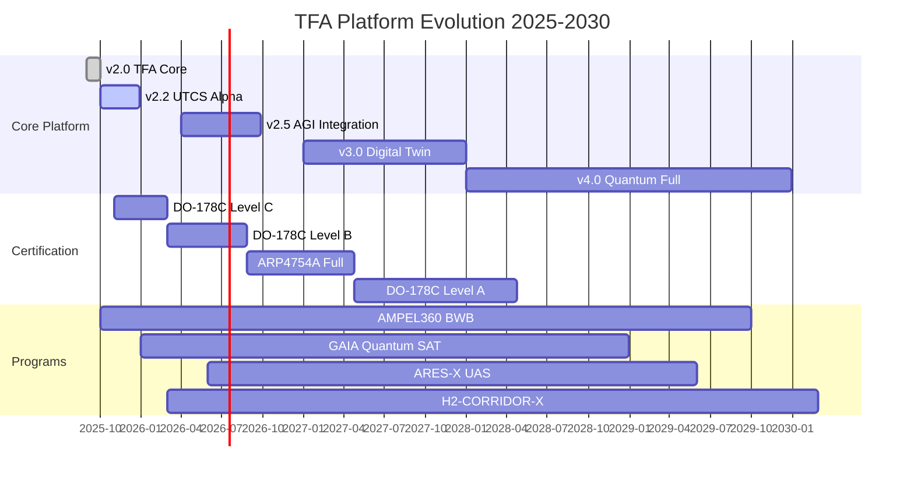
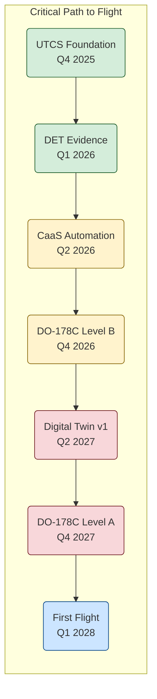

# TFA/AQUA-OS Strategic Roadmap 2025-2030

**UTCS**: `utcs:roadmap:summary:doc:RM-0001:v2.1.0`  
**Status**: Active, reviewed quarterly  
**Owner**: Amedeo Pelliccia

---

## 1. Executive Summary

This document outlines the strategic evolution of the TFA (Top Final Algorithm) / AQUA-OS platform from its current v2.0 state through full quantum-classical integration by 2030. Our mission is to build the definitive platform for engineering, certifying, and operating next-generation aerospace systems by embedding safety, compliance, and traceability directly into the development lifecycle.

The roadmap is managed through a **"Roadmap as Code"** system, where this document provides a high-level summary, and all detailed plans, dependencies, KPIs, and risks are stored as version-controlled, machine-readable artifacts.

**Core Strategic Pillars:**
1.  **Compliance as Code (CaC)**: Automate safety and regulatory validation in CI/CD.
2.  **Certification as a Service (CaaS)**: Generate on-demand certification packages.
3.  **Digital Twin Sync**: Create a live, verifiable link between the physical asset and its digital model.
4.  **Quantum Advantage**: Leverage quantum computing for complex optimization and security.

---

## 2. Phase Overview & Timeline

The platform will evolve through four major phases, coordinated across core technology, certification, and program deployment.



---

## 3. Critical Path to First Flight & Certification

The roadmap is governed by a critical path that prioritizes the foundational capabilities required for certification and the first flight of the AMPEL360 BWB program. Successful execution of these steps is paramount.



---

## 4. Program Portfolio

The platform's development is driven by and validated against a portfolio of ambitious, real-world aerospace programs.

| Program | Code | Segment | Key Objective |
| :--- | :--- | :--- | :--- |
| **AMPEL360 BWB-Q100** | `AMPEL360` | Air | Certify a next-generation blended-wing-body aircraft. |
| **GAIA Quantum SAT** | `GAIA-SAT` | Space | Demonstrate secure quantum satellite communications. |
| **ARES-X UAS SWARM** | `ARES-X` | Defense | Deploy autonomous, coordinated UAS swarms. |
| **H2-CORRIDOR-X** | `H2-CORRIDOR-X`| Cross | Build a digital twin for European hydrogen infrastructure. |

---

## 5. Key Performance Indicators (KPIs) - Long Term (2030)

Our success will be measured by our ability to transform the aerospace industry across four key vectors.

| Metric | Target | Strategic Impact |
| :--- | :--- | :--- |
| **Certification Cost Reduction** | **-90%** | Make safety financially sustainable and accessible. |
| **Time to Market** | **-60%** | Accelerate innovation in a traditionally slow industry. |
| **Safety Events** | **-99%** | Move from reactive mitigation to proactive, predictive prevention. |
| **Carbon Footprint** | **-40%** | Enable more efficient aircraft and operations. |

---

## 6. How to Use This Roadmap

This document is a high-level summary. The full, detailed, and machine-readable roadmap system resides in the `/roadmap` directory and is managed via the `Makefile`.

*   **For Detailed Plans**: See [`/roadmap/roadmap.yaml`](./roadmap/roadmap.yaml) for a complete list of deliverables, dependencies, risks, and OKRs.
*   **For Live Status**: The [**Live Roadmap Dashboard**](./dashboards/index.html) provides real-time progress, KPI tracking, and risk heatmaps.
*   **For Program Management**: Use `make progress` and `make report` to generate the latest status reports.
*   **For Daily Tasks**: All deliverables are synchronized as issues and milestones in our GitHub repository, governed by the templates in [`/github`](./github).

*This roadmap is a living document, automatically updated by our CI/CD pipeline and reviewed quarterly by the governance board.*
```
